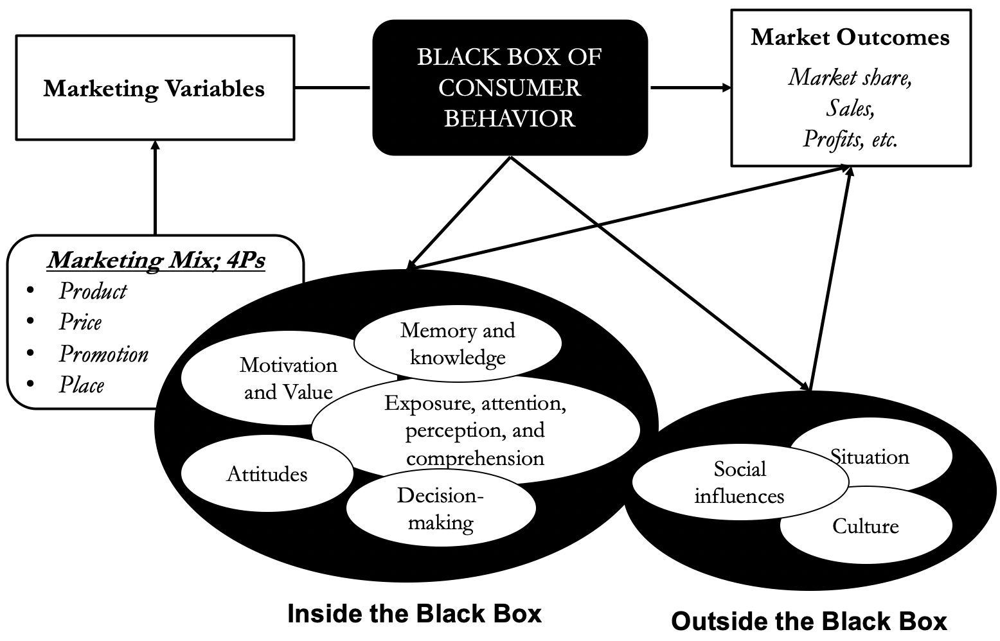
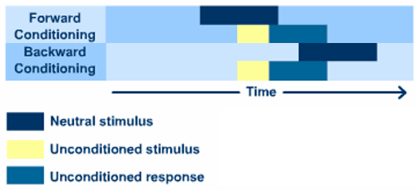

# Consumer behaviour

Instructor - Kim Junghan

* auto-gen TOC:
{:toc}
### Course overview

 Component             | Week | Percentage 
 --------------------- | ---- | ---------- 
 Class Participation   | -    | 15%        
 Individual Assignment | 11   | 10%        
 Quiz 1                | 6    | 10%        
 Quiz 2                | 10   | 10%        
 Project Report        | 13   | 15%        
 Project Presentation  | 13   | 10%        
 Finals                | 15   | 30%        

Materials 
- https://www.amazon.com/Consumer-Behavior-Wayne-D-Hoyer/dp/1305507274

Individual Assignment
- 5 papers (quite recent), choose one
- Summary, Critique and Application

Group Project

- Diagnose the Status a Market Laggard

- Components
  - Exploratory Research
    - Categories of product
    - Positioning of different brands
    - Packaging considerations
    - Relevant citations
  - Segmentation
    - Define two target segments
      - On a basis (STP)
      - Each of reasonable size
      - Together make up most of Singaporeans
  - Qualitative Research (online-only)
    - Clear deliervables
    - Avoid surveying SMU students (not required this year)
      - Do not recruit students taking this course
  - Quantitiative Research (online-only)
    - Please get approval of questionnaire before fielding it
    - 12 times the number of group members
    - (Should include some attention-checking question)
  - Analysis and Recommendations
- Deliver report and presentation

Quiz
- Around 33 MCQ

Finals
- 75% MCQ and True/False
- 25% short answers

## Session 1 - Marketing

Definition 

> An organizational function and a set of processes for creating, capturing, communicating, and delivering **value** to **customers** and for managing customer **relationships** in ways that benefit the organization and its stakeholders.

Consumer behaviour

- the science behind marketing
- the black box between the marketing variables to market outcomes
- attempts to understand "why" and "how" rather than following "whatever has worked" (in commerical marketing research) which is context specific
- > reflects totality of consumers' **decisions** with respect to the **acquisition, consumption, and disposition** of goods, services, time, and ideas by (human) decision-making units (over time)
- applications
  - marketing managers for the company
  - public policy market regulators

Example of application

- Kia
  - Good price, good product (can be measured objectively)
  - Mediocre sales however
  - Most consumers are aware of KIA
  - Bad product image for some reason (copycat), never used to "show off"
  - Attempted to enhance brand preception (e.g. Blackpink)
  - Positioned themselves in the premium market
    - Unknown brand entering an SUV market
    - Wants the town to be known for the SUV production
    - (the advertisement for Telluride does not state any features)
    - Top-selling SUV in the US in one year

Example of research

- Stock price animation
  - Animating the stock changes increases the perceptions of risk
  - Also influences expert (e.g. expert traders)
  - Theory of mechanism (e.g. attention, information processing)

Difference between academic and commerical research

- Explanation vs description/prediction
- Generalisable vs context-specific
- Level of abstraction

 

### The black box of consumer behaviour

- Motivation and Values
- Exposure, Attention, Perception, and Comprehension
- Memory and Knowledge
- Attitudes and Persuasion
- Problem Recognition and Information Search
- Decision Making

## Session 2 - Methods of Consumer Research

- Classifications
  - Primary Data and Secondary Data
  - Qualitative and Quantitative Research
    - gain insights vs getting usable statistics
    - small and non-representative vs large and representative
      - from the target demographic for both
- Observational methods (quantitative)
  - Types of systematic observation study
    
    - > a research design guides the sampling and ensures control in **standardizing** what is being observed
    
    - Descriptive vs Hypothesis Testing vs Causal
    
  - Specialised Observational Study Designs
    - Contrived Observativation (Causal) - The researcher changes the environment and observes if there is a change in the behavior 
    - Content Analysis - Study media content for evidence
    - Empathic Design - Watch how people use the prototype as naturally as possible by going to the consumer's environment
    - Behaviour Recording Devices - skin galvanometers and eye-tracking devices
      - Example - Eye-tracking devices to help with website design, commericals design etc. Findings - center placement is important, effective to frame the message to be relevant to the current situation
    - Issues with observational methods
      - Cannot observe latent constructs - motives, attitudes or intentions
      - Eye-tracking software is expensive ($10k)
      - Ethics - consent is required
      - Need to control confounding variables
- Qualitative Research
  - Focus group or individual in-depth interviews
  - Purposive Sampling
    - **Homogeneity on variables relevant to group dynamics**
      - i.e. you need to focus on your target demographic
      - e.g. luxury brands do not interview low-income people
      - You need to define your target population first
    - **Heterogeneity on variables to ensure a variety of opinions**
      - i.e. so that it is not an echo chamber
      - e.g. research on Xiaomi image should include non-Xiaomi users
      - Diversity rather than proportional representation
  - Strengths of Qualitative Research
    - (You can get unexpected answers)
  - Serves as a precursor to a (quantitative) survey
    - Suggest hypothesis, scales
- Focus Group Discussions (example of Qualitative Research)
  - Needs to be well-designed
  - Participants tend to digress
  - The role of the moderator
  - Effectiveness w.r.t. individual in-depth interview
    - More ideas as participants can build on ideas of one another
    - Peer pressure and discomfort of putting dissenting viewpoints (bias and contamination)
  
	- 6-8 people in person, but for online 4-5 people is recommended
	- Class discussion: Cell phone usage, focus group research
	  - Mostly descriptive, no deep questions, just asking which app was used.
	  - Topics
	    - Change of phone
	      - Reasons and experience
	    - Texting behaviours
	      - How fast do you reply to a notification
	      - Reasons why do you reply quickly
	  - Conversational but lack control (need to direct)
	  - Projective techniques used - e.g. role-playing
	  - Second moderator brought the discussion even more off-topic
    - Therefore one moderator is preferred
  
- Question design in qualitative research
  - Open ended questions and avoid dichotomous questions
  - "What" and "how" rather than "Why"
    - "What prompted you to join SMU" rather than "Why did you join SMU" (feels offensive, makes people defensive)
    - Specific and detailed questions encourages specific and detailed responses
  - Uncued questions first (so not to bias the interview)
  - Avoid suggesting answers or evaluate (judge) their responses
  - Probing
    - Clarification - clarifying abstract words used by interviewee
    - Elaboration - ask for more details or examples
  - Projective techniques
    - **Role playing** - Describe what are you doing at a role
    - **Personification** - Project an animate object to a person
    - **Analogies** - "If Toyota Prius were an actor, which actor would it be?"
    - **Fantasy solutions** - "Describe the perfect starting job for you after your BBM"
    - **Psychodrawings** - "Draw a picture of a room of a typical user of an iPhone"
- Survey Research (qualitative)
  - "A highly structured and standardized method of interviewing amenable to quantification of the responses and statistical analysis"
  - Biases
    - **<u>Uninformed response bias</u>** (no interest in product category, bad memories, bad insights) - responses are "constructed" on the spot
      - 96% response rate for a fictional agency
    - **Self-presentation bias** - to be seen as rational, well-informed, "normal", fair and non-partisan
    - Respondent may take cues to choose the right answer
  - Survey objectives are typically descriptive (**casual objectives need experiments**)
    - Status of the marketplace
      - Study of awareness, usage and attitude
      - Perceived positioning of different brands
    - Diagnostic
      - Impact of a marketing campaign
      - New product potential
  - How to administer a survey
    - Personal interview is less prone to fraud
    - Personal interview are expensive and may cause discomfort
  - Survey content
    - Ask uncued questions first (e.g. recall brands) before cued questions (select brands that you know)
    - Knowledge, Perferences, Behaviour
    - Demographics question at the end to reduce intrusiveness, but at the start to screen out irrelevant participation
    - Do not ask - marketing advice, information better obtained with secondary source, where memory is likely unreliable.
  - Question wording
    - Use specific terminology - how many times a week rather than regularly
    - Do not ask leading questions
    - Only ask one question at a time - avoid double-barrelled questions
    - **Framing effect** - "forbid" vs "allow"
  - Question order
    - Responses to eariler question may bias responses to later questions
    - **Self-presentation bias** (e.g. Soviet journalists)
    - **Halo effect** (e.g. overall attributes)
  - Scale design
    - Multiple choice - measure knowledge and behaviour
    - **Likert Scale** - rate how strongly do you agree or disagree
    - **Semantic Differential Scale** - rate on each of the following scale
    - Rankings
  - Sampling methods
    - Population, sampling frame (the list of people you have access to), sample (the people you have accessed)
    - **Random sampling** - everyone in the sampling frame has a equal chance of being selected
    - **Conveinence sampling** - Quota (minimal quotas of mutually exclusive segments), Judgemental (selection), Snowball (referral)
    - Does not really need to be true random

## Session 3 - Experimentation

### Causality and correlation

- When X and Y are correlated
  - X may be causing Y
  - Y may be causing X
  - Some underlying Z may be causing both X and Y
  - X may be causing Q which causes Y 
    - X still do cause Y
    - Identifying the **meditating factor** Q helps to explain and support
- Dependent and Independent variable
- Control Group and Treatment Group
  - Random assignment is required
- Confounding variable
  - Example - "expert" recommendation in dental advice
    - the expert should have the same gender, attractiveness, attire etc
- Three conditions for Causality
  - Manipulate independent variable (IV) and corresponding dependent variable (DV)
  - Holding all other factors constant (except IV)
  - Measuring association between IV and DV -> correlation

### Within-subject versus between-subject design

- **Within-subject design**
  - O1 and O2 sees both X1 and X2
  - Subject is only "within" one setup
- **Between-subject design**
  - O1 sees X1, O2 sees X2
  - Subject only see one setup

| Design                     | Pros/Cons                                                    |
| -------------------------- | ------------------------------------------------------------ |
| **Within-subject design**  | **Pros** **Independent** responses  **Cons** **Learning / carry-over effects**  - people can guess your research hypothesis **Fatigue effects** - boredom from seeing the same ad twice |
| **Between-subject design** | **Pros** can compare the same participant across different manipulation and **<u>isolate individual differences</u>**   **Cons** Need a larger number of participants  - not really possible when have many combinations in factorial design Environment variables - lack of aircon, seating arrangement affect results |

### Experimental validity

- **Internal Validtity**
  - Does your IV really cause DV (is your results valid?)
    - Isolated cause with no confounding variable
  - Threats to the Internal Validity of an Experiment (how other factors may the cause)
    - Selection (control and treatment must be random, sampling does not need to be random - this affect representativeness not validity)
    - History (external events - e.g. covid, elections)
    - Maturation (people change their perception over time)
    - **Testing** (people learn from tests, generally)
    - **Interactive Testing Effect** ("earlier question on a survey influences response to a subsequent question the survey" - difference with former?)
- **External Validity**
  - Is your results generalisable? 
    - (requires internal validity first)
    - Applicability to situations external to the actual experimental context
    - e.g. use graph experiment on oil trader professionals
  - Running the same study in different contexts
- Conflict between internal and external validaity
  - The more **realisitic** the conditions, the more representative the participants, the greater the external validity
    - Internal validity may be lowered because of confounds
    - Commerical research do not care too much about external validity?

### Factorial Design

- Multiple factors are examined in the same experiment
  - e.g. price cut and advertising
  - each **factor** is given multiple **levels**
- A central reason: to test for interactions
  - Whether one marketing variable affects the effectiveness of another marketing variable
  - **Interaction effect** "Does the impact of X depend on Y"?
- You can still analyse only the **main** effect of one variable
  - Take the average
  - There can be no main effect for either variable but there can be interaction
    - Example - classic branding should have non-dynamic logo, modern branding should have dynamic logo
- Please understand how to read graphs from prof
  - Legend
    - x-axis - different levels for first factor
    - y-axis - dependent variable
    - one line for each level of level of second factor
  - Parallel lines = no interaction

## Session 4 - Motivation (and Values)

The three factor behavioural model
> Motivation, Ability, Opportunity jointly influence a consumer’s acquisition, usage, and disposition decisions

### Motivation

> The **needs, wants, drives, and desires** of an individual that lead him or her toward the purchase of products or ideas. The motivations may be physiologically, psychologically, or environmentally driven.

#### Factors affecting motivation

##### Self-concept

- Your view of yourself and the way you think others view you
  - e.g. Harley Davidson - consumers believe brand has identities relevant to self-concept of strong tough rebellious

##### Needs

- An internal state of **tension** caused by distance from a desired state
- Classifications
  - Biogeneic (biological) / Psychogenic (non-biological)
  - Utilitarian (functional) / Hedonic (non-functional)
  - Maslow Hierarchy - Physiological / Safety / Belongingness / Ego / Self-Actualisation (too simple, too strict, not necessarily a hierarchy, too Western as Asians might prioritise belongingness over ego)
- Characterisitcs
  - Dynamic (constantly changing and evolving)
  - Exist in heirarchy but may be felt simultaneously
  - May be internally or externally aroused
  - Can conflict
    - approach-avoidance, approach-approach, avoidance-avoidance depending whether the options are desirable or not

##### Values

- Beliefs that a given behavior or outcome is good or bad.

- Examples - liberal versus conservative
  
  - (Liberals) open to new experience, prefer the unique (horizontally differentiated) over the best (vertically differentiated), prefer less risky financial instruments
  
- When it aligns with your values, you will be **<u>more motivated to process information</u>**

- **Means-end** chain model
  
  - > A technique that can help to explain how **values** link to attributes in products and services.
    
  - Tangible Attribute 
  - Performance benefit (**<u>Functional consequence</u>**)
  - Instrumental value (Psycho-social benefit)
  - Terminal value
  
- Example: Television - Large screen - Can view in large room - Can view with friends - Belongingness
  
##### Perceived Risk

- Causes - Lack of information, Newness, Complex technology, High price
- Types - Financial risk (lose money), Performance risk (might not work), Physical risk (safety), Social risk (what would my friends think), Psychological risk (self-concept, guilt)
- How COVID-19 affects consumer behaviour

#### Outcomes of Motivation
- High effort behaviour (e.g. queue for iPhone)
- High effort information processing
- Feel involvement (enduring or situational) - consumer interest over time

#### How to affect motivation
- Appeal to consumers' hedonic needs
- Use novel or prominent stimuli (something new)
- Include celebrity endorsers
- Alert consumers about potential risk - to process information more
- Create spectacles or performances (unconventional placement)
- Contests, lucky draws, demonstrations of product
- Connect brand/issue to underlying values or consumer self-concept

Class dicussion

- Will demand move back from global toward local products?
- Will consumers prefer owning over sharing again?
- Will digital selling channels finally be the most promising selling strategy
- Will consumer continue to buy in-home and not return to out-of-home consumption
- Will consumers take less care of data security as convenince and electronic services become more important? (e.g. Zoom security)

### Ability
Factors affecting ability

- Product knowledge and expertise (if you do not have knowledge about hard drives you are not likely to buy)
- Language (targeted marketing on migrants with their language)
- Intelligence
- Income (availability of installment plans)

How to affect - make the marketing/product/service accessible

### Opportunity
Factors affecting opportunity

- Time available for processing
- Lack of distraction
- Repetition of information

How to affect consumer opportunity

- Repeat communications
- Reduce distractions
- Reduce purchasing/using/learning time
- Automate process (e.g. automatic subscription renewal)

## Session 5 - Exposure and Attention

> Marketing stimuli include all messages and information about a product delivered personally, or via media such as radio, television, print, outdoor hoardings, web sites, email, regular mail, mobile phones, and even product packaging and store displays.

### Exposure

> the process through which the consumer comes into **contact** with a stimulus (a thing or event that evokes a specific functional reaction in an organ or tissue)

Factors affecting exposure

- Position of an ad within a medium
  - at the beginning or end of a commercial break within a program
  - ads placed next to articles that people are interested in.
- Position of product in a shopping context
  - "eye level is buy level"
- **Selective exposure**
  - Consumers are actively fighting the clutter of ads
    - Email filters and unsubscribe
    - Website popup blockers and adblock, opting for paid version

How to maximise exposure
- Unusual media vehicles
- **Product placements** (good fit required for success, but was there consent?)

Why exposure is important
- Makes it easier for consumers to recognise the brand 
- Helps to digest the marketing message afterwards
- (even if no attention is paid)

### Attention

> the process by which an individual devotes part of his or her **mental activity** to a stimulus

Characteristics of attention

- (Difference between exposure and attention - contact only, you do not pay attention)
- Capable of being divided
  - Consumers can multi-task
- Limited
  - Consumers cannot possibly attend to all stimuli
- Selective
  - Conscious decision on what to pay attention to
    - Less likely to pay attention to familar stimuli
    - **Motivated** by goals

Factors affecting attention

- Arousal
  - Less attention when over- or under-stimulated
- Involvement
  - If there is motivation, there is attention
- Focal and nonfocal attention
  - **Preattentive processing** 
    - processing even without being conscious - can affect choice by increasing familiarity with brand (e.g. driving, website browsing)
    - **Hemispheric lateralisation**
      - **left brain, right eye, unit processing at numerical and textual info**
      - right brain, left eye, holistic infromation at visual and spatial info, inferences and conclusions

How to increase attention

- Personally relevant (motivation)
- Pleasant
- Surprising
- Easy to process 
  - Easier to pay attention
  - Familiarity after repeated exposure
  - Opposite findings - if the font is difficult to read or ugly, children do better in exams. 
    - Neat font makes the reader feel that the text has been read before
    - Ugly font increases attention intensity

Modern advertising

- Objective
  - Get attention
  - "Content with strategy is advertising"

- Constraint faced 
  - The total attention that people have is a constant
  - People are willing to avoid ads 
  - Volume does not really matter now
- Targeted advertising
  - You need to put the advertisement in the right places - to increase efficiency of advertisement
  - People also want to protect their privacy

Implications of attentions

- Different customer segments respond differently
- Habituation - need to undergo change to redirect attention

## Session 6 - Perception and Comprehension

### Perception

> the process through which incoming stimuli are **registered** by one of our five senses: vision, hearing, taste, smell, and touch.

Absolute thresholds, Differential thresholds, **Just Noticeable Difference** (j.n.d)
- The j.n.d. is not an absolute value, but an amount relative to the intensity of the first stimuli (**<u>Weber's Law</u>**)
- Need to be above j.n.d. for consumer notice the different (in price or quality for example)
- Marketers may want consumers not to notice the change in order not to lose the brand identity - product packaging, brand logo modification, product downsizing, imitator brand

Subliminal perception
- not legal in the US
- no research evidence of effects on explicit memory, but can affect feelings or familarity
- may be effective if the consumer is already experiencing a particular need-state (hungry/thirsty)

**Perceptual organisation**

- Consumers organize the available stimuli into a unified whole
- Principles
  - Figure and ground - contrast foreground with background
  - Closure - e.g. complete the missing letter
  - Grouping - group to make it easier to process information - tendency to buy the whole set (culteries for example)
  - **<u>Bias for the whole</u>** - consumer see more value in the "whole" than in the separate parts (do not want to break $10 note)

### Comprehension

> the process of extracting **higher-order meaning** from what consumers have perceived

Objective comprehension

- The extent to which consumers accurately understand the message a sender intended to communicate

Subjective comprehension

- What the consumer understands from the message, regardless whether this understand is accurate (w.r.t. what the sender want to say)

Consumer **inferences**
- Price and quality - consumer think you get what you pay for, so premium brands rarely have promotions
- Inference from brand names - description, word and number association
- Inference from product features/attributes
  - Correlated attributes - larger car is safer
  - Country-of-origin
  - Inference from brand logo and package design - content volume "elongation bias" more attention to height than width, logo roundedness-softness and angular-hardness
- Inference from retail atmospherics
  - narrow aisles - **want to seek freedom - more diverse purchases**
  - fewer shoppers - more space - **higher value** placed on product - bigger sales (used in luxury shops)
- Inference from product surface
  - matt surface - perceived hardness (ala stones and woods) - durability judgements (e.g. iPhone)

* auto-gen TOC:
{:toc}

## Session 7 - Learning and Memory

### Learning

> the process of **acquiring new information and knowledge** about products and services for application to future behavior

#### Cognitive learning theory

> Learning based on mental activity (a conscious effort is expended to learn) - thinking, reasoning, problem-solving

- Searching, evaluating, decision-making (learn not only by trial and error)

#### Behavioural learning theory

> Learning takes place as the result of responses to external events - no conscious effort is expanded

- Focuses on the relationship between external stimulus and response
- **Classical conditioning**
  
  - > a learning theory centered on **creating associations** between meaningful objects or ideas (i.e. stimuli - something that evokes a reaction in an organ) to elicit desired response (Pavlov's dog)
  - **<u>stimulus happens before response</u>**
  - Mechanism
    - **unconditioned stimulus** (meat) and **unconditioned response** (salivation)
    - stimulus generalisation to pair conditioned stimulus with unconditioned stimulus
    - **condition stimulus** (bell) now elicit the desired **conditioned response** (salivation)
  - Application - celebrity endorsement
    - **forward conditioning** - the order the appearance is important - you should show the brand first then the endorser
    - **backward conditioning** - less effective because unconditioned stimuli may be **pre-exposed** (e.g. if you sound the bell after the dog salivated the conditioning is not effective)
    - strong association if the celebrity exclusively endorse only one brand (e.g. Micheal Jordan and Nike vs Beyonce and many brands)

- **Operant conditioning**
  - > A process of learning driven by **the use of rewards** to reinforce desired behavior and punishment to discourage objectionable behavior
    
  - **stimulus (reward/punishment) happens after response**
    - reinforcement - to increase the (desired) behaviour 
      - **positive reinforcement** - something good happens (e.g. loyalty programmes)
      - **negative reinforcement** - something bad stops happening (e.g. seatbelt warnings)
    - **punishment** - to reduce the (undesired) behaviour
      - something bad happens (speeding tickets, removal of privileges)
      - (we do not really differentiate between positive or negative punishment)

### Memory

> As the persistence of learning, memory **enables past experience and learning to influence** current behaviour

- Memory (storage facility)
- Encoding (transfering formation)
- Retrieval (accessing)

#### Types of memory

- **Sensory Memory** 
  - Retain impressions of sensory information after the original stimulus has ceased
    - Echoic memory
    - Iconic memory
    - Olfactory memory
  - Very temporary storage of information that we receive from our senses
  
- Short-Term Memory

  - Currently activated portion of memory
  - Limited capacity
  - Shorted-lived (lost if not encoded as long term memory)

- Long-Term Memory

  - Permanently stored knowledge, information is never lost (mental effort is needed to maintain), but sometimes cannot be found
  - **<u>Elaboration Rehearsal</u>** is required - process involves thinking about a stimulus and **relating** it to information already in memory
  - **Declarative** - **explicit** and conscious information
    - **Episodic** memory - knowledge about ourselves and our own experiences
    - **Semantic** memory - knowledge about the world even though we have not experienced it
  - **Non-declarative** - **implicit** and non-conscious information
    - **Associative** - associations are learned based on stimuli and response
      - **<u>Procedural Memory</u>** - knowledge about how to do things (because you have been doing them in procedure)
      - **Conditioning** - (from conditioning, operant and classical)
    - **Non-associative**
      - <u>**Habituation and Sensitization**</u> - (memorising unconsicously because you are exposed to it repeatedly)
  - Knowledge structure

    - **Associative networks**
      - Nodes store concepts, feelings, categories, events
      - Links are created through learning and experience
      - Nodes are connected with each other with associative links
      - **Spreading activation** - when one node is activated, this activation spreads along links to related concepts

#### Characterisitcs of memory

- **Transcience** 

  - **Forgetting** over time (information accessibility decreases with time, but not "lost")

- **Absent-mindedness**

  - Forgetting as a result of shallow or superficial processing during encoding or retrieval (i.e. mistake)

- **Blocking effect**

  - Retrieval failure due to interference of related information (know it exists, but cannot find)

- **Encoding-specificity principle**

  - Memory is context specific, memory performance is enhanced if the contextual cues at the time of encoding and retrieval is the same (easier to recall if person is bought to the place where it was remembered)

- **Misattribution**

  - **Source confusion** (remembering the fact but forgetting source)

  - **Feelings of familiarity** (confuses familarity from exposure with facts)

  - **False memories** (due to associative networks)

    

## Session 8 - Attitude

> A general and enduring **evaluation** of people, objects, advertisements, or issues

Consumer **Judgements** - evaluative and non-evaluative

- **Non-evaulative**: Belief - "I believe Starbucks coffee is strong"
  - Search attributes (interest rate, calories)
    - Can acquire belief without experience
  - Experience attributes
    - Need experience to acquire belief
  - Credence attributes
    - Mere experience is not enough, require trust built over time (e.g. doctors)

- **Evaluative**: Attitude - "I like Starbucks"

  - Direction - positive, negative, neutral
  - Extremity -  weak, moderate, strong

ABC model of attitudes

- **Affect** (Feel, scared of spiders) - Affective
- **Behaviour** (Do, run in the sight of spider) - Conative
- **Cognition** (Think, beliefs on the spider) - Cognitive

How to measure attitude strength

- Attitude accessibility (time taken to answer)
- Resistance to competitive efforts (willing to defend)
- Confidence in attitudinal judgement (reemphasis)

Theories to attidude formation
- Consistence Principle
- Multiattribute Attitude Models

### Consistence Principle

- **Cognitive dissonance**

  - We seek harmony among thoughts, feeling and behaviours
  - Theory of cognitive dissonance - We will change attitude to make it **consistent to our behaviour** (which cannot be changed) - "rationalisation"
  - **Buyer's remorse**
    - When product is not as good as hoped
    - How to resolve discrepancy
      - Stop purchasing product
      - Change attitude and decide product is fine
    - How do managers change attitudes after sales
      - After-sales service
      - Send "congratulatory mailings"
      - Include promotional materials in the package
      - Continued advertising
    - How do managers change attitudes before sales
      - "Playing hard-to-get" - Zappos offer $2000 not to take up the job - make people believe that they love the job

- **Balance Theory**

  - > Considers how a person might perceive relationships among different attitude elements and how he might alter attitudes to maintain consistency

  - **Triad attitude structures** 

    - Person (you)
    - Attitude object (Adidas)
    - Other person/object (Kanye West)

  - If you like Kanye West but dislike Adidas, you need to

    - **Change** your attitude (like Adidas or hate Kanye West)
    - **Deny** the relationship (Kanye West is only in for the money)
    - **Differentiate** the relationship (Kanye West is not an expert in shoes)

### Multiattribute Attitude Models

- > Consumer’s attitudes toward an attitude object depend on **beliefs** one has about object attributes

- Three elements of multiattribute model
  - Attributes
  - Beliefs (that brand X has attribute A)
  - Importance weights (of attribute A)
- **Theory of Reasoned Action** (**Fishbein Theory**)
  
  - Average of belief of attributes weighted by importance of attributes
  - Yeah just calculate
- How to change attitude
  - Change performance
  - Change perception on performance
  - Change weights to favour your strong attributes
  - Add a new attribute (e.g. folding phone)

## Session 9 - Persuasion

> Dual Process model (central and peripheral) of **attitude formation and change**

### Elaboration Likelihood Model

Routes taken in persuasion

- **Central Route**
  - Attitude formation and change result from **diligent** consideration of information that is central to the true merits of a message.
  - Requires 
    - high motivation to elaborate
    - high ability and opportunity to elaborate
  - Characterised by active, conscious thoughts
  - Think about arguments carefully, systematically, and effortfully
  - Persuasion through **strong arguments** (facts, evidence, examples, reasoning, logic)
  
- **Peripheral Route**
  - Attitude formation and change result from cues that are peripheral to, but nevertheless associated with, a persuasive message.
  - Characterised by **limited effort and low elaboration** (celebrities, authority figures, humor, background music, visual scenes)

- Can take both routes
- Participants received an ad for Edge razors.
  - Variables
    - High or low involvement (personal relevance)
    - Strong or weak arguments
    - Famous or non-famous endorser
  - Effective if 
    - low involvement and famous endorser
    - high involvement and strong argument quality

### Source of persuasion

- The same message rendered by different people can have very different meanings

- **Source credibility**
  - Reduce perceived performance risk
  - Has greater impact on message acceptance when
    - Prior attitudes are **negative**
    - Message is **complex** or difficult to understand
  - Has less impact on message acceptance when
    - Consumers have **confident attitudes**
    - Consumers have an ability to generate their **own conclusions** from the message
- **Source attractiveness**
  - **Social value** (reduces perceived social risk)
  - **Match-up hypothesis** (CR7-Shopee it is not persuading)
- **Sleeper Effect**
  - Usually, people forget messages over time
  - The persuasiveness of a message can increase with time rather than decrease
    - Initially the low credibility of the message inhibit persuasion
    - Over time, the link between the source and the message diminishes due to source confusion

### Structuring arguments

- Use of two-sided arguments
  - Draw attention
  - Increase credibility
  - Reduce counter-arguing
  - Effective when
    - the consumers are intelligent and prefer neutral, unbiased messages
    - the negative message is about an attribute that is not extremely important in the functionality
- Picture or words
  - Verbal for factual information
  - Picture of aesthetic evaluations
- Explict or implict conclusion
  - Explict conclusion for novices
  - Implict conclusion for experts
- Should it arouse emotions
  - Sex appeals, but distracting
  - Humor appeals - inhibits counterarguments, creates classical conditioning effects
  - Fear appeals - need to provide believable and usable coping mechanism

How to affect attitude under peripheral route
- **Mere exposure effect**
  - Consumer prefer familiar products
  - Increasing opportunity to process a message consciously
  - Marketers need to be wary of **wearout effects**
    - Over-repetition can be dulling, or even induce dislike
    - Variations on the execution of the same theme can help
- **Simple inferences** about brand
  - Other things presented in the ad (background, music)
  - Similarity in appearance
  - Price or country of origin
  - Attributions of motivations of endorser
- **Heurisitics**
  - **Frequency** heuristic (We count the number of points without evaluating them)
  - **Truth effect** (The more familiar the argument, the more true it is)

## Session 10 - Decision Making

Stages in Decision Making

### Problem Recognition
- Ideal state and actual state
  - Opportunity recognition - ideal state improved
  - Need recognition - actual state worsened
- Can be recognised by consumers (Maslow, boredom, product breakdown) or stimulated (friends, product trial)

### Information Search
- Consumers consider costs and benefits of search
- **Satisfice** - searching just enough to get a good enough choice
- Types of Information Search - **Prepurchase Search** and **Ongoing Search** (one-time purchase item vs Apple products)
  - **Determinants**: Involvement with the purchase vs involvement in the **product**
  - **Motives**: to make better purchase decision vs to build a bank of information for **fun and pleasure**
  - **Outcomes**: Better purchase decisions, increased satisfaction with purchase outcome vs **increased knowledge** and impulse buying 
- **Internal Search** - Searching for information from memory
  - Degree of internal search - motivation ability opportunity
  - Recall of brands
    - **Consideration set** - the subset of top-of-mind brands evaluated when making a choice (usually 3-4) 
    - Factors increasing probability of recall - **prototypicality** (exemplar of category), brand familiarity, brand perference (attitude), retrieval cue (scent for example)
  - Recall of attributes
    - Factors increasing probability of recall - **<u>Accessibility</u>** (easier to recall), **<u>Diagnosticity</u>** (price of Xiaomi), **<u>Salience</u>** (prominent and noticeable, Apple multicam feature), **Goal** (relevant to purchase goal)
  - Recall of evaluations
    - Easier to remember than attributes, tend to form strong associative links with brand
  - Recall of experien4ces
    - Likely to recall if vivid, salient or frequent
  - Issues with the accuracy of internal search
    - **Confirmation bias** - we tend to recall information consistent with attitude, vulnerable to comparative advertising
    - **Inhibition** - consumers recall accessible information rather than key aspects
- External Search 
  - Relationship between amount of search vs product knowledge 
    - no knowledge do not know how to search
    - a lot of knowledge do not need to search
    - inverted-U shape
  - Risk also increase the amount of information search

### Evaluation of Alternatives
- Consumers do not consider all available brands
  - Evoked set - from internal memory
  - Consideration set - brands that are seriously considered before purchase
    - = evoked set + from external information search
  
- Influencing the consideration set (is this a decision model?)
  - **Regularity** (if someone is rational) - if A is preferred over B, even if C is added into to consideration set it should not affect the preferrence of A over B if we are rational
  - **Attraction effect** - the addition of an **inferior** brand to a consideration set increases the attractiveness of another brand (large popcorn experiment)
  - **Compromise effect** - we try to avoid choosing between two extreme attributes (camera example) - <u>significant if we need to justify to another party</u>
  
- **Cognitive** decision making
  
  - > Use mental resources, consider salient attribute info 
  
  - **Compensatory model** (i.e. considers tradeoff)
  
    - **Theory of Reasoned Action** - multiattribute models
    - high level of cognitive effort is need - tend to be for high importance products/situations
    - compare attribute scores with weighted with importance
  - Non-compensatory model
    - **Lexiographic** (only care about most important factor) - based on the most important attribute, easy to use, does not care about tradeoff
    - **Conjunctive** (reject if bad at any aspect) - alternatives with ANY attribute below a minimum separate cutoff are eliminated - for consumers with many alternatives that they have to first simplify the task
    - **Disjunctive** (accept if excellent at any aspect) - alternative with one (any) attribute above a high cutoff is chosen
  
- **Affect**-based decision making
  
  - > Feelings, emotions, brand loyalty, consistent and persistent attitude towards a specific brand, don’t process info, positive affect
  
  - **<u>Brand loyalty</u>** - buying the same brand repeatedly because of a strong preference for it
  - **<u>Affect referral</u>** - tactic whereby people simply remember their feelings for product or service
  
    - Benefits of brand loyalty and affect referral - low-effort required in decision making
  - Variety seeking - consumers seek variety (e.g. clothes and food)
  
    - Motivated to relieve their boredom because their level of arousal falls below the **optimal stimulation level** (OSL)
  - Impulse purchase - consumers suddenly decide to purchase a product they had not planned on buying
  
- **Heuristics**-based decision making
  
  - > taking mental shortcuts to save and minimize cognitive process
    
  - **<u>Availability</u>** Heuristic
    
    - We are exposured to information that is more available
    - Riding a merry-go-round is actually riskier than riding a rollercoaster
    - We tend to ignore base-rate information
  - **<u>Representativeness</u>** Heuristic
    - If Honda cars are high quality, we believe that Honda motorbikes are similarly high in quality
    - Gambler's fallacy of hot streak, and ignoring base-rate
    
  - **Anchoring and Adjustment**
    
      - Making a judgement based on an initial judgement and adjust based on new information - but we are not adjusting enough
  - **Framing**
  
    - When problems are framed positively (in terms of gain), people are risk averse
  
- Product Choice

- Outcome

Post-purchase evaluation

- **Expectancy Disconfirmation Model**
  - Difference between performance and expectations
  - Actions taken on dissatisfaction or delight - purchase or switch, word-of mouth, complain

## Session 11 - Social Influences

Sources of influences

- Marketing source vs non-marketing source
- Mass media vs delivered personally

**Reference group**

> A group that significantly **influences** an individual's **evaluation**, aspirations or behaviour (role models, popular kids in high school - could be imaginary like animated characters)

- Powers that groups can exert
  - Referent power
    - We want to be like those people
  - Information/Expert power
    - We trust the groups' expertise
  - Legitimate power
    - Based on social agreement or legal powers
  - Reward/Coercive power
    - No agreement required here
- Types of Groups
  - Associative Groups (e.g. Harley Davidson group)
  - Aspirational Groups (celebrities, high-performing athletes)
  - Dissociative Groups (people who you do not want to be with)
  - Opinion Leaders
    - Experts, Unbiased evaluation, Socially active, Similar to the consumer, Among the first to buy, Usually are expert in one category
    - Types of Opinion Leaders
      - Gatekeeper (people who decide whether information is disseminated, unlikely to be held by a few nowadays)
      - Market maven (i.e. experts)
      - Surrogate consumers (people who make decisions on behalf of you)
  
  

**Conformity**

> Change in belief or actions due to real or imagined **group pressure**

- Confirmity vs Need for uniqueness
  - People might approve of others who exhibit nonconforming behaviour
    - Helps if you are powerful or competent (e.g. Zuckerberg wearing T-shirt, Red Sneakers Effect applies)
- Reasons for conformity
  - Culture pressures (Eastern culture)
  - Fear of deviance (or else punishment)
  - Commitment (value of membership in the group)
  - Group unianimity (more reason if the group is usually unianimious)
  - Susceptibility to interpersonal influence (some groups like young people are more susceptible to influence due to reasons)

**Reasons while people share**

- Social currency (to make you look good)
- Trigger (what comes to mind)
- Emotion (something you care about, usually positive)
- Remarkable (talk worthy)
- Pratical value (if it is useful)
- Storytelling (if it is related to a story)

**Viral Marketing**

- e.g. Blendtec to show that product is good

### Documentary - The Social Dilemma

- released January 26, 2020 (and September)

- Quotes
  - If you are not paying for the product, you are product

**Surveilence Capitalism**

- Markets that trade in human futures at scale
- Capitalism profiting off of the infinite tracking of everywhere everyone goes by large technology companies whose business model is to make sure that advertisers are as successful as possible

Objectives of social media (and characterised by the skit)

- Growth
- Engagement
- Advertisement

**Growth hacking**

- Psychology, dopamine and addiction, pressure-pain balance
- A/B testing and experiment, and to optimise
- "Prison experiment"
- Undetected by people

Impact on children

- Suicide rates and self-harm rates

Polarisation

- Effective at keeping people online
- Reinforces echo chamber
- Imagine a Wikipedia that monetise based on your profile - which is what social media is doing now
- Pushing people into "rabbit hole"

The interviewees described taking the following actions to protect themselves and their families (Wikipedia)

- Turn off notifications or reduce the number of notifications
- Uninstall social media and news apps that are wasting time
- Use a search engine that doesn't store search history
- Use browser extensions to block recommendations
- Fact-check before sharing
- Obtain sources of information with different perspectives, including people one might disagree with
- Do not give devices to children; no screen time.

Contribution

- Humans have always been making decisions with algorithms, and are unlikely to be objective ourselves. For major decisions, we use models such as Theory of Reasoned Action, and heuristics-based decision-making for less important decisions. We use computers to make decisions to reduce human effort and improve objectivity in decision-making. One such decision is employment, where recruiters commonly utilise automated resume filters to process the large number of applications. However, algorithms may be biased, due to biased data, such as previous biased judgements which the algorithm is trained on. For an algorithm to be objective, we need to be aware of our biases and ensure that our algorithms are explainable.

## Session 12 - Guest Presentation

Speaker 

- Ryan Kim, Senior Data Scientist from TCCC
- https://www.linkedin.com/in/ryan-kim-11330a82/
- Job history
  - Mechanical Engineering Degree
  - Middleware Architect in Samsung
  - Marketing in P&G

The Coca-Cola Company (TCCC)

- TCCC is only responsible for marketing and manufacturing of concentrates. Headcount is less than 500 globally
- The company sell concentrates to the bottlers, which are different for each region. The bottlers are responsible for everything else - manufacturing, sales and distribution.

The Data Science Department

- Support data-driven decision making
- 87% of data science projects fail (personal experience 50%)
- Why should company build an in-house data science department (as opposed to seeking a consultant)
  - Guaranteed exclusivity over data and processes
  - Credibility on results (consultants may not act in the principal's interest)
- Building blocks of data analytical tools
  - Systems of record (Azure Analytics Services)
    - You need to store the data and it takes time to fill up the data
  - Descriptive analytics (PowerBI)
    - Helps to show certain metrics
  - Advanced analytics (Python and Spark, with DataBricks on Microsoft)
    - Advanced analytics provides explainable algorithms
    - While more people dream of working on advanced analytics, most people work on the pre-requisites
    - Objective explain certain pheomonea, evaluate success rates
- Prerequisites for a data science position
  - Python is expected
  - PowerBI, SQL is preferred
  - Not expected to be familiar with enterprise tools
- Business case example
  - How to sell in vending machines at scale
  - Business questions that have never changed
    - Where to sell - at the highest potential areas
    - What to sell - based on location characteristics (near a school or an office)
    - How to sell - price and volume to optimise filling operation and inventory management
  - Revenue forecast
  - McKinsey quote for this project - 1 million dollars
  - Vending machine model can be applied to other markets
  - Your data science work will eventually need to help with a business
- How data science transformed the business
| Before                                     | After                                     |
| ------------------------------------------ | ----------------------------------------- |
| Intuition-based decision with limited data | Holistic view of consumers with mass data |
| Excel based methodologies                  | Granular prediction of methodologies      |
| One-size fit all goals                     | Objective can vary per location           |

## Exam checklist

### Concepts Recall

(can you recall the definition and the points)

**Marketing**, **Consumer Behaviour**

Research, Systematic observation study (3), Specialised Observational Study Designs (4), Purposive Sampling (2), Projective techniques (5), Survey Biases (3)

Conditions for Causality (3), Within-subject design vs Between-subject design, cons (2+2), Internal Validtity, Threats (5)

**Motivation**, factors affecting (4), outcomes (3)

**Ability**, factors (4)

**Opportunity**, factors (3), recommendations (4)

**Exposure**, factors (3), recommendations (2)

**Attention**, factors (3), recommendations (4)

**Perception**, Principles of Perceptual organisation (4)

**Comprehension**, Consumer inferences (5)

**Learning**, Classical conditioning, Operant conditioning 

**Memory** (table)

**Attitude** (2+1), ABC, measure (3)

**Persuasion**, Central (requirements), Peripheral (what is effective), Source (3), structure (4), recommendations (4)

**Decision making** (5)

Internal search - factors (4), issues (2)

Consideration set (3), Non-compensatory model (3)

Reference group, powers (4), types (4), Opinion leaders (3)

Conformity, reasons (5)

Reason why people share (5)

### Assorted

(distinguish which concept each of these terminology relate to)

Habituation

Grouping

Means-end chain model (4)

Uninformed response bias

Self-presentation bias

Framing effect

Self-presentation bias

Halo effect

Homogeneity, Heterogeneity

Pre-exposure effect

Habituation and Sensitization

Spreading activation 

Associative networks

Blocking effect

Misattribution

False memories

Judgements

Consistence Principle

Sleeper effect

The three factor behavioural model

Interaction effect, main effect

Confirmation bias 

Prototypicality

Inhibition

Accessibility

Just Noticeable Difference

Elaboration Rehearsal

Source confusion

Diagnosticity

Salience

Expectancy Disconfirmation Model

Red Sneakers Effect

Surveilence Capitalism

Growth hacking

Declarative, Associative

Instrumental value

Encoding-specificity principle

Cognitive dissonance

Match-up hypothesis

Sleeper Effect

Truth effect

Attraction effect

Compromise effect

Optimal stimulation level

Misattribution

Fishbein Theory