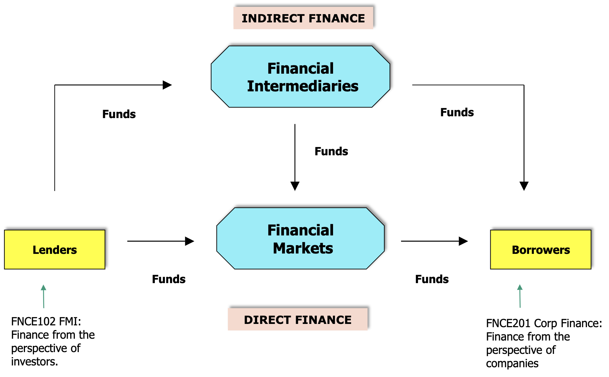

# Financial Markets and Instruments

Instructor - Ekkehart Boehmer

* auto-gen TOC:
{:toc}

### Course overview

| Component           | Week | Percentage |
| ------------------- | ---- | ---------- |
| Class Participation |      | 5%         |
| Group Project       | 13   | 25%        |
| Homework            | 13   | 10%        |
| Mid-term            |      | 20%        |
| Finals              |      | 40%        |

Class Participation

- There will be a quiz on elearn every week

Mid-term Exams

- Online due to Covid
- 2 hours
- Questions similar to exercises

Finals

- In-campus for all students in Singapore
- 3 hours
- Questions similar to exercises
- 4 short essay questions

Project outline

- Event studies of the impact of covid
- 10-page report
- 25 minute presentation
- Deliverables
  - 20 minute powerpoint presentation
  - 10 pages (excluding tables and appendix)

## Session 1 - Introduction

Learning Objectives - Chapter 1

- Real assets vs. financial assets
- The investment process and financial intermediaries
- Risk-return trade-off and efficient pricing
- The causes and effects of the 2008 financial crisis

#### Real assets vs financial assets

- real assets contribute directly to productive capacity
- boundary can be blur

Financial assets are claims on real assets.

- fixed income securities - promises of a fixed stream of income
- equity - represents ownership share
- derivatives - determined by the prices of other assets

#### The roles of financial markets

- **Informational Role** - provide information about the potential of the company, information affects prices, prices affect information
- **Comsumption Timing** - allow the investor to choose between different risk levels depending on the investor's needs
- **Allocation of Risk** - benefits companies who could issue securities at the best possible prices

(This courses focuses on the point of view of the investor)

- Portfolio - collection of investment assets
  - Asset allocation (between asset class) vs security selection (within asset class)
  - Two approaches
    - Top-down approach - asset allocation by security analysis
    - Bottom-up approach - investment based solely on price-attractiveness

Agency problem

- Arise then managers start persuing their own interest instead of maximising firm's value
- Mitigation methods
  - Compensation plans
  - Monitoring by the board if directors
  - Monitoring by outsiders - large institutional investors and security analysts
  - Takeover threat - by shareholders and other firms

Efficient markets
- One that quicking incorporates information, no underpricing and overpricing
- Risk-return trade-off

Passive management vs. active management
- Passive manager holds a highly diversified portfolio
- Active manager finds mispriced secutities at the correct timing

The market for capital

- Supplier = Households, Consumer = Firms
- Price of capital = interest rate?

Types of financial intermediaries

- Investment Bank
  - underwrite securities and issue them to the *primary market*
- Commerical Bank
  - takes deposit and make loans
- Insurance companies
- Credit unions

Measure of credit risk

- LIBOR (rate at which banks borrow from each other)
- T-Bill rates (rate at which the U.S. government borrows)
- TED (Treasury-Eurodollar) spread
  - 3-month LIBOR $-$ 3-month T-Bill
  - how much interest you earn from bank deposit company
  - higher during periods of crisis
  - measure of credit risk in the banking market

#### Causes of 2008 Financial Crisis 
Andi Lo | [Youtube](https://www.youtube.com/watch?v=DhX0PGG-baI)

- (essential to learn this because it is related to half of the suggested problems for the project)
- Consider two $1000 IOU with 10% default rate
  - Expected price $900
- **Securitization** into Senior Tranche and Junior Tranche
  - Senior Tranche will only default only if both IOU default
  - Assuming independent defaults
  - Senior Tranche
    - Expected price $990
    - Insured by big-name insurance companies as well
  - Junior Tranche
    - Expected price $810
    - Taken up by hedge funds
- However the defaults are **not independent**
  - When housing prices decrease, defaults are correlated with each other
    - Historically the defaults are uncorrelated (because housing price has been increasing)
  - If there is a perfect correlation
    - Both Tranches actually have a similar rate of default
    - Senior Tranches lost money, starting the financial crisis
  - Investors do not understand what they own
- Diagnostics 
  - Modified Perrow's Theory of Normal Accidents
    - Complex system (nonlinearities)
    - Tight coupling
    - Absence of negative feedback over an extended period of time (the modified condition)
- Can this crisis be avoided
  - Hypothetical CEO, CRO of Lehman Brothers could not do anything even if they know where they are going

## Session 2 - Asset Classes

Learning Objectives - Chapter 2 (not tested maybe)

- Understand the various asset classes and financial instruments
- An insight as to the interpretation, composition and calculation process involved in the various market indexes
- Some understanding of the basics of options and futures

(IDK) Why do government issues bills and bonds?

#### Fixed Income

**Money markets**

- Short-term debt instruments (less than one year)
- Low-risk (why - mostly backed by government?)
- T-bills
  - Short term debt issued by the government
  - Secondary market for T-bills
  - Price = $100 - nr/360$
    - $n$ the number of days
    - $r$ the prevailing interest rate

**Capital Markets**

- Treasury Notes and Bonds
  - Issued by the federal government
  - Maturities
    - Notes - Maturities up to 10 years
    - Bonds - Maturities from 10 to 30 years
  - Interest paid semiannually
- Municipal Bonds
  - Issued by state and local government
  - Exempt from federal income tax and sometimes state and local tax
  - Take taxes into account into when comparing returns
    - consider the investor's marginal tax bracket
    - take the tax percentage off it
    - (you are only paying tax on the interest earned)
- Corporate Bonds (refer to bond pricing chapter)
  - Issued by private firms
  - Usually semi-annual interest payments
  - Larger default risk than government securities
    - Unsecured (debentures) or secured
  - Options in corporate bonds
- Mortgage-backed securities
  - Proportional ownership of a mortgage pool
  - Produced by securitiszing mortgages
  - Fannie Mae and Freddie Mac in the US
    - Subprime mortgage securities

#### Equity

**Common stock**

- Ownership
- Residual claim
- Limited Liability
- Metrics
  - Dividend Yield
  - Capital Gains
  - P/E ratio

**Preferred stock**

- Fixed dividents but at the discretion of the company
- No voting rights
- (Probably some arrangement that differ from company by company)

**American Depositary Receipts (ADR)**

- Certificates traded in US market that represent ownership of a foreign company

**Stock Market Indexes**

- Weighted (price or market value) average of stock prices to top companies

#### Foreign Exchange
- Law of One Price
  - How exchange rate will return to equilibrium
- How do you even earn money from forex (nope, more like companies wanting to hedge risk)

#### Derivatives

To be discussed at the end of the course - nope?

**Options**

- Right to buy or sell, exercised only if it is profitable
  - Call Option
    - Right to buy the underlying asset at the strike price
  - Put Option
    - Right to sell the underlying asset at the strike price
- The premium is the price of the option itself
  - The party delivering the option is obliged to fulfill the option when exercised

**Futures**

- Obliged to make make or take delivery at the "futures price"
  - Long position - must buy
  - Short position - must sell
-  Futures contracts are entered without cost
  - Because the obligation lies on both parties
  - Termination is possible, at an agreed cost

## Session 3 - Capital Allocation to Risky Assets

Learning Objectives - Chapter 6

- Apply the concept of risk aversion in measuring a utility function and understand how it affects capital allocation

- Work with a portfolio that allocates funds between a risky asset and a risk-free asset

- Understand passive strategies and the capital market line (CML)

### Risk and Risk Aversion

- Difference between speculation and gambling
  - speculation - different parties assign expectations differently, and take risk in exchange for gain
  - gambling - the probabilities can be determined exactly, the risk is being enjoyed
- Risk is quantified as the variance of returns

#### Utility Function

- Motivation - which would you invest in and why
  - risk-free asset
  - speculative positions with positive risk premiums
- Function
  - $U = E(r) - 0.5 A \sigma^2$
  - Variables
    - $U =$ Utility
    - $E(r) =$ Expected return on the asset or portfolio
    - $A =$  Coefficient of risk aversion, higher more risk averse
      - Risk Averse $A>0$
      - Risk Neutral $A=0$
      - Risk Lovers $A<0$
    - $\sigma^2 =$ Variance of returns
    - $0.5$ = scaling factor
  - Mean-Variance Criterion (only applies to risk averse people)
    - Portfolio X dominates portfolio Y if both
      - The return is higher
      - The risk is lower
      - (and at least one inequality is strict)

#### Indifference Curve

  - The curve which connects all portfolio points with the same utility value
  - For a constant $U$, the curve is the relationship between $E(r)$ and $\sigma$
  - Graphing
    - $E(r)$ is the intercept, which is the utility when there is no risk
    - $A$ affects the slope, the higher the $A$, 
    - Is this the risky asset perspective or the investor prespective?

### Capital Allocation Line

- Risk control
  - One risky asset and one risk-free asset
  - $y$ is the percentage of capital allocated to risky asset
  - $y$ can be more than one - you borrow to invest
- Capital allocation line (CAL)
  - Cuts through $(0,r_f)$ and $P = (\sigma_p,E(r_p))$
    - $P$ is where all asset is allocated into the risky asset $y=1$ 
  - $S = \dfrac{E(r_p) - r_f}{\sigma_p}$
    - Known as the Sharpe ratio, risk-to-reward ratio
    - Gradient of the slope $\Delta x/\Delta y$
  - You can invest borrow to invest
    - Assumes that borrowing rate is same as lending rate $r_f$
- Capital allocation line with leverage
  - However, borrowing rate $r_f^B$ is higher than lending rate $r_f$
  - The capital allocation line is a smaller gradient beyond $P$

- Optimal Complete Portfolio
  - We want to choose $y$ such that we maximise utility $U$
    - For risk averse investor, there is an optimal $U$
  - Take derivative of the difference between indifference curve and the Capital Allocation Line and equate to zero
  - $y^* = \dfrac{E(r_p) - r_f}{A \sigma_p^2}$

Capital Market Line
- Capital market line (CML) as the CAL that is constructed from the market portfolio (instead of an individual security) and money market account (or T-bills)

Caveat

- Assumes normal distributions, may not cover black swans

## Session 4 - Optimal Risky Portfolios

Learning Objectives - Chapter 7

- Calculate standard deviation and return for two security portfolios and find the minimum variance combinations of two securities 
- Fully understand systematic and firm-specific risk
- Conceptualize the importance of diversification in a portfolio and demonstrate its risk-reduction effect by calculating and interpreting covariance and correlation coefficients

### The investment decision

- Capital allocation (risky vs. risk-free)
- Asset allocation (construction of the risky portfolio across broad asset classes)
- Security selection (individual assets within asset class)

### Market risk

- Market-wide risk sources (systematic or non-diversifiable)
  - Remains even after diversification
- Firm-specific risk (diversifiable or Nonsystematic)
  - Risk that can be eliminated by diversification

### Portfolio of two risky assets $D$ and $E$

- The return of the portfolio is the weighted average of the returns of individual portfolios
  - $E(r_p) = w_D E(r_D) + w_E E(r_E)$
- The variance of the portfolio is
  - $$\sigma_p^2 = w_D^2 \sigma_D^2 + w_E^2 \sigma_E^2 + 2 w_D^\ w_E^\ \rho_{DE}^\ \sigma_D^\ \sigma_E^\ $$
  - $\text{Cov}(r_D, r_E) = \rho_{DE}^\ \sigma_D^\ \sigma_E^\ $
  - $\rho_{XY} = \dfrac{\text{Cov}(X,Y)}{\sigma_X \sigma_Y} = \dfrac{E[XY]-E[X]E[Y]}{\sqrt{E[X^2] - E[X]^2} \sqrt{E[Y^2] - E[Y]^2}}$
    - please use all decimals in this calculation
    - one if perfectly correlated
    - negative one if negatively correlated
- **Minimum variance portfolio**
  - May not be the optimal
  - Regardless of correlation coefficient $\rho$
  - Not the optimal portfolio (unless investor is infinitely risk-adverse)
  - $w_A = \dfrac{\sigma_B}{\sigma_A + \sigma_B}$
- Minimum variance of perfectly negatively correlated portfolio is zero
  

### Optimal risky portfolio

By mixing portfolios with varying degree of correlation, we can achieve lower risk for a specified rate of return. The effectiveness of risk reduction depends on how negatively correlated are the two components of the portfolio.

#### Building an optimal complete portfolio

- Find the optimal ratio of debt and equity such that the Sharpe ratio (i.e. gradient of CAL, which is reward to variability ratio) is maximum. This will form the optimal risky portfolio.
- Depending on the investor risk aversion, find the point on the CAL such that utility is maximum. The point corresponds to a ratio of the optimal risky portfolio to the ratio of T-bill.
- You will now have an portfolio of equity, debt and T-bills.

- **Separation property.** The property that portfolio choice can be separated into two independent tasks: (1) determination of the optimal risky portfolio, which is a purely technical problem, and (2) the personal choice of the best mix of the risky portfolio and the risk-free asset.

#### The Markowitz portfolio optimization model

Instead of debt, equity and T-bills, you now have various securities and T-bills

- The Efficient Frontier 

  - Minimum-variance frontier of risky assets
  - Individual stocks are on the right of the frontier
  - Produced with optimisation, with input list of
    - $n$ estimates of expected return
    - $n$ estimates of variance
    - $n(n-1)/2$ estimates of covariance
- Diversification reduces risk

  - Portfolio variance can be reduced to zero if the average covariance is zero
  - However a diversified portfolio usually has irreducible risk due to the covariance of returns
  - Some formulas - not required I guess
-  The insurance principle

  - Risk increases less than proportionally to the number of policies when the policies are uncorrelated

  - Sharpe ratio increases (refer to debt-equity graph for example)
- The case of non-normal returns
  - "bootstrapping" to estimate the value at risk and expected shortfall for npn-normal returns - with a method I do not really understand

#### Risk reduction methods

- Risk pooling - spreading your exposures across multiple uncorrelated risky ventures
- Risk sharing - allowing other investors to share the risk of portfolio of assets
- Time diversifiation is not true diversification
  - Original strategy - year 1 risky asset, year 2 risk-free asset 
    - Risk $\sigma$, Sharpe ratio $R/\sigma$
  - Risk pooling - year 1 risky asset, year 2 risky asset
    - Risk $\sqrt{2} \sigma$, Sharpe ratio $\sqrt{2} R/\sigma$
    - Improves the Sharpe ratio, but increases risk as well
  - Risk sharing - year 1 50% risky asset,  year 2 50% risky asset
    - Risk $\sigma / \sqrt{2}$, Sharpe ratio $\sqrt{2} R/\sigma$
    - Which is same as investing 50% in two unrelated assets (diversification)
  - True diversification entails spreading a portfolio of fixed size across many assets, not merely adding more risky bets to an every growing risky portfolio

## Session 5 - Index Models

Learning Objectives - Chapter 8

- Understand how to reduce the amount of firm-specific risk in the portfolio by combining securities with differing patterns of returns
- Know the case that systematic risk becomes the relevant risk measure for the portfolio when the portfolio is adequately diversified
- Identify inputs required to use the index model and understand the characteristic line

### Single Index Model

- $R_i(t) = \alpha_i + \beta_i R_M (t) + e_i (t)$
- Variables
  - $R_i(t)$ **excess** return of security $i$ (returns above risk-free rate)
  - $\alpha_i$ expected excess return when the market excess return is zero
    - will be driven to zero if the market is at equilibrium
  - $\beta_i$ sensitivity of security $i$'s return to changes in return of the market
    - positive if the security return is positively correleated with the market return (negative and likewise)
    - market beta is one by definition
  - $R_M(t)$ expected **excess** return of the market
    - $\sigma_M^2$ is the market risk
  -  $e_i(t)$ zero mean, firm specific surprise in security $i$ in the month $t$ (residual error term)
    - $\sigma^2(e_i)$ is the variance attributed to firm-specific uncertainty
- Regression equation is used to estimate $\alpha$ and $\beta$
- If the security is well-diversified, there is no firm specific risk and $e_i (t)$ is zero.

Security risk = systematic risk + firm-specific risk

- $\sigma^2_i = \beta_i^2 \sigma_M^2 + \sigma^2(e_i)$

Covariance between two securities = product of betas $\times$ market risk

- $\text{Cov}(r_i, r_j) = \beta_i \beta_j \sigma_M^2$

Correlation between two securities = product of correleations with the market index

- $\text{Corr}(r_i,r_j) = \dfrac{\beta_i \beta_j \sigma_M^2}{\sigma_i \sigma_j} = \text{Corr}(r_i,r_M) \times \text{Corr}(r_j,r_M)$

#### Diversification with Single-Index Model

The $\alpha$ and $\beta$ of the portfolio of multiple securities is the weighted average of the component securities.

The error term of an equally weighted portfolio is $\dfrac{1}{n}\overline{\sigma}(e)$

#### Security characteristic line

For a specific security $i$, we plot excess return $R_i$ against the excess return of the market $R_M$.
- $\alpha$ is the intercept
- $\beta$ is the gradient

R-square value explains how much variation in the security is explained by the market index

Statistics on whether to reject the hypothesis that the true value of $\alpha$ is zero (low p-value, large t-statistic in order to reject)

Industry practices and observations

- Beta estimates are available in the industry. 
- Beta values evolve towards one. Beta estimates are usually adjusted in this direction.
- The challenge is to forecast alpha values (which is different from the past)

#### Optimal Risky Portfolio in the Single-Index Model

Also known as the Treynor-Black model

The market portfolio is a component in the risky portfolio

The objective is to select portfolio weights to maximise the Sharpe ratio.

$S_P = \dfrac{E(R_P)}{\sigma_P} = \dfrac{\alpha_P + E(R_M) \beta_P}{\sigma_P} $ 

> If we were interested only in diversification, we would just hold the market index. **But security analysis gives us the chance to uncover securities with a nonzero alpha and to take a differential position in those securities**. The cost of that differential position is a departure from efficient diversification, specifically, the assumption of unnecessary firm- specific risk. The model shows us that the optimal risky portfolio trades off the search for alpha against the departure from efficient diversification.

The optimal portfolio is a combination of two portfolios - an active portfolio $A$ and passive portfolio $M$.

- Input list
  - $n$ estimates of $\alpha_i$
  - $n$ estimates of $\beta_i$
  - $n$ estimates of $\sigma_M^2(e_i)$
  - 1 estimate of market risk premium $E(R_M)$
  - 1 estimate of the variance of the macroeconomic factor $\sigma_M^2$
- Sharpe ratio of optimal portfolio
  - $S_P^2 = S_M^2 + \left[ \dfrac{\alpha_A}{\sigma(e_A)} \right]^2$
- Information ratio of the active portfolio (to be maximised)
  - measures the extra return we can obtain from security analysis compared to the firm-specific risk we incur when we over- or underweight securities relative to the passive market index
  - maximized if we invest in each security in proportion to the ratio of $\dfrac{\alpha_i}{\sigma^2(e_i)}$
  - $\left[ \dfrac{\alpha_A}{\sigma(e_A)} \right]^2 = \sum{\left[ \dfrac{\alpha_i}{\sigma(e_i)} \right]^2}$
- Optimal asset weight $w^*_i$ in full portfolio
  - $w_i^* = w_A^* \dfrac{\dfrac{\alpha_i}{\sigma^2(e_i)}}{\sum{\dfrac{\alpha_x}{\sigma^2(e_x)}}}$
  - $w^*_A$ is the position in the active portfolio

Optimisation Procedure of Index Model

- To maximise the information ratio
- Results as above

How does in the index model moves the market towards equilibrium

- Stocks with positive alphas are longed
- Stocks with negative alphas are shorted

#### Comparison with Full Markowitz model

- For conservative portfolios (with lower volatility), the index model underestimates the volatility and hence overestimates performance. The reverse happens with portfolios that are riskier than the index.
- Full Markowitz model is better in theory
  - Single-index models not do take into account of correlation of security with each other not due to the market index
    - Some events may only affect one industry, and the Full Markowitz model diversifies against that
    - This result in a portfolio less optimal that the full Markowitz model
  - "Single Index model imposes an additional assumption that might not be accurate - what assumptions?"
- Merits of the index model
  - Smaller number of estimates required
    - Input list of size of $3n + 2$ instead of $2n + n(n-1)/2$
    - Security analysis is difficult
    - Estimating the convariance across industries is difficult
    - Cumulative errors may result in a portfolio that is actually inferior 

## Session 6 - CAPM

Learning Objectives - Chapter 9

- Explain the theory of the capital asset pricing model (CAPM)
- Construct and use the security market line
- Understand the zero-beta formulization and the impact that differential liquidity costs may have on expected return

#### Assumptions

- Individual behaviour
  - Investors are rational, mean-variance optimizers
  - Their common planning horizon is a single period
  - Investors all have homogeneous expectations. Perfect information
- Market structure
  - All assets are publicly held and trade on public exchanges
  - Investors can borrow or lend at a common risk-free rate, and they can take short positions on traded securities
  - No taxes, no transcation costs

#### Resulting conditions

- The market portfolio is the optimal portfolio for risky assets, and all investor will hold that portfolio for risky assets
- The market portfolio contains all securities and the proportion of each security is its market value as a percentage of total market value
- **Mutual fund theorem.** If all investors would freely choose to hold a common risky portfolio identical to the market portfolio, they would not object if all stocks in the market were replaced with shares of a single mutual fund holding that market portfolio.

Capital Asset Pricing Model, if the above assumptions hold

$E(r) - r_f = \beta \cdot (E(r_M) - r_f)$

Market risk premium at equilibirum

$E(R_M) = \bar{A} \sigma_M^2$

- $\bar{A}$ is the average investor risk aversion
- This is because the average position in the risky portfolio is one as investors borrow and lend among each other.

The risk-to-reward ratio of every security should be equal.

- Reward-to-risk ratio $= \dfrac{E(R_{GE})}{\text{Cov}(R_{GE}, R_M)} = \dfrac{E(R_M)}{\sigma_M^2}$

- $E(R_{GE}) = \dfrac{\text{Cov}(R_{GE}, R_M)}{\sigma_M^2} E(R_M) = \beta \cdot E(R_M)$

#### Security Market Line

- Capital Market Line (CML) graphs the risk premiums of efficient portfolios (and the investor will select a portfolio based on his risk aversion)
- SML graphs individual asset risk premium as a function of asset risk.
- At equilibrium, all assets should lie on the SML.
- If a stock is undervalued, the asset will be located above the SML and the $\alpha$ will be the vertical distance.
  - the price of the stock will return to equilibrium

#### Extension of the CAPM

- Zero-Beta Model
  - $E(r_i) - E(r_Z) = \beta_i [E(r_M) - E(r_Z)]$
  - This is the CAPM equation when investors face restrictions on borrowing
  - The zero beta portfolio now replaces the risk-free portfolio
  - Helps to explain negative alphas on high beta stocks (risk tolerant investors overvalue high beta stock as a substitute for not being able to leverage - an assumption of CAPM) and positive alphas on low beta stocks
- Consideration of labour income and non-traded assets
  - Many assets are not tradable
  - Some people and businesses prefer not to diversify
- Merton's Multi-period Model and Hedge portfolios
  - Merton' envisions individuals who optimize a lifetime consumption/investment plan and who continually adapt their consumption/investment decisions to changes in wealth, prices, and investment opportunities
  - The new expression generalizes the one-factor SML to a world with multiple sources of systematic risk (e.g. inflation)
  - $E(R_i) = \beta_{iM} E(R_M) + \Sigma_{k=1}^K \beta_{ik} E(R_k)$
- Consumption-based CAPM
  - An asset should be viewed as riskier in terms of consumption if it has positive covariance with consumption growth
  - Therefore, equilibrium risk premiums should be greater for assets that exhibit higher covariance with consumption growth
- Liquidity and the CAPM

  - Higher bid-ask spread (illquidity), higher averge monthly return up till a limit
  - Investors demand compensation for liquidity risk with liquidity betas (measures the sensitivity of a firm’s returns to changes in market liquidity, whereas the traditional beta measures return sensitivity to the market return).

Challenges faced by acedemic research

- Cannot observe all tradable assets
- Impossible to pin down market portfolio

Application of CAPM in the industry

- Investment industry relies on the single-index CAPM model
- Most investors do not beat the index portfolio

## Session 7 - Arbitarge Pricing Theory and Multifactor Models

Learning Objectives - Chapter 10

- Refer to textbook
- How do APT relate to multifactor models? (IDK)

#### Arbitrage Pricing Theory

- (Pure) arbitrage occurs if there is a zero-investment portfolio with a sure (risk-free) profit immediately
  - Law of One Price
    - if two assets are equivalent in all economically relevant aspects, then they should have the same price
- Assumption
  - The excess return of any well-diversified portfolio should only be affected by the systematic factor
- Procedure
  - Two portfolios with the same beta (ratio of the variance of the security to the variance of the market portfolio) should have the same return
    - Otherwise you can short the portfolio with lower return and long the portfolio with higher return at zero risk and zero investment with guaranteed returns
- Result
  - The excess return of all well-diversified portfolios should proportional to the beta
    - $E(R_P) = \beta E(R_M)$
    - It is possible to construct another portfolio to match the portfolio with a lower beta and conduct the same arbitrage
  - It is possible that some individual securities may not fulfill the return-beta relationship - the effect is small in the well-diversified portfolio

#### Comparison of APT and CAPM

Assumptions

- APT
  - The excess return of any well-diversified portfolio should only be affected by the systematic factor
  - A highly rational market will preclude arbitrage opportunities
- CAPM
  - Relies on the elusive and impossible-to-observe market portfolio of all assets that underpins the CAPM
  - Requires all investors to be mean-variance optimizers

Results

- APT
  - Some assets may not fulfil the expected return-beta relationship (since arbitrage applies on the well-diversified portfolios)
  - Even large portfolios may have non-residual risk
- CAPM
  - All securities should have the expected return-beta relationship
- Both arrive at the same security market line, and highlight the distinction between firm-specific and systematic risk
- The T-B Single Index Optimisation Procedure is similar to APT but less extreme (because risk is not zero)

#### Multifactor models

- Instead of the market return, we can have multiple factors.

$R_i = E(R_i) + \beta_{i \text{GDP}} \text{GDP} + \beta_{i \text{GDP}} \text{IR} + e_i$

- The factor portfolios ($\beta = 1$ for one portfolio and $0$ for all other factors) track a particular source of macroeconomic risk, but are uncorrelated with other sources of risk. (IDK)

Fama-French Three-Factor Model

- $$R_{it} = \alpha + \beta_{iM} R_{Mt} + \beta_{i\text{SMB}}\text{SMB}_t + \beta_{i\text{HML}}\text{HML}_t + e_{it}$$
- HML - High Minus Low (book-to-market ratio)
- SMB - Small Minus Big (market capitalisation)

## Session 8 - Efficient Market Hypothesis

Learning Objectives - Chapter 11

- Understand the concept of market efficiency
- Differentiate among the three forms of market efficiency
- Know how to make rational investment decisions based upon efficient markets
- Identify different tests of market efficiency and understand market anomalies

#### Assumptions of efficiency

- (either conditions leads to efficiency)
- Investors use information in a rational manner
- Deviations from rationality, if they happen, are independent from each other and cancel out across investors.
- Arbitrage is possible and profitable.

If the market is efficient

- It is not possible to "beat the market" (consistently earning a positive excess (w.r.t. market) return)
- Does not mean that the market has perfect foresight (but rather information are fully incorporated into prices for efficient resource allocation)

- Benefits of an efficient market
  - Overvalued securities can raise capital too cheaply
  - Undervalued securities may pass up profitable opportunities because cost of capital is too high

Is the market really efficient

- Most managers do not do better than the passive strategy
  - Stock Market Analysts
  - Mutual Fund Managers
    - Ranking of quarterly performance one quarter does not carry on to the next quarter
  - Investment superstars
    - There are some investment superstars that consistently performed better than the market
- Issues with claims of market inefficiency
  - Magnitude issue - need to scale
  - Selection Bias issue - only successful people boast of their investments
  - Lucky Event Issue

- Role for portfolio management even if market is efficient
  - Diversification
  - Risk selection
  - Prepare input
  - Tax considerations

#### Weak-form efficiency

- If weak form efficient
  - Stock prices only reflect information that can be derived by examining market data (prices and volume)
  - It is not possible to profit from technical analysis (using past prices and volume information to predict future prices)
- Testing market weak form efficiency with return over short horizons
  - Serial correlation - tendency for stock returns to be related to past returns - stronger for best and worst performers
  - Momentum effect
    - Good or bad recent performance continues over short to intermediate horizons (3-6 months)
    - Stronger positive serial correlation for top and worst performers
      - Suggestion - invest on top the 10% of a current best performers and sell them in 6 months
  - Reversal effect
    - Over a year or longer
    - In which losers rebound and winners fade back, suggests that stock market overreacts to relevant news
  - How are these two observations consistent with each other?
- Predictors
  - Fama and French - higher dividend ratio higher return
  - Campbell and Shiller - earnings yield
  - Keim and Stambaugh - bond spreads

#### Semi-strong form efficiency

- If semi-strong form efficient
  - Stock prices reflect all historical and current public information, but not inside information
  - It is not possible to profit from fundamental analysis (using economic and accounting information to predict stock prices)
- Expected events should not affect prices
  
  - Unexpected events with information content should instantaneously be compounded into prices (does not happen)
  
- Testing market semi-strong form efficiency  with event studies

  - Computing abnormal returns
    - The abnormal return due to the event is the difference between the stock's actual return and a proxy for the stock's return in the absence of the event (use market return)
    - Follow instructions, read textbook

  - Three basic ways of how new information gets into stock prices
  - Efficient Market Reaction
    - Delayed Reaction
    - Overreaction or Correction

- Anomalies
  - List of anomalies
    - Small firm anomaly
    - Book-to-market anomaly
    - Post-earning announcement drift
- How to interpret the anomalies
    - Fama and French - risk premiums (HML and SMB betas)
    - Inefficient markets
  - Effects of anomalies has been declining
  
    - However some anomalies remain
    - The conventional performance benchmark today is three Fama-French + momentum factor

#### Strong-form efficiency

- Even insiders cannot beat the market

  - Not observed

- Regulation - SEC requires all insiders to register their trading activity

  

## Session 9 - Bond pricing

Learning Objectives - Chapter 14

- Refer to textbook

Types of bonds
- Government bonds
- Corporate bonds

Features of corporate bonds

- (consider whether the features make it better for the bond holder, and its impact on the price)

- Callable bonds - Can be repurchased before the maturity date
- Convertible bonds - Can be exchanged for shares of the firm's common stock
- Puttable bonds - Give the holder an option to retire or extend the bond 
- Floating-rate bonds - have an adjustable coupon rate (e.g. by inflation)

Preferred stock

- How is it like fixed income 
  - Payments are typically fixed
- How is it like equity
  - Dividends are paid in perpetuity
  - No tax break
  - Nonpayment does not mean bankruptcy

International bonds (IDK)

- Foreign bonds
  - Eurodollar
  - Euroyen
  - Eurosterling
- Eurobonds
  - Yankee bonds
  - Samurai bonds
  - Bulldog bonds

Some innovation

- Asset-backed bonds (backed with collateral or revenue)
- Catastrophe bonds (no/less repayment if disaster happens)
- Indexed bonds (bond return depends on an index such as oil index)

#### Bond Pricing

Timeline of a bond

- Issuer issue a bond at price $P$
- At the end* of every period, issuer pays out $C$
  - Current yield = $\dfrac{C}{P}$
  - Coupon rate = $\dfrac{C}{\text{par value}}$
- Effective annual return = $\left(1 + \dfrac{C}{\text{par value}} \right)^{n} - 1$
  
- At maturity, the issuer pays the $\text{par value} = 1000$
- The market interest rate is the discount rate $r$ of the period.
  - The higher the market interest rate, the lower the price of the bond (because might as well invest in other bonds or opportunities)

Present value of bond
$$
P = \dfrac{1000}{(1+r)^T} + 
\sum_{t=1}^{T} \dfrac{C}{(1+r)^t}
$$

Limitations

- Does not take into account of default risk (considered inside $r$)
- Enroll into fixed-income course for further studies.

Yield of maturity

- The bond's internal rate of return.
- The interest rate such that the present value of the bond payments is equal to its price
- This assumes that bond coupons are reinvested at YTM rate.
- Premium and discount bonds
  - Premium bonds - coupon rate > current yield > YTM
  - Discount bonds - coupon rate < current yield < YTM

Price of callable bond

- Yield-to-call
  - Yield to maturity but for callable bonds
  - The market interest rate such that it is better the issuer to call the bond

Holding period return (HPR)

- Changes in rates affect returns
- Coupon payments can be invested
- It is the rate of return over a particular investment period (not necessarily until maturity)
  - The bond price can change at the end of the period
  - Can only be forcasted

Bond pricing

- Based on default risk
- Rating companies - Moody, S&P, Fitch
- Default risk premium
  - The difference between expected YTM and the promised YTM

Determinants of Bond Safety

- Coverage ratios
- Leverage ratios, debt-to-equity ratio
- Liquidity ratios
- Profitability ratios
- Cash flow-to-debt ratio

Altman Z-Score

- EBIT, sales, retained earnings, working capital over assets
- Equity over liabilities
- $Z < 1.23$ - vulnerable to bankruptcy
- $Z > 2.90$ - considered safe (larger safer)

#### Bond risk management

Bond indentures (additional features of bonds to reduce risk - this arrangement only involves the issuer and issuee)

- Sinking funds - a way to call funds early
- Subordination of future debt - restrict additional borrowing
- Dividend restrictions - force firms to retain assets rather than paying them out to shareholders
- Collateral - assets that bondholders receives if the firm defaults

Credit default swaps

- Insurance policy on the default risk of a corporate bond
- Buyer pays annual premiums
- Issuers agrees to buy the bond in a default

Collateralised debt obligations

- Loans are pooled together and split into tranches
- Refer to Andy Lo

## Session 10 - Investment Companies

Learning Objectives - Chapter 4

- Describe the different types of investment companies
- Identify key differences between open-end and closed-end investment companies
- Describe mutual funds’ investment policies, the services they provide, and the expenses associated with investment in them
- Calculate mutual fund NAV and return

Instead of direct ownership of securities, you invest through investment companies. 

Services provided by investment companies

- Record keeping and adminstration (inheritance management)
- Diversification and divisibility (?)
- Professional management
- Lower transcation costs compared to buying shares or bonds directly

#### Types of investment companies

- Unit Investment Trusts
  - Fixed portfolio of uniform (?) assets
  - Unmanaged (?)
  - Examples?
- Managed Investment Companies
  - Open-End (aka **Mutual Funds**)
    - Issues shares when investors buy, redeems shares when investors cash out, priced at net asset value
  - Closed-End
    - Shares outstanding is constant, investors cash out by selling to new investors
    - Possible for closed-end funds to be bought or sold at a premium or discount
- Other investment organisations
  - Commingled Funds
    - Partnerships of investors that pool funds
  - Real Estate Investment Trust
    - Invest in real estate
    - Highly leveraged with loans secured by real estate, typical debt ratio of 70%
    - (most popular in Singapore)
  - Hedge Funds
    - Private partnerships to allow only minimal SEC regulation

#### Types of Mutual Funds

- Money Market
  - Money market securities
- Equity
  - Concentrates in equity
  - Sector funds
    - Equity funds that concentrate on a particular industry
- Bond
  - Concentrates in the fixed-income sector (bonds)
- International
  - Funds that invest in securities worldwide, may focus on a particular part of the world
- Balanced
  - Funds that become more conservative at the investor ages
- Fund of funds
  - Funds that invest in shares of other mutual funds
- Asset allocation
  - ???
- Index
  - Try to match the performance of a broad market index

- (Refer to the book for the distribution of wealth)

#### How funds are sold

- Direct-market funds
- Sales-force distributed
  - (The funds are solicted to the investors?)
  - Potential conflicts of interest (because the broker want commission and you want returns)
- Financial supermarkets (?)

#### Cost of Investing in Mutual funds

- Operating expenses (the rate charged is the expense ratio), annually
- 12 b-1 charge, annually (included in operating expenses?)
- Front-end load at purchase
- Back-end load at sale

Why would mutual funds prefer instituitonal investors
- Trust that they do not take advantage of asymmetric inforation
- Instituitonal investors enjoy lower fees (even zero?)

#### Investment Valuation

**Net Asset Value (NAV)**

- $\dfrac{\text{market value of asset} - \text{liabilities} }{\text{number of outstanding shares}}$
- "Market value" because we care about the current value of the asset rather than the price it was bought at (by accounting standards)
- Expenses will affect the NAV (including back-end load)

Rate of return

- $\dfrac{\text{NAV}_1 - \text{NAV}_0 + \text{dividend distributed} + \text{capital gain distributions}}{\text{NAV}_0}$
- $\text{NAV}_0$ is before all expenses (but after front-end load)
- $NAV_1$ considers all expenses
- Capital Gain Distributions should not already be considered in $\text{NAV}_1$

**Turnover ratio of portfolio**

- Fraction of the portfolio that is replaced in each year
- $\dfrac{\text{amount of asset sold}}{\text{amount of starting assets}}$
- Amount of asset bought in the period not considered in the turnover ratio

**Exchange Traded Funds**

- (where do I put this?)
- Advantages
  - Can be traded continuously like stocks
  - Can be sold short or purchased on margin
  - Lower cost
  - Tax efficient
- Disadvantages
  - Prices can depart from NAV (lose out to arbitrageurs)
  - Must be purchased from a broker
- Please go an understand exactly how it works
- It this a mutual fund?
- Difference between indexed fund and ETF?

## Exam checklist

#### Recall list

(content that you should memorise and recall)

- The roles of financial markets (3)
- Causes of 2008 financial crisis (story)
- CAPM assumptions (3+3) and result (2)
- Comparison of APT and CAPM (4+2)
- Assumptions and market efficiency (3), outcome (2) and validity
- Weak, semistrong, strong-form efficiency
- Features of corporate bonds (4)
- Bond innovations (3)
- Bond indentures (4)
- Types of investment companies (3)
- Types of mutual funds (8)
- How funds and sold (3)
- Cost of investment (5)
- Exchange Traded Funds, advantages (3) and disadvantages (2)
- Input list of Markowitz portfolio optimization model

#### Possible essay questions

- How did the market crash of 2008 happen?
- Describe how the following theories describe how the market reaches equilibrium
  - Capital Asset Pricing Model
  - Index Models
  - Arbitrage Pricing Theory
- Explain how the following theories allow the investor to produce an optimal investment strategy
  - Capital Asset Pricing Model
  - Index Models
- Is the Index Model inferior to the full Markowitz procedure? (1+1)
- Are market really efficient?
- Advantages and disadvantages of financing with equity and financing with debt

#### Calculation Checklist

(before you submit your paper)

It is return $r$ or **excess** return $R$?

Is it an **expected** value or measurement?

Is it **variance** or **standard deviation**?

Does the risk and return refer to a individual security or a **well-diversified** portfolio

**Percentage** values, and when **squaring** them (but please use all decimals)

Bid price is always smaller than ask price