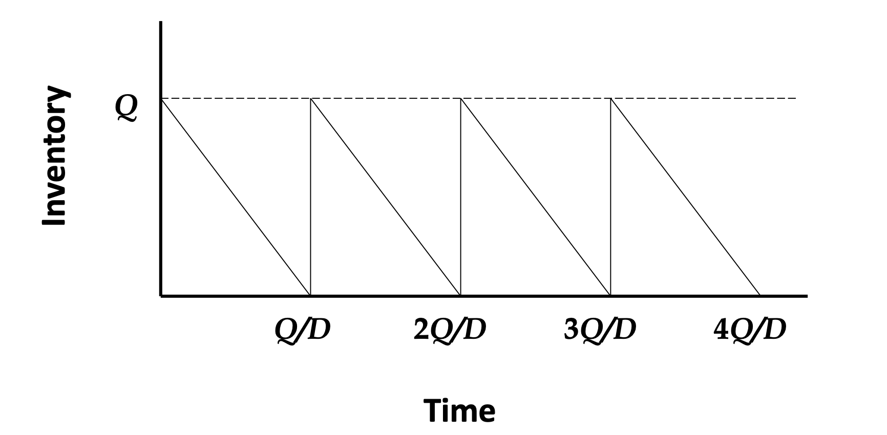

# Supply Chain Management

Instructor - Alan Zeller

* auto-gen TOC:
{:toc}

### Course overview

| Component           | Week  | Percentage |
| ------------------- | ----- | ---------- |
| Class Participation | -     | 10%        |
| Group Homework      | 5, 13 | 20%        |
| Group Project       | 12    | 20%        |
| Finals              | 15    | 50%        |

Course structure

- First part is more quantitative, second part is more qualitative (with guest lectures)
- At the end off the class, everybody is to mention one thing you have learnt
- Please email the prof at the end of the class if you are unsure of anything, or feedback (optional)
- Slides are made by Sarah Gao Yini, midterms and finals are same as the other section

Group Homework

- 2 case studies (second homework is pass-fail)
- Submit a summary (max 4 pages) to answer the questions

Group project

- The group will select a company, conduct indepth analysis of its existing supply chain and logistics processes. Make recommendations for improvements.
- 20 + 10 minute presentation

Course objectives

- Examine the link between supply chain strategy, structures and logistical capabilities in a firm or supply chain.
- Develop solutions for a variety of supply chain management and design problems.
- Understand the complexity of inter-firm and intra-firm coordination in implementing programs such as e-collaboration, quick response, vendor-managed inventories and strategic alliances.
- Design logistics systems and associated KPIs.
- Formulate integrated supply chain strategy, so that all components are not only internally synchronized but also tuned to fit corporate strategy, competitive realities and market needs.
- Analyze and explain how the behaviors and strategic decisions of individual entities of the supply chain impact the performance of the firm as well as the entire supply chain.
- Rationalize some of the current practices in the industry.
- Think analytically in order to successfully apply their knowledge and technical expertise learnt during the course to solve a variety of real business problems.

## Session 1 - Overview

Stages of supply chain (more of a network)

- supplier, manufacturer, distributor, retailer, customer

Flows in a supply chain (**<u>and sources of cost</u>**)

- product, information, funds

Objective of a supply chain

- Maximise overall supply chain surplus (i.e. profit)
- Supply chain surplus
  - Customer Value - Supply Chain Cost
  - Consumer surplus + Supply Chain profitability

Pillars of supply chain

- plan, source (buy), make, deliver, return, enable (software)

Three phases of Supply Chain Management
- strategy/design (configuration)
- planning (forecasting)
- operation (execution)

Views of supply chain
- Cycle view
  - Performed between two successive supply chain stages
  - Customer Order / Replenishment / Manufacturing / Procurement Cycle
- Push/pull view
  - Whether the processes is executed in response (pull) or in anticipation (push) of a customer order
  - Whether the product/service is time sensitive
- Macro processes
  - Supplier Relationship Management
  - Internal Supply Chain Management
  - Customer Relationship Management

Strategic Fit

- The consistency between customer priorities of competitive strategy and supply chain capabilities specified by supply chain strategy
- How to achieve
  - Identify the needs of the customer segment being served (quantity, expected response time, variety, service level, price, innovation)
  - Understand demand uncertainty and supply uncertainty (implied uncertainty)
  - Understand supply chain capabilities
    - Cost-Responsiveness Frontier
      - Responsiveness - high service level, short lead times, handle wide range of quantities, handle a variety of product, meet a very high service level
      - e.g. minimise cost for 97% service level
  - "Zone of strategic fit"
    - Uncertain demand need **responsive** supply chain
    - Certain demand need (cost) **efficient** supply chain
    - Agile intercompany Scope - firms must have the ability to become part of new supply chains while ensuring strategic fit
- Challenges to achieving strategic fit (examples)
  - Multiple products and variety
  - Shortening product life cycles
  - Trade barriers

## Session 2 - Drivers and Metrics

- Financial Metrics (need to interpret)
  - ROE 
    = Net Income / Average Total Equity
  - ROA 
    = Earnings before Interest / Average Total Assets 
    = (Net Income + Interest Expense - Tax Shield) / Total Assets
    = Profit Margin ✕ Asset Turnover
    - interest is excluded because we are not interested in how the asset is financed
  - Profit margin = Revenue / Cost of Goods Sold
  - ROFL return on financial leverage = ROE - ROA
  - Turnovers
    - (number of times x get replaced in a year)
    - APT payable turnover = sales revenue / accounts payable
    - ART receivables turnover = sales revenue / accounts receivable
    - INVT inventory turnover = cost of goods sold / inventory 
      - the numerator is COGS we because we are not intersted in the margin
    - C2C cash-to-cash cycle
      + 1/inventory turnover + 1/receivables turnover - 1/payable turnover
      + negative is favourable
      + "How fast the company turns its inventory to cash"
    - PPE turnover = sales revenue / PPE
  - Markdowns - discounts required to convince customers to buy excess inventory
  - Lost sales - sales that did not materialise because of inavailability 

**Supply Chain Framework**

(What is the difference between competitive strategy and supply chain strategy?)

**Drivers of Supply Chain Performance**

- For every driver
  - Description, role in supply chain and competitive strategy
  - Decisions (from the tradeoffs)
  - Metrics (financial and non-financial)
  
- **Logistical Drivers**
  - **Facilities**
    - Where/how to build/store
    - Tradeoffs
      - Responsiveness vs efficiency
      - Other tradeoffs as well - e.g. due to trade war
    - Places where inventory is stored, assembled or fabricated
  - **Inventory**
    - How much to store
    - To address the mismatch between supply and demand
  - **Transportation**
    - How to deliver
- **Cross Functional Drivers**
  - **Information**
    - Gather data and use
      - to improve the utilization of supply chain
      - to improve the coordination of supply chain flows
  - **Sourcing**
    - Purchase goods and services
  - **Pricing**
    - Set effective prices

## Session 3 - Network Design

Factors influencing distribution network design

- Response time, Product variety, Product availability, Customer experience, Time to market, Order visibility, Returnability

With increasing number of facilities

- Reponse time
  - Smaller response time
- Cost
  - Larger inventory cost (loss in economies of scale)
  - Larger facility cost
  - Greater inbound cost (need to distribute to many)
  - Smaller outbound cost (nearer to demand)

Strengths and weaknesses of various distribution options

- Design options

  - Will the product be delivered or picked-up?
  - Will the product flow through an intermediary?

- Distribution network designs

  | Storage                     | Shipping                     | Example                                  |
  | --------------------------- | ---------------------------- | ---------------------------------------- |
  | Manufacturer                | Direct Shipping              | eBags                                    |
  | Manufacturer                | Direct with in transit merge | Dell (direct selling)                    |
  | Distributor                 | Carrier                      | **Larger goods**                         |
  | Distributor                 | Last mile                    | **Smaller goods**                        |
  | Manufacturer or Distributor | Customer Pickup              | Car (different pickup sites with retail) |
  | Retail                      | Customer Pickup              | Supermarkets                             |

  - Consider Product, Information and Customer Flow
  - "X" Storage with "Y"

Impact of online sales

- On customer service
  - Response time to customers (less likely to out-of-stock, no delay in information)
  - Product variety (easier to offer larger selection)
  - Product availability (information)
  - Customer experience (improved access / customisation / conveinence)
  - Time to market (fast)
  - Order visibility (easier)
  - Returnability (harder)
  - Direct sales to customers (social media)
  - Flexible pricing, portfolio and promotions
  - Efficient funds transfer
- On cost
  - Inventory (aggregation, improved coordination)
  - Facilities (allows centralised operations and self-order)
  - Transportation (due to increased outbound costs)
  - Information (low cost to set up e-business)

Network Design Decisions

- Capacitated Plant model (Network optimisation model) - Facility Location & Capacity Allocation
  - Decision variables
    - Whether to locate the plant in each candidate location
    - How much to ship (from plant to demand)
  - Objective function - minimise cost of
    - Shipping cost
    - Operation cost of plant
  - Constraints
    - All demand must be met
    - Plants cannot produce more than capacity

- Gravity Location model
  - Decision variables
    - Where to locate the plants (no candidates given)
  - Objective function - minimise cost of
    - Shipping cost (Euclidean distance)
  - Constraints
    - All demand must be met
    - Total number of plants is limited (?)

Amazon delivery network

- In the warehouse for Amazon Prime (2 hour delivery), goods of the same type are scattered randomly around the warehouse rather than centralised within one point. (surprising)
- The Amazon picker (a human) will pick the item and put it into a basket.
- The picker will pick the next nearest item, not the first-placed or last-placed item. These items will therefore need to be randomly placed.
- The information system needs to complement such arrangement.

## Session 4,5,6 - Inventory Management

Refer to SUTD [notes](https://tonghuikang.github.io/notes_ESD_term12/mso/summary.html)

Reasons for Inventory

- Pipeline inventory - there is inventory as the goods go through the process
- Seasonal inventory - if demand and supply have different seasonality
- Cycle inventory - benefits to process flow units in batches (e.g. truckload)
- Decoupling inventory - allows for temporary breaks in process
- Safety inventory - protects the flow rate from unpredictable variations in demand or supply

Comments on appliability of model

- Hard to quantify missing sales because it is not recorded.
- Decision biases - do not order enough high-margin products, order too many low-margin products (optimal ordering can be counterintuitive)
- Recommendations for inventory management - improve forecast accuracy, risk-sharing, influence demand, make supply reactive (might need a different inventory model)

## Session 6 - Pricing and Revenue Management

Please refer to [math.md](./math.md)

## Session 7 - Supply Chain Coordination

<u>**Bullwhip Effect**</u>

- Fluctuations in orders increase (exaggerated) as they move up the supply chain from retailers to wholesalers to manufacturers to suppliers.
- Impact of bullwhip effect
  - Costs increase - manufacturing, inventory, transportation, labour
  - Reduced product availability
  - Increased replenishment lead time
  - Worsened relationship within the supply chains

Obstacles to coordination in a supply chain, and solutions

- Incentive
  - Causes - local optimisation, sales force incentives
  - Solutions - align goals and incentives to maximise total profits, change sales force incentives in sell-in (to retailer) and sell-through (by retailer)
- Information Processing
  - Causes - distorted demand from different stages of the supply chain, lack of information sharing
  - Solutions - information sharing (e.g. inform if there is promotions), forecast based on actual customer demand.
    - Point of sale data (learning about how much is being sold is better than relying on retailer order size)
    - Collaborative Planning, Forecasting and Replenishment (CPFR) with retailers
    - Single-stage control of replenishment - Continuous replenishment programs (the wholesaler or manufacturer replenishes a retailer regularly based on POS data), **<u>Vendor managed inventory</u>** (the manufacturer is responsible for all decisions regarding product inventories at the retailer, inventory is owned by the manufacturer)
- Operational
  - Causes 
    - meet end-of-period sales quotas, spend end-of-period budgets
    - large replenishment lead times (interpretation of change in demand)
    - rationing and shortage gaming (buyers inflate orders during shortage, canceling orders when there is excess)
  - Solutions - reduce lot sizes, reduce replenishment time, rationing based on past sales
- Pricing
  - Causes - price fluctuations, lot-size based pricing (large orders are offered a smaller unit cost)
  - Solutions - **<u>encourage smaller lots</u>**, stabilizing pricing
- Behavioural
  - Causes
    - Each stage of the supply chain views its actions locally
    - React to the local situation rather than trying to identify the root cause
    - Blame each other for fluctuations
    - No learning from actions over time
    - Lack of trust, lack of information sharing
  - Solution - build trust and partnerships

## Session 8 - Global Supply Chain Networks

The total cost of offshoring decision

Risk arising from offshoring

Risk Mitigation Strategies for offshoring

## Session 9 - Sourcing Decisions

Key outsourcing questions

- Will the outsource party increase the supply chain surplus relative to performing the activity in-house?
- How much of the increase in surplus does the firm get to keep?
- To what extent do risks grow upon outsourcing?

How do third parties increase supply chain surplus

- Capacity Aggregation
  - Aggregate demand across multiple firms and gaining production economies of scale
  - e.g. Third party manufacturer like Foxconn
- Inventory Aggregation
  - Reduce the safety inventory as demand is aggregated
  - e.g. Brightstar which aggregate phones made in Asia 
- Transportation Aggregation
  - Why run your transportation/delivery system when you can pay someone to do it cheaply and reliably?
    - transportation intermediaries - aggregate transportation function
    - storage intermediaries - aggregate inbound and outbound transportation
- Warehouse Aggregation
  - e.g. warehouses integrated with the ecommerce platform.
- Receivables Aggregation
  - Zuellig Pharma - Pharma manufacturers no longer need to take receivables risk of doctors not paying up
- Procurement Aggregation
  -  Zuellig Pharma from the doctor's prespective, you do not need to buy from every manufacturer
- Information Aggregation
  - e.g. eBags is a single point of display of information for both sellers and buyers. Not every manufacturer should create their own sales website
- Relationship Aggregation
  - Decrease the number of relationship between buyers and sellers, increasing the size of each transcations and decreasing the number of transcations
- Lower costs and higher quality
  - Sustainable if these benefits come from **<u>specialisation and learning</u>**

Risks of outsourcing

- Broken process (do not outsource because you lost control of the process)
- Underestimation of cost of co-ordinations
- Reduced customer/supplier contact
- Loss of internal capability and growth in third party power
- Leakage of sensitive data and information
- Ineffective contracts
- Loss of supply chain visibility
- Negative reputational impact

Factors influencing growth of surplus

- Scale - if you are doing it in a large scale already, third party usually cannot do it better
- Uncertainty - more uncertainty in demand, more surplus
- Specificity of assets - if the asset is specific (e.g. luxury call center), you cannot grow the surplus

Examples when you cannot and should not aggregate

- If your company is big enough you can be the aggregator and do not need to outsource - e.g. Amazon
- International SOS - they cannot aggregate call centres from different regions due to different accents. What they did is to offer the concierge to luxury brands like Ferrari.

## Invited Talks

#### Au Yang Sian - Ferrero

- Past colleague of prof at SOS
- Director Supply Chain Operations, Ferrero

LinkedIn description
- Taught the distributor about S&OP and logistics management 
- Implemented S&OP, S&OP canvass and Forecasting and replenishment management (FARM) tool for the supply chain team
- Successfully obtained Halal certification and Standard National Indonesia (SNI) for Indonesia by working with their government agencies
- Handled and closed the litigation issue with ex-distributor
- Introduced new technology into the department such as the Optical Character Recognition for Customer service team. Was interviewed and appeared on social media.
- Forged a strong team both internal and external
- Tackled parallel import issue from other regions into APAC

Slide Content (Food Supply Chain)

- Freshness - Shelf life, Humidity control (data logger at various parts of the container, end-to-end monitoring), Warehousing (independent air circulation)
- Contaimination - Risk of contaimination from local packers
- Regulatory - Each country has laws and **require license**, Health Science Authority (Singapore) mandated product recall and counterfeit raid, corruption and coffee money and Mr Ferroro
- Religious - Halal regulations (need to bring government officials to the entire supply chain), marketing regulations
- Environmental - Palm oil, NGO pressures and RSPO, need to interview supplier e.g. use child labour in harvesting coaca
- Certification - Suppliers need to get **certification**, HACCP and ISO 22000
- Market Practice - Retailer expectation shelf life is 50% of remaining shelf life, maintain FIFO or else retailer will not accept, handle disposal to prevent goods flowing into the grey market. 
- Seasonal Effect - 15 trucks during normal times and 50 trucks during Christmas need to negotiate in advance. Ramandan port closure
- Supply Chain planning process - during budgeting, assign the supplies the bigger countries, smaller countries act as fillers, subjected to Halal constraints
- Food Waste Problem - safety is still number priority, forecast feedback, both "sell in" and "sell through" KPI
- Departments - product management, planning (forecasting), logistics (3PL), shipping (FTA), customer service
- Future planning - Ferrero purchased coaca farms to secure supply
- Valuedollar - authorised and parallel import (legal, and in) and counterfeit
- Price controls - discount marketing affects the brand, business problem rather than supply chain problem
- Sales and Operations Planning - forecast to factory, inventory as a buffer, how to resolve conflict between sales and operations, forecast needs to be supported with reasons and facts (sales building block)
- Life story - talked about statistical model on betting for UK football, advice to talk to something in the company before getting a job

#### Jonathan Chee - Sinco

- Sinco Chief Operating Officer

  - https://www.linkedin.com/in/jonathan-chee-4bb288162/
  - CEO started Sinco in Singapore https://www.linkedin.com/in/bryan-lim-055b232b/

- Summary of setbacks in life

- The middle phase
  - The initial phase is actually ok, due to hope
  - The end phase is the where the rewards are leap
  - Example of commitment to Magic Leap which failed

- Consider the gross margins in phone component manufacturing

- Use of framework for decisions
  
- Gut feeling is bad, framework is like flight instrument
  
- How Apple manages supply chain risk
  
- Suppliers must license their "exclusive" methods out, if there is
  
- US-China decoupling
  - Not just accounting cost, you also need to consider cultural distance
  - Expertise needs to be migrateable from source 
  - Destination also need to be able to accept expertise

#### Andrei - Alcott Global

- Supply Chain
- Top trends in supply chain
  - Digitalisation
- What skills do you need in response to these trends?
  - Soft skills
    - Collaboration (school projects)
    - Creativity
    - Negotiation, communication (sales)
    - Emotional intelligence
  - Hard skills
    - Data management (e.g. when you procure a company with a different IT system)
    - Accounting, financial statements
    - Problem understanding and solving
    - Cross cultural understanding
    - Ethics and law

- Career
  - Superpowers. Success stories. Make them visible.
  - Activity on LinkedIn - how someone got a job - participate in events, write summary and tag speakers **(need to show interest and effort)**
  - Interview - it is a conversation to convince the interviewer. Ask what are they trying to solve with the hire.
  - Network - you need to talk to people. You need to connect with someone in the company.
- Prof's comments
  - Three criteria he looks for in an interview
    - Learner - nobody arrive in the job knowing about the job. "What discoveries have you made in the past 3 months?"
    - Resilience - must not give up during stress time
    - Relationship - someone able to build relationship, people need to like you, you will be selling projects internally. Performance review question - "What relationships have you made in the past 3 months?"
  - Has never got a job without any connections
  - Hiring managers hire people that they like, especially so as there are many competitors
  - The best time to connect to headhunters is when you are currently hired

## Presentation

Applies to all presentations

- What makes their supply chain unique?
- Why is this a supply chain presentation?
- Is it just marketing?

**Starbucks**

- History
- CSR initiatives (feels like CSR review rather than relevant to supply chain)
- Is the displayed initiative just for show? Does it really have impact.
- It is indeed true that the taste of coffee is standardised throughout the world? Is it really a big deal?
- Ask about difference with competitors?
- Greenhouse - feasibility, reduce transportation costs? Cost of coffee beans in a cup of coffee sold, and how much is your proposed alternative?

**Lego**

- The story of lego
  - Outsource, in-house, and outsource again
  - Whether to diversify or to focus
  - Why Lego tumbled and how Lego was revived

**Nike**

- History of Nike supply chain strategy
  - "Sweatshops"
  - Triple double strategy

**Loreal**

- Why is the cash-to-cash cycle so different for the industry partners - it is like more than a hundred days? Why can't competitors have such a favourable cash-to-cash cycle?
- Do they actually sell to badly connected 

**Exxon (LNG)**

- Learnt about LNGs

## Crisis Management

Risk management and crisis management
- risk management considers likeliness and severity
- crisis management also considers event that are below the threshold of what a risk manage will consider
  - crisis management also happens before the event happens.

Crisis management and crisis communication
- Crisis management deals with the reality
- Crisis communication deals with the perception
- Good crisis communication but bad crisis management
  - Air Asia 8501
- Bad crisis management but good (?) crisis management
  - BP oil spill
  - Horrible communication, British accent

Low-probability, high-impact situation
- perceived by critical stakeholders to threaten the viability of the organisation
- personally and socially threatening to invididual
- decision making is pressed by perceived time constraints and colored by cognitive limitations

Example of crisis
- AirAsia plane crash
- BP oil spill

Classification of crises
- Technical / Economic (tangible aspects) vs Societal (people-related)
- Internal (your organisation created it) vs External (other forces)

Causes
- Culture of the company (NASA and O-ring subcontractor)
- Faulty rationalisation that hinder CM efforts (won't happen, we can save ourselves, something to will save us, done enough already)

Effective crisis communication
- Are industry-standard scripted explanations the best response?
- Note that lawyers look after the company interest, PR department look after the reputation of the company.

Crisis readiness
- You cannot prepare for every possible crisis
- You can prepare for each category of crisis, each possible crisis has a similar set characteristics

Crisis readiness checklist

- Business Continuity Planning (BCP)
  - practical logistical plan for how an organisation will recover and restore after a disaster has occurred	
  - e.g. SMU has required courses to be held online for one week for every term
  - ISO requirement

- Judgement and desicion making
  - Check your biases
  - It is easy to miss something that you are not looking for

## Miscellaneous

- Importance of Supply Chain Management
  - Jeff Bezos the richest man in the world runs a supply chain company
  - Tim Cook is Chief Operating Officer of Apple, which is the first $2T company
- Licensing of pharmaceuticals
  - License for Manufacturing, Distributor, Retailing are separate. Vertical integration is possible nevertheless. Every step of the supply chain has skills, "to protect the end consumer". Consider the case of a recall. 
  - Supply chain can be complex, it is a network rather than a chain
- Flows in a supply chain
  - Product, information, funds (may not happen at the same time)
- Takeaway from class understand from the perspective of supply chain 
  - important no matter which role you are in the company
  - as an informed citizen discussing on policy
- Tackling niches
  - How the idea of selling diapers online worked ($500 million acquisition)
    - Half of Amazon's shipments are empty (bubbly wrap etc)
    - Half of Amazon's warehouse are empty
    - Predictable demand of diapers helps
- Stocktake

  - 120 working days to please the auditors, but could not enter into the software
  - RFID - First-Aid box and life jackets in planes

- Emergency distributors
  - Case Study
    - Fukushima Daiichi nuclear disaster
    - How to stock and deliver Potassium Iodide
      - 5-years shelf life
      - US25 per treatment 
    - Your company offers membership to export medical supplies all over the world in times of crisis
  - Should the distributors keep stock? Why and how much?
    - Should not keep stock, it is not profitable
      - Crisis are very unpredictable
      - It is not profitable to stock every possible item - nobody would pay that membership fee
    - Should only serve as a advisor and matchmaker
      - The membership fee covers this
      - The client is to buy and store the advised stock
      - Possible to negotiate contracts with supplier to produce emergency stock
      - Push the risk to the supplier and the client
  - How should you deliver the stock if you have it?
    - Very likely to be impounded by the customs for public good, regardless how much you paid to prepare for this
    - The client should have the stock on site

Additional notes on offshoring

- Arbitrage opportunity has been diminishing (labour cost in China no longer cheap)
- Brain drain (e.g. Bulgaria) reduced the abundance of skill labour
- Nationalistic concerns affecting the demand
- You cannot take for granted the free movement of goods (medical supplies during a pandemic)

Dabbawala system

- Key learning according to prof 
  - How to get extraordinary results from ordinary people (dabbawala)?
- How to obtain high service performance
  - Organisation
    - Flat structure, equal pay, the train (the problem and the solution), partnership, charity trust
  - Management (what gets done and when)
    - Daily lunchtime (only after delivery, for AAR), sales and money collection (customer relationship and negotiation), tacit knowledge (does not have return information), standardisation (code, cap, box) with some flexibility (runner, pricing) (balance between efficiency and empowerment)
  - Process
    - Takt time (expected puntcuality for the rythmn), hub and spoke model, buffers (to absorb a variation)
  - Culture
    - Trust, religion, recruitment (co-opting), homogenous (same origin village)
  - X-factors
    - Simple and focused mission (delivery)
    - **Clear sense of mission** (dabbawala knows what are they doing, what is a job well done, proud of work, empowered, bottom-up resolution)
    - Gradual change (that allows dabbawala to adapt)
    - No technology (nothing needs to be solved currently)
    - Customer centricity
    - How the system reinforce each other (any change to the system will cause an imbalance)
  - The cause for change
    - Should the Dabbawala system embrace technology?
    - They will be disrupted, as the environment.
    - It is a challenge to change to another system that work. (e.g. digital transformation - how can traditional wholesaler)
    - Leadership is required, company culture.

## Mathematical models

### Newsvendor model and applications

#### Basic Newsvendor model

**Numerical inputs**

- Price $p$
- Cost $c$
- Salvage value $v$

**Model inputs**

- Underage cost (buy too little, lost profits)
  - $C_u = p-c$
- Overage cost (buy too much, lost inventory)
  - $C_o = c-v$

- Demand (assumed normal $N(\mu, \sigma^2)$
  - mean $\mu$
  - standard deviation $\sigma$

Procedure to calculate **optimal** order quantity $Q$

- Calculate critical fractile
  - $\Phi(z) = \dfrac{C_u}{C_o + C_u}$
  - This is also the **in-stock probability**
- Calculate $z$-statistic
  - Refer to table for $\Phi^{-1}(\Phi(z))$
  - $z$ can be negative or more than one
- Determine optimal quantity $Q$
  - $Q = \mu + z \times \sigma$

Procedure to calculate metrics for a **given** order quantity $Q$

- Calculate z-statistic
  - $z = \dfrac{Q-\mu}{\sigma}$
- Standard normal loss function $L(z)$
  - $L(z) = \phi(z) - z \times \Phi(-z)$
  - Refer to table
- Expected lost sales = $\sigma \times L(z)$
- Expected sales = $\mu$ - Expected lost sales
- Expected leftover inventory = $Q$ - Expected Sales
- Expected profit
  - $C_o \times $ Expected sales $+ \, C_u \times $  Expected lost sales
- Expected fill rate = Expected Sales / $\mu$
- In-stock probability = $\Phi(z)$

#### Order-up-to model

We apply the newsvendor model.

**Numerical inputs**

- Holding cost $h$ (per unit per time)
- Period between orders $p$
- Backorder cost $b$ (per unit)
- Lead time $L$
- Duration cited for demand $d$

**Model inputs**

- Underage cost
  - $C_u = b$
- Overage cost
  - $C_o = h \times p$
- Demand **during the lead time ($l+p$)**
  - Mean $\mu = \mu_d \times \dfrac{l+p}{d}$
  - Std dev $\sigma = \sigma_d  \times \sqrt{\dfrac{l+p}{d}}$

Comments

- Once the order is made, you need to wait for $p$ to order next, and the order will only arrive at $L+p$ from now
- Intuition - right after the order, the inventory level until $L+p$ is out of your control
- How much to order considers OUL and Inventory position (including orders waiting to arrive)

#### Segment allocation

**Numerical inputs**

- Higher price $p_H$
- Lower price $p_L$

**Model inputs**

- Underage cost
  - $C_u = p_H - p_L$
  - Sell too many to lower price buyers
- Overage cost
  - $C_o = p_L$
  - Reserve too many to higher price buyers

#### Overbooking

**Numerical inputs**

- price $p$
- cost $c$
- cost of using a backup $b$

**Model inputs**

- Underage cost
  - $C_u = p_H - p_L$
  - Waste of capacity due to empty seats
- Overage cost
  - $C_o = p_L$
  - Overbooking resulting in the need to use of backup

#### Local optimisation and risk sharing

Numerical inputs

- Retail price $p$
- Wholesale price $c$
- Salvage value $s$ (if there is)
- Buyback price $b$
- Manufacturing price $v$
- Fraction revenue taken $f$

**Local optimisation setting**

- Retailer (Newsvendor model)
  - Underage cost = $c-s$
  - Overage cost = $p-c$

- Manufacturer
  - Profit = $O \times (c - v)$

**Global optimisation setting**

- Combined (Newsvendor model)
  - Underage cost = $c$
  - Overage cost = $p-v$

**Risk sharing through buybacks**

- Retailer (Newsvendor model)
  - Underage cost = $c - b$
  - Overage cost = $p-c$

- Manufacturer
  - Profit = $O \times (c - v) - b \times L$
  - ($L$ is the expected leftover inventory)

- Comments
  - Return cost is not considered
  - Proof needs to be provided that the goods is unsold
  - It might lead the retailer to exert less to sell. Possible to limit the amount of buyback permitted.
  - Increases the bullwhip effect because we are reacting to the retailers rather then reacting to the actual consumer demand

**Risk sharing through revenue sharing**

- Retailer (Newsvendor model)
  - Underage cost = $(1-f)\times c - s$
  - Overage cost = $(1-f)\times p-c$
- Manufacturer
  - Profit = $O \times (c - v) + f \times p \times (O-L)$ 
  - ($L$ is the expected leftover inventory)
- Comments
  - Need to monitor the sales.
  - Might also lead to lower retailer effort becuase the retailer gets only a fraction of the revenue from each sales
  - Also results in the supply chain producing to retailer orders rather than the actual demand

| Configuration       | Local | Global | Buyback | Revenue |
| ------------------- | ----- | ------ | ------- | ------- |
|                     |       |        |         |         |
| Price               | 10    | 10     | 10      | 5.5     |
| Revenue share       |       |        |         | 4.5     |
| Wholesale price     | 5     | 1      | 5       | 1       |
| Buyback price       |       |        | 3       |         |
| Manufacturing price | 1     |        | 1       | 1       |
|                     |       |        |         |         |
| Demand statistics   |       |        |         |         |
| Demand Mean         | 1000  | 1000   | 1000    | 1000    |
| Demand Std dev      | 300   | 300    | 300     | 300     |
|                     |       |        |         |         |
| Underage cost       | 5     | 9      | 5       | 4.5     |
| Overage cost        | 5     | 1      | 2       | 1       |

| Configuration        | Local     | Global    | Buyback   | Revenue   |
| -------------------- | --------- | --------- | --------- | --------- |
| Critical fractile    | 0.50000   | 0.90000   | 0.71429   | 0.81818   |
| z                    | 0.00000   | 1.28155   | 0.56595   | 0.90846   |
| Q                    | 1000.000  | 1384.465  | 1169.785  | 1272.537  |
| L(z)                 | 0.39894   | 0.04734   | 0.17821   | 0.09888   |
| Expected lost sales  | 119.683   | 14.203    | 53.462    | 29.665    |
| Expected sales       | 880.317   | 985.797   | 946.538   | 970.335   |
| Expected leftover    | 119.683   | 398.668   | 223.246   | 302.203   |
|                      |           |           |           |           |
| Retailer revenue     | 8803.173  | 9857.970  | 9465.382  | 5336.842  |
| Retailer cost        | -5000.000 | -1384.465 | -5848.923 | -1272.537 |
| Retailer misc        |           |           | 669.739   |           |
| Retailer profit      | 3803.173  | 8473.505  | 4286.198  | 4064.304  |
|                      |           |           |           |           |
| Manufacturer revenue | 5000.000  |           | 5848.923  | 1272.537  |
| Manufacturer cost    | -1000.000 |           | -1169.785 | -1272.537 |
| Manufacturer misc    |           |           | -669.739  | 4366.507  |
| Manufacturer profit  | 4000.000  |           | 4009.399  | 4366.507  |
|                      |           |           |           |           |
| Total profit         | 7803.173  | 8473.505  | 8295.598  | 8430.811  |

### Continuous review models

#### EOQ model

This is continuous review (there is nothing to review actually, the setup is deterministic)

Model input

- Demand rate $D$
- Fixed cost to place an order $A$
- Purchase/production cost $c$ (per unit)
- Holding cost $h$ (per unit per time)

**Decision variable**

- $Q$ The size of an order

**Optimal** order quantity $Q^*$

- $Q^* = \sqrt{\dfrac{2AD}{h}}$
- Where incremental holding cost exceed decremental fixed order cost

**Performance measures**

- Total cost per unit time
  - $Y(Q) = \dfrac{hQ}{2} + \dfrac{AD}{Q} + cD$
  - = Holding cost + Order cost + Purchase cost
- Total cost per unit time **per unit product** (not incremental)
  - $Y'(Q) = \dfrac{hQ}{2D} + \dfrac{A}{Q} + c$
- Average inventory
  - $\dfrac{Q}{2}$

**Extension of EOQ**

- Non-zero supply lead times
  - You will just order $L$ in advance
  - $Q^*$ is unchanged
- Non-zero safety stocks
  - Only a constant (holding cost) is added to the total cost
  - $Q^*$ is unchanged
- Finite production capacity
  - Economic Production Quantity Model
- Uncertain demand
  - (Q,r) model

#### (Q,r) model

This is continuous review.

**Variables and constants**

- Model input

  - Demand over a duration $d = N(\mu_d, \sigma_d^2)$ 
  - Fixed cost to place an order $A$
  - Purchase/production cost $c$ (per unit)
  - Holding cost $h$ (per unit per time)
  - Backorder cost $b$ (per unit)
  - Fixed and known replenishment lead time $l$

**Decision variables**

- $Q$ replenishment quantity
- $r$ the reorder point

**Optimal decision variables**

- $Q^* = \sqrt{\dfrac{2AD}{h}}$
- $r = \mu + z \times \sigma$ to be determined with newsvendor model 

Newsvendor model to solve for reorder pont $r$

- Shortage cost
  - $C_s = b$
- Overage cost 
  - $C_o = hT$

- Demand **during the lead time period**
  - Mean $\mu = \mu_d \times L/D$
  - Std dev $\sigma = \sigma_d \times \sqrt{L/D}$

Metrics

- Safety stock = $z \times \sigma$
- Average inventory = safety stock + $Q/2$
- Average flow time = average inventory / average demand

Comments

- Unsastisifed demand is backordered (still needs to be fulfilled)

### Pricing models

#### Differential Pricing

Conditions for differential pricing (either)

- The value of the product varies in different market segments
- The product or asset is highly perishable
- Demand is seasonal and have other peaks

Pricing to one segment

- Demand curve $d = A - B \times p$
- Unit cost of production $c$
- Supplier maximises profit $(p - c)(A - B \times P)$
- Price that maximises profit $p = \dfrac{A}{2 \times B} + \dfrac{c}{2}$

How to combine demand curve

- Demand curve $(A_1 + A_2 - (B_1 + B_2) \times P)$
- Price that maximises profit $p = \dfrac{\sum{A}}{2 \times \sum{B}} + \dfrac{c}{2}$

If there capacity constraint

- Sum of quantity produced is now a constraint
- Use solver to maximise profit. Prices of each segment is a decision variable

Dynamic pricing

- Differential pricing over time

### Exam Checklist

- Do not miss zeroes (e.g. 0.**0**118)
- Use the nearest number in the table
- Negative number (especially for $z$)
- Calculator calulations
- Copy-errors