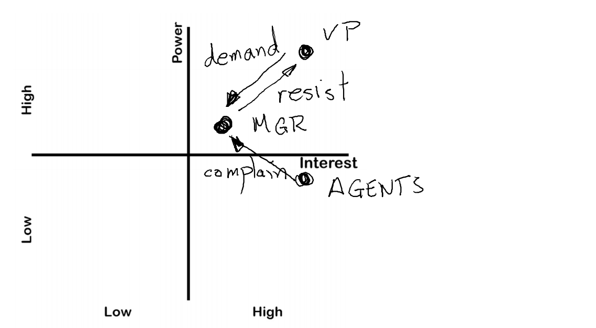
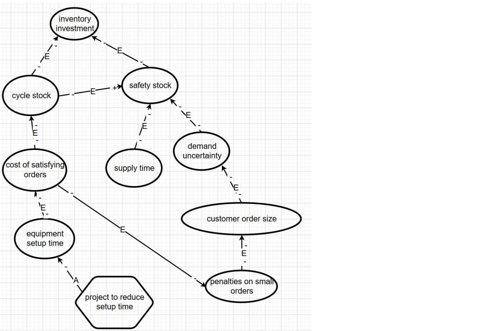

# Engineering Systems Architecture

Instructors - Peter Jackson, Stefano


* auto-gen TOC:
{:toc}
Our documentation and demo may be included.

## Grading Breakdown

| Component                   | Weightage (%) |
| --------------------------- | ------------- |
| Class participation         | 10            |
| Project (System definition) | 20            |
| Project (R-Shiny)           | 25            |
| Mid-term Exam               | 20            |
| Final Exam                  | 25            |

Deadlines

- Week 9 - HTML portfolio of documents detailing steps in the architectural design process, with their outputs; maximal use of Capella where possible
- Week 13 - A game enhancement mechanism delivered using RShiny; Working prototype of design concept; 3-minute video with marketing pitch for design concept

(develop an educational game)

Project Theme

- Design an **educational** game (or toy).
- Teams of four
  - Made up of two partners
  - You can choose three people that can be your partner

## Midterms revision

Bring a ruler to improve your quality of life.

### Architectural design concepts

- Modularity, Operational Analysis, Scenario Analysis, Structural Design, Operational Analysis, Concept Generation, Problem and Mission Statements, Use Cases
- Use common sense


### Identifying Stakeholders

- Your power-interest diagram require annotated arrows.



- One table explains the position of the power and interest in the diagram.
- One table explains the relationship between the different stakeholders. You only need to fill up cells with a relationship.


### Influence Diagrams

-  Sketch this argument using the Design Research Methodology notation. In particular, each arc should have two signs (either “+” or “-“), one at the tail end of the arc and the other at the head of the arc. Label each arc as “E”, for “Experience” or “A” for “Assumption”. 
- Points will be deducted if you use the words "increase" or "decrease" within a bubble - this information belongs on the arcs.
- Your proposal should be in the shape of a hexagon.



### Architectural DSM

- Rearrange rows and columns such that the "loss" is minimum. "Loss" is the distance of ones from the diagonal.
- You can sketch the relationships as a graph.


### Modularity

- Identify six functions
- Identify three subsystems
- Assign functions to the subsystems
- List the exchanges on a table "Exchange", "From Entity", "To Entity"
- Sketch a state change diagram for a typical cycle of events


### Trade Studies

- You need to draw a table.
- Headings: Attribute List, Relative Weighting, A Rating, A Weighted Rating, B Rating, B Weighted Rating.
- Summaries (after attribute list): Total, Rank, Recommend


## Finals revision

This is a summary of the second half of the course. The finals is focused on R programming.


Installation script (not exhaustive, someone should complete this)

```R
install.packages('ggplot2')
install.packages('devtools')
install.packages('devtools')
devtools::install_github('r-lib/later')
install.packages('shiny')
```

### Architectural Trade-spaces (L13, W8)
Multi-Objective Problem

You minimise a vector (instead of a value) in a minimisation optimisation problem.

**Nadir point** is not the worse vector in the feasible region. It represents the upper bound of objective elements of the objective vector in the Pareto optimal set.

A solution weakly dominates over another solution if
- The solution is not worse in all objectives
- The solution is strictly better in at least one objective

Strongly dominates if
- The solution is strictly better in all objectives

Properties of domination
- Not reflexive - you cannot dominate yourself
- Not symmetric - domination is one way
- Transitive - if $a$ dominates $b$, and $b$ dominates $c$, $a$ dominates $c$.

The Pareto optimal set is the set of optimal solutions that are not dominated by any other solution in the feasible space.


### Visualizing Complex Decision Spaces (L14, W9)

- Parallel coordinates

- Radar plots


### Choosing Among Multiple Solutions (L15, W9)

- Lexicographic method
  - an objective with lower-level priority is (infinitely) less important than an objective with a higher-level priority
- Utopia point method
  - choose the closest solution to the Utopia point
  - recommended to normalize the data to within $[0,1]$
    - $f_i^{norm} = \dfrac{f_i - f_i^*}{f_i^{nad} - f_i^*}$
- Maximum curvature method
  - the point in which the Pareto front curvature is maximum
  - tradeoff is less reasonable at other points


### Generating Multiple Solutions (L16-L18, W10-W11)

A-posteriori method 
- No information about the decision-maker’s preference structure is available. They iteratively generate a set of Pareto-optimal solutions

Interactive methods
- Use the information progressively during the optimization process

A-priori methods
- Some information is available. They usually find one preferred Pareto-optimal solution


$\varepsilon$-constraint methods (a-posteriori)

- **Please revise on code**


Weighting method (a-posteriori)

- Combine all objectives into a single objective function by assigning weights to each objective. The sum of weights is usually one
- You need to scale your objective function with nadir and utopian vector (really?)
- You may not find the Pareto frontier if the feasible space is non-convex


Goal programming (a-priori)

- There is a goal for each objective
- To minimize positive and negative deviations from the goals
- Uses and minimises "slack variables"


Lexicographic Goal Programming (a-priori)

- Lexicographic method - but positive and negative deviations are prioritised differently
- Unwanted deviations are placed into a number of priority levels
- Some goals are defined more important than the others
  - Some goals can share the same priority


Weighted Goal Programming (a-priori)

- The achievement function consists of a weighted (normalized) sum of unwanted deviations


Interactive methods

- NIMBUS
- The idea is to move around the Pareto optimal set
- When a solution is presented, the decision maker decides for each objective function
  - Should be improved
  - Should be improved till some aspiration level
  - Are satisfactory at the moment (no change)
  - Are allowed to impair till some bound
  - Are allowed to change freely


### Evolutionary and Genetic Algorithms (L19-L20, W11-W12)

- A heuristic is a technique designed for solving a problem more quickly when classic methods are too slow, etc. A metaheuristic are problem-independent methods

Key elements

- Group of Individuals - Population
- Source of Variation - Genetic operators
- Reproductive Fitness - Fitness
- Survival of the Fittest - Selection


Binary Genetic Algorithms

- Nonlinear optimisation algorithm
- Each solution is encoded in binary
- Procedures
  - Identify good (above average) solutions in the population;
  - Make multiple copies of good solutions;
  - Eliminate bad solutions from the population so that multiple copies of good solutions can be placed in the population.


Multi-objective Genetic Algorithms

- Objective
  - Identify the Global Pareto-Optimal set of solutions (aka the Pareto Optimal Front).
  - Find a sufficient coverage of that set.
  - Find an even distribution of solutions.


Non-dominated sorting genetic algorithm II, NSGA-II
- Main advantages
  - The diversity among non-dominated solutions is maintained using the crowding procedure: No extra diversity control is needed.
  - Elitism protects an already found Pareto-optimal solution from being deleted.

