# Manufacturing and Service Operations

Instructors: Shruti and Lingjie

* auto-gen TOC:
{:toc}

## Course Overview

| Component             | Weightage (%) |
| --------------------- | ------------- |
| Class Participation   | 5             |
| Homework/Activities   | 20            |
| Group Project         | 25            |
| Midterms (Simulation) | 25            |
| Finals                | 25            |

**Group project**

- Choose either inventory or service management
- Ideally, work with a company on a relevant task
- You may resort to using public data

## Inventory Management

**Permutations of manufacturing operations**

- Refer to week one notes, please make sure you can understand how each category is different.
- Periodic review versus continuous review
- Little's Law
  - Average inventory / Average time = Average rate 

**Review of Excel functions**

- NORMSDIST - the cumulative distribution function $\Phi(x)$ for standard normal distribution
- NORMSINV - inverse of the standard normal CDF
- PHI - probability density function $\phi(x)$ for a standard normal distribution
- NORMDIST(x,mean,standard_dev,cumulative)
  - x - The value for which you want the distribution.
  - mean - The arithmetic mean of the distribution.
  - standard_dev - The standard deviation of the distribution.
  - cumulative - TRUE or FALSE
    - If TRUE, NORMDIST returns the cumulative distribution function
    - if FALSE, it returns the probability density function.

**For each model**

- Variables and constants
- Assumptions
- Decision variable (What is being decided and optimised)
- Optimal condition
- Performance measures
- Identities (Not just for the optimal quantity)

- Miscellaneous

### News Vendor model

This is periodic review

**Variables and constants**

- Demand of the period
  - with known **continuous** probability distribution $g(x)$ or $G(x)$
  - that has mean $\theta$ and standard deviation $\sigma$
- Overage cost $c_o$
- Shortage cost $c_s$ (which is also unit profit)

**Assumptions**

- Planning is done for a single period
- Deliveries are made in advance of demand
- No fixed cost (you are making a purchase at the start of each period anyway)
- Products can analysed individually - either a single product or no interactions between products

**Decison variable**

- $Q$ Order / production quantity (product units)

**Opitimal order quantity $Q^*$**

- $G(Q^*) = \dfrac{c_s}{c_o + c_s}$
- Where **incremental** overage cost exceed **incremental** shortage cost

**Performance measures** (for a certain order quantity $Q$)

- Expected lost sales (units)
  - calculated based on the demand distribution and $Q$
  - 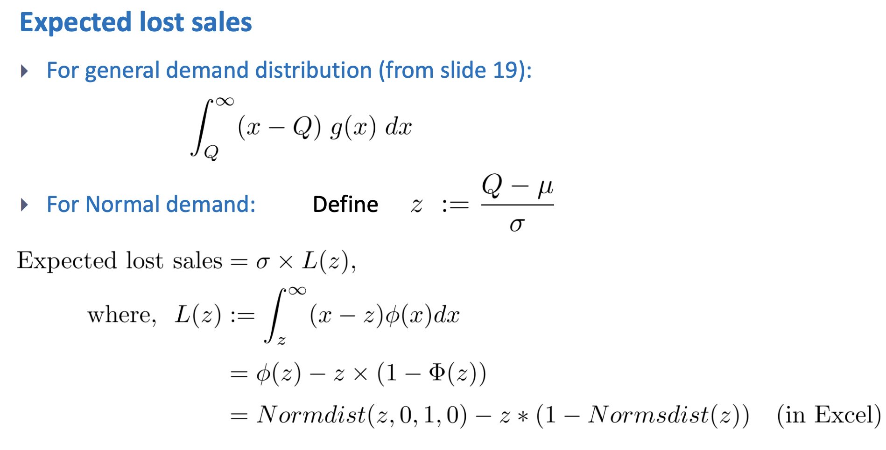
- Expected demand (units)
  - $\mu$ of the given assumed distribution
- Expected sales (units)
  - expected demand $\mu$ $-$ expected lost sales
- Expected leftover inventory (units)
  - $Q$ the chosen supply $-$ expected sales
- Expected profit (dollars)
  - expected sales $\times$ shortage cost $–$ expected leftover inventory $\times$ overage cost
- Probability of shortage or overage
  - read from the probability distribution for demand

**Identities** (for all $Q$)

- Specified supply $Q$ $=$ Expected sales $+$ Expected leftover inventory
- Expected demand $\mu$ $=$ Expected sales $+$ Expected lost sales

**News Vendor Model with Risk pooling**

- Why not we use blanks to fulfill unmet demand of star player Jerseys?
  - If there is shortage, we can print using the blank
  - Printing in the US **is still more expensive**, so there is tradeoff
- Differences
  - Cost of overage is the same (could only salvage)
  - Cost of shortage is different
    - depends if blank is available
    - whether is it available is a probability (**previously calculated**)
      - for each of the two scenario there is a cost
    - **this is an approximate**
- Are we now only ordering blanks from the CM?
  - No, but less

How is the profit **calculated**? **Example**?

### Base-stock model

This is continuous review.

**Variables and constants**

- Lead time $l$ (or replenishment time, fixed and known)
- Demand during replenishment lead time
  - with known **continuous** probability distribution $g(x)$ or $G(x)$
  - that has mean $\theta$ and standard deviation $\sigma$
  - (demand still happens one at a time)
- Unit holding cost $h$ (per unit, per time)
- Unit backorder cost $b$ (per unit, per time)

**Assumptions**

- Demand occurs one at a time, with i.i.d. interarrival times
- Replenishment units are ordered one at a time
- Unsatisfied demand is backordered, and will be fulfilled.
- No fixed cost. (The order is placed one at a time anyways)
- Products can analysed individually - either a single product or no interactions between products
- Initial amount of inventory is $r+1$

**Decision variable**

- Reorder point $r$
  - $r+1$ is the base-stock level

**Optimal** base-stock level $r^*+1$

- $G(r^*+1) = \dfrac{b}{h+b}$
- Where **incremental** holding cost exceed **incremental** backorder cost

**Performance measures** (for a certain reorder point $r$)

- Safety stock level $r - \theta$
- Expected backorder level
  - $B(r+1) = \int_{r+1}^{\infty} \enspace (x-r-1) \enspace  g(x) \enspace dx$
  - If demand is normal
    - $(\theta -r -1)\left( 1 - \Phi \left[ \dfrac{r+1 - \theta}{\sigma} \right] \right) + \sigma \phi \left[\dfrac{r+1-\theta}{\sigma}\right]$
- Expected inventory level
  - (identity) $r+1 - \theta +$ Expected backorder level
  - Current inventory position = on-hand inventory + orders - backorders (Because negative inventory level is considered zero inventory)
- Fill rate
  - Fraction of demand satisfied instantaneously from on-hand inventory
  - $P (X \leq r+1) = P \left( \dfrac{X - \theta}{\sigma} \leq \dfrac{r+1-\theta}{\sigma} \right)$

**Identities** for all $r$

- Expected inventory level per unit time + Expected lead time demand = Expected number of backorders per unit time + Reorder point + 1

**Model design**

- Why r-plus-one?
  - This is so that $r$ is the reorder point, which can be zero.

**Questions**

- What happens if you have have a fixed cost of ordering?

### Economic Order Quantity model

This is continuous review (there is nothing to review actually, the setup is deterministic)

**Variables and constants**

- Demand rate $D$
- Fixed cost to place an order $A$
- Unit purchase/production cost $c$
- Unit holding cost $h$

**Assumptions**

- Unlimited **rate of** production capacity
- Instantaneous satisfaction of demand and no supply lead time
- Fixed setup cost to start production
- Products can analysed individually - either a single product or no interactions between products

**Decision variable**

- $Q$ The size of an order

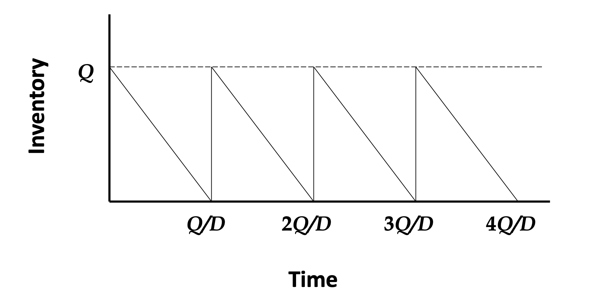

**Optimal** order quantity $Q^*$

- $Q^* = \sqrt{\dfrac{2AD}{h}}$
- Where incremental holding cost exceed decremental fixed order cost

**Performance measures**

- Total cost per unit time
  - $Y(Q) = \dfrac{hQ}{2} + \dfrac{AD}{Q} + cD$
- Total cost per unit time **per unit product** (not incremental)
  - $Y'(Q) = \dfrac{hQ}{2D} + \dfrac{A}{Q} + c$
- Average inventory
  - $\dfrac{Q}{2}$

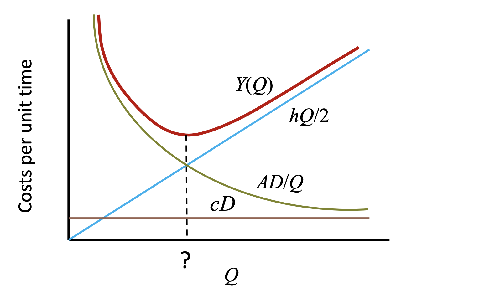

**Extension of EOQ**

- Non-zero supply lead times
  - You will just order $L$ in advance
  - $Q^*$ is unchanged
- Non-zero safety stocks
  - Only a constant (holding cost) is added to the total cost
  - $Q^*$ is unchanged
- Finite production capacity
  - Economic Production Quantity Model

### Economic Production Quantity Model

This is continuous review (there is nothing to review actually, the setup is deterministic)

The same as EOQ, except that production takes time.

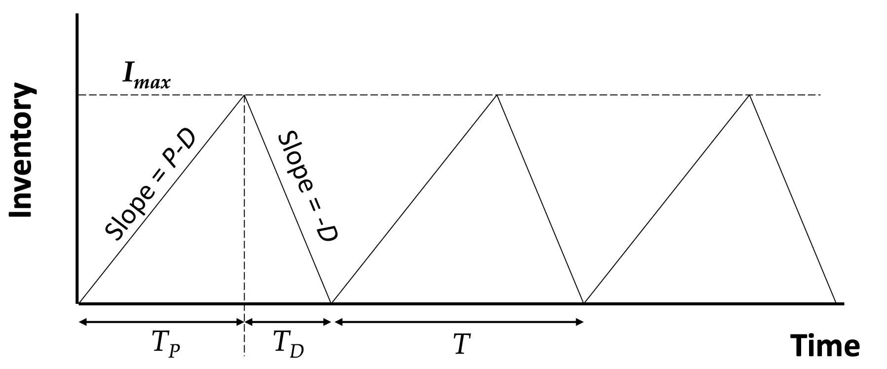

**Variables and constants**

- Demand rate $D$
- Production rate $P$ (additional parameter from EOQ)
- Fixed cost to place an order $A$
- Unit purchase/production cost $c$
- Unit holding cost $h$

**Assumptions**

- **Limited rate of production**
- Determinisitic and constant demand which must be fulfilled
- Instantaneous satisfaction of demand and no supply lead time
- Fixed setup cost to start production
- Products can analysed individually - either a single product or no interactions between products

**Decision variable**

- $Q$ The size of an order

**Optimal** order quantity $Q^*$

- $Q^* = \sqrt{2ADh\left(1-\dfrac{D}{P}\right)} + cD$
- Where incremental holding cost exceed decremental fixed order cost

**Performance measures** (for a certain order quantity $Q$)

- Total cost per unit time
  - $Y(Q) = \dfrac{hQ}{2}\left(1-\dfrac{D}{P}\right) + \dfrac{AD}{Q} + cD$
- Total cost per unit time **per unit product** (not incremental)
  - $Y'(Q) = \dfrac{hQ}{2D}\left(1-\dfrac{D}{P}\right) + \dfrac{A}{Q} + c$

- Average inventory
  - $\dfrac{Q}{2} \left( 1 - \dfrac{D}{P} \right)$

### (Q,r) model

This is continuous review.

**Variables and constants**

- Demand
  - with known **continuous** probability distribution $g(x)$ or $G(x)$
  - that has mean $\theta$ and standard deviation $\sigma$
  - (demand still happens one at a time)
- Fixed cost $A$ is associated with placing an order
- Fixed and known replenishment lead time $l$
- Unit purchase/production cost $c$ (per unit)
- Unit holding cost $h$ (per unit, per time)
- Unit backorder cost $b$ (per unit, per time)

**Assumptions**

- Unstatisifed demand is backordered
- Products can analysed individually - either a single product or no interactions between products

**Decision variable**

- $Q$ replenishment quantity
- $r$ the reorder point stock

**Optimal decision variables**

- $Q^* = \sqrt{\dfrac{2AD}{h}}$
  - Where marginal fixed order costs exceeds marginal holding costs 
- $G(r^*) = \dfrac{b}{b+h}$
  - Where marginal holding cost exceeds marginal backorder costs

**Performance measures**

- Safety stock level $s= r - \theta$
- Expected backorder level
  - $B(Q,r) = \frac{1}{Q} \int_r^{r+Q} B(x) dx \lessapprox B(r)$
    - The appoximation is allowed as $\int_{r+Q}^{\infty} B(x) dx \gtrapprox 0 $
  - If demand is normal
  - $B(r) = (\theta - r)\left(1 - \Phi \left[ \dfrac{r-\theta}{\sigma}  \right] \right) + \sigma \phi \left[ \dfrac{r-\theta}{\sigma} \right]$
  
- Expected inventory level
  - $I(Q,r) = \frac{1}{Q} \int_r^{r+Q} I(x) dx \\ = \dfrac{Q}{2} + r - \theta + B(Q,r)$

- Fill rate
  - $S(Q,r) = \dfrac{1}{Q} \int_r^{r+Q} G(x) dx \\ = 1 - \frac{1}{Q}[B(r) - B(r+Q)] \\ \gtrapprox G(r) = \Phi \left[ \dfrac{r - \theta}{\sigma} \right] $ 

- Expected total cost
  - $Y(Q,r) = A \cdot F(Q,r) + h \cdot I(Q,r) + b \cdot B(Q,r)$

**Identities** for all $r$ and $Q$

- Inventory position = On-hand inventory + outstanding orders – backorders
  - Please understand which is which
- Inventory position is uniformly distributed between $r$ and $r+Q$

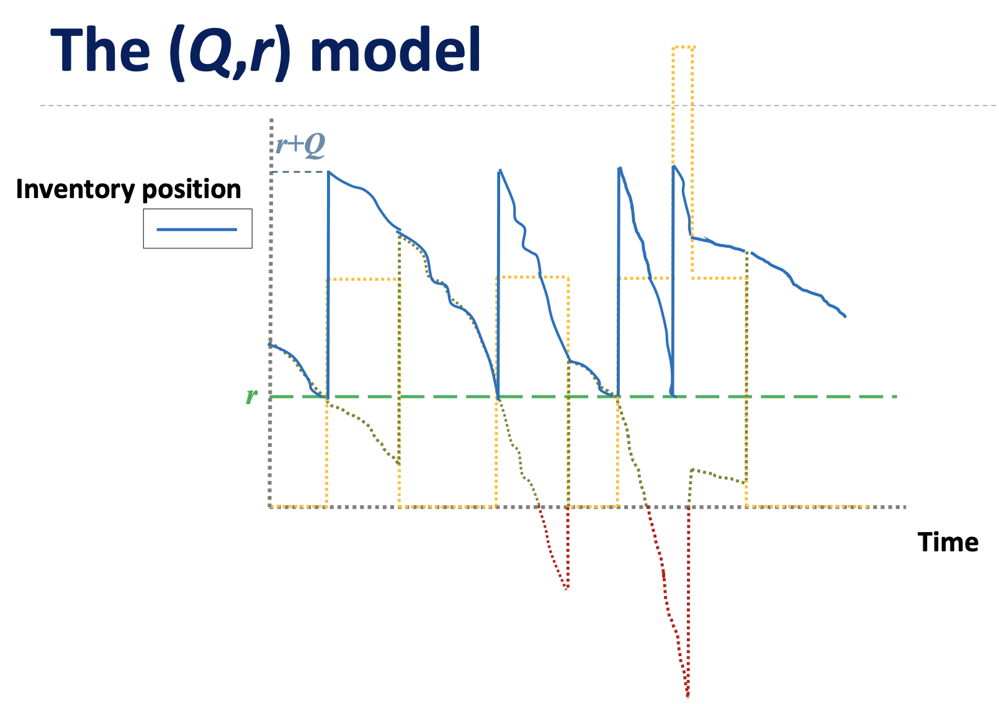

(Dark green - on-hand inventory, Red - negative of backorder, Orange - outstanding orders, Blue - inventory position)

## Discrete Time Markov Chains

A special stochastic process satisfying “Markov/memoryless” (given previous state, the future is independent of the past) & “time-invariant”.

### Modeling A System As A DTMC

- Determine $X_n$ the state of the system at the n-th observation. 
- Write down the state space $\mathcal{S}$, i.e. the set values $X_n$.
- Check if memoryless and time-invariant properties hold in the modeling. 
  - If yes, HURRAY!
  - If no, redefine $\{X_n, n \geq 0 \}$. 
- Obtain the transition probability matrix $P$ (and transition diagram). **Rows of $P$ should add up to one.**

**Advice**

Draw the transition diagram. Outgoing arrows should add up to one.

#### Chapman-Kolmogorov Equation

$$[P^k]_{ij} = \sum_{r \in \mathcal{S}} [P^{k-l}]_{rj} [P^l]_{ir}$$

This is because of the time-invariant property.

### Reducible and Irreducible DTMC

If it is possible to go from any state $i$ to any state $j$ with at least $k$ step, the DTMC is irreducible with $k$ steps.

Otherwise the DTMC is reducible.

### Periodic and aperiodic DTMC

For any state if the probability of revisiting the state is non-zero after $d, 2d, 3d, \cdots$ steps.

A DTMC is aperiodic if $[P]_{ii} > 0$ for some state $i \in \mathcal{S}$ or $d=1$.

### Recurrent and transient DTMC

**Recurrent**: If each state will be revisited sooner or later, the DTMC is recurrent.

**Positive recurrent**: the expected time to revisit any state is finite.

**Null recurrent**: If the DTMC is recurrent but not positive recurrent 

**Transient**: If the DTMC is not recurrent.

Theroems

- For a finite-state DTMC, irreducible property guarantess recurrent.
- For a finite-state DTMC, all recurrent matrices are positive recurrent.

### Limiting Behavior of DTMC

$\pi = a P^{\infty}$

If row vector $\pi$ exists, it is the stationary probability of the DTMC. $a$ is the initial row vector.

If the DTMC is apreiodic, the rows $P^{\infty}$ is made up of is equal to $\pi$.

Theorems

- A finite-state irreducible aperiodic DTMC has a unique $\pi$.
- A DTMC that is poth positive recurrent and aperiodic has a unique $\pi$. The DTMC is said to be ergodic.

### Average cost models

A cost $C_i$ is incurred for observing state $i$.

The long-run average cost is 

$C = \sum_{i \in \mathcal{S}} \pi_i C_i$

## Continuous Time Markov Chains

The state can now change at any time.

### Mathmatical formulas

Geometric progression

Sum to infinity

$\displaystyle\sum_{k=0}^\infty ar^k = \dfrac{a}{1-r}$

Sum of first n terms

$\displaystyle\sum_{k=0}^n ar^k = \dfrac{a(1-r^{n+1})}{1-r}$

Power identity (for full list refer to MF15 or search on Google)

$1 + 2 \rho + 3 \rho^2 + 4 \rho^3 + \cdots = \dfrac{1}{(1-p)^2}$

### Some theorems of CTMC

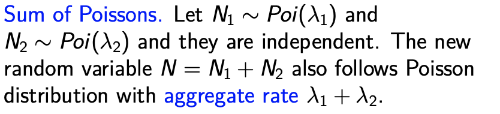

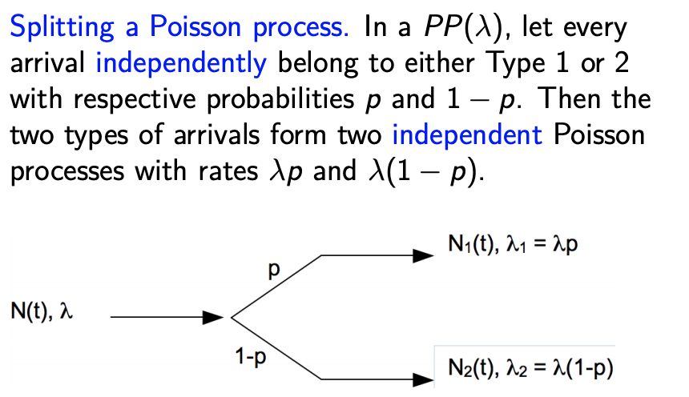

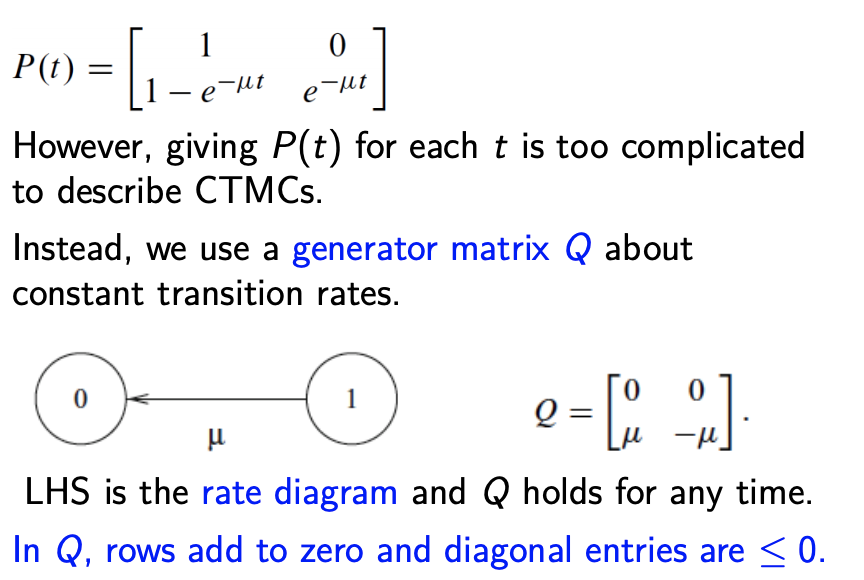

### Modeling A System As A DTMC

- Define $X(t)$, the state of the system at time $t$
- Write down $\mathcal{S}$, the state space. 
- Obtain the generator matrix $Q$ and draw the rate diagram.

### Steady state analysis

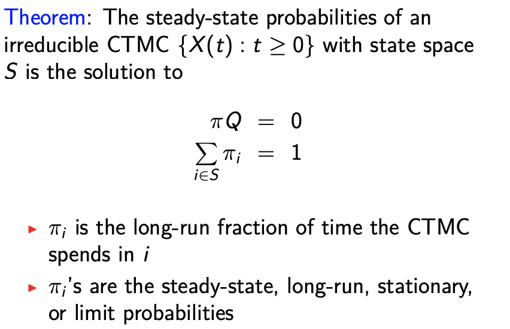

### Cut analysis

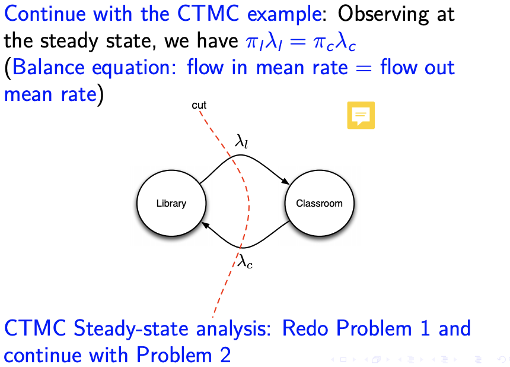

Flow in mean rate = flow out mean rate

Rate = $\lambda_{ij} \cdot \pi_i$ 

Where $\lambda_{ij}$ is the transition rate of state $i$ to state $j$, and $\pi_i$ is the long term probability of the state $i$.

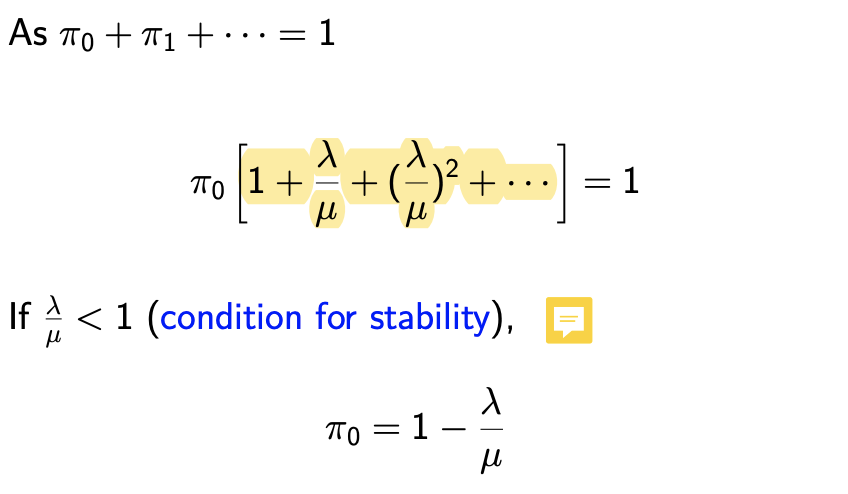

Strategy

- Express all $\pi_i$ everything in terms of $\pi_0$
  - Start the cut analysis from state 0
- Equate $\sum \pi = 1$ to solve for $\pi_0$
- Substitute $\pi_0$ into your expressions of $\pi_i$

### Retrial queue

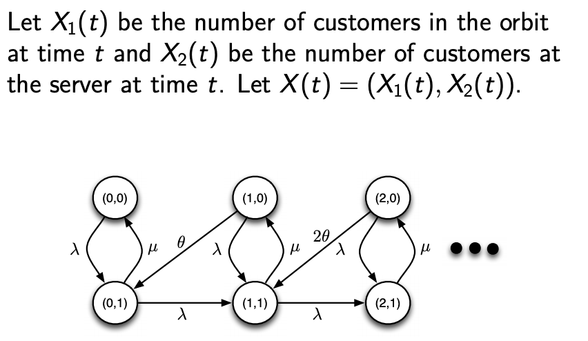

- $\lambda$ is the rate of passengers entering
- $\mu$ is the rate of passengers getting served
- $\theta$ is the rate of passengers in orbit starts to get served

How is this different from the normal queue 

- The customers in the queue do not immediate get served when the server is idle.

After formulation

$\pi_{0,0} = \left[ (1-\dfrac{\lambda}{\mu})^{\frac{\lambda}{\mu} + 1} \right]$

### Average cost analysis

The long run average cost per unit time is 

$\sum_{i=0}^k C_i \pi_i$

