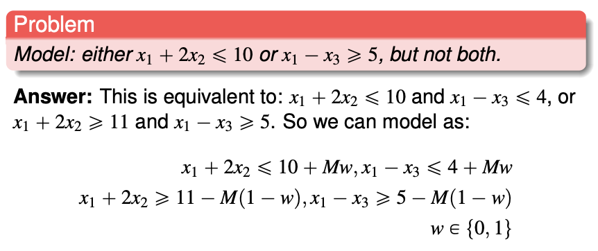

# Optimisation

Instructors - Selin, Xingyin

* auto-gen TOC:
{:toc}

## Course Overview

| Component           | Weightage (%) |
| ------------------- | ------------- |
| Midterms            | 32.5          |
| Finals              | 32.5          |
| Quiz 1              | 15            |
| Quiz 2              | 15            |
| Class participation | 3             |
| Course evaluation   | 2             |

## Course Timetable

| Week | Content                                                      |
| ---- | ------------------------------------------------------------ |
| 1    | Introduction, modeling with linear programming, geometry of linear programs. Reformulation tricks (absolute value, minimax, maximin). Canonical form of an LP and reduction to canonical form. |
| 2    | The simplex method in matrix form: simplex tableau, basic feasible solutions, reduced costs, pivoting. Phase I, Phase II. Anti-cycling rules. |
| 3    | Sensitivity analysis. Alternative optima.                    |
| 4    | Dual of a linear program, relationship to sensitivity analysis. Weak and strong duality theorem. |
| 5    | Two-player zero-sum games. The minimax theorem.              |
| 6    | Introduction to networks and Dijkstra’s algorithm.           |
| 7    | Recess week.                                                 |
| 8    | Max-flow / min-cut. Maximum matching. The min-cost flow problem. |
| 9    | Network simplex algorithm. Applications.                     |
| 10   | Integer programming formulations. Modeling with binary variables. LP relaxation. |
| 11   | Branch-and-bound. Cutting planes: knapsack covers, Gomory fractional cuts. |
| 12   | Dynamic programming: shortest paths, Bellman’s principle of optimality. |
| 13   | Traveling Salesman Problem                                   |
| 14   | Review session. Final exam                                   |

# Linear Programming Procedure

Procedure of solving a problem with linear programming.

**1) Transform the problem into a linear program.**

- This is a step highly dependent on the circumstances. Some examples are given in - **[A]** converting linear residuals into a linear program.

**2) Transform the linear program into a standard linear program.**

- This can always be done, by adding slack variables **[B]**.

**3) Ensure the standard linear program has linearly independent rows.**

- If the rows are not linearly independent, there are redundant constraints. You may remove them.

**4) Obtain a canonical form of the linear program.**

- Simplex I algorithm **[C]**. This can always be done unless there is no feasible solution.

**5) Obtain the optimal solution of the linear program.**

- Simplex II algorithm **[D]**. You might have many solutions - then you need to present all of them.

**6) Conduct sensitivity analysis and consider edge cases.**

- Interpret the matrices **[E]**, and calculate the allowable change **[F]**.
- Consider edge cases as well **[G]** and multiple solutions **[H]**

- **[I]** Dual problems

## [0] Definitions

"**General**" linear program (one if the objective function is linear and the constraints are linear equalities or inequalities). 

$$
\begin{align*}
max/min &\quad \vec{c}^T\vec{x} \\
s.t. &\quad \vec{a}_i^T\vec{x} \enspace \geq / =/\leq \enspace b_i \quad \forall i \\
\end{align*}
$$

Note that all inequalities **<u>are non-strict.</u>** Please transform all strict inequalities to non-strict inequalities.

**Standard** form of a linear program

$$
\begin{align*}
max \quad \vec{c}^T \vec{x} \\
s.t. \quad A\vec{x} &= \vec{b} \geq \vec{0} \\
\vec{x} &\geq 0
\end{align*}
$$

**Canonical** form of a linear program - variables and constraints of $x$ can permuted to represented in this way

$$
\begin{array}{r@{}cl}
max \quad c_N x_N  &+k \\
\quad x_B + A_N x_N &=& b \\
\quad x_B, x_N &\geq& 0
\end{array}
$$

One basic feasible solution can be read off the canonical form, with $x_b = b$ and $x_N = 0$, with the objective value equal to $k$.

If $c_N$ is nonnegative, the basic feasible solution is an optimal solution.

## [A] Converting linear residuals into a linear program

Please note that a linear program **does not allow strict inequalities**.

**Least squares - cannot be converted into a linear program.**

This includes the least-squares best-fit line.

**Converting linear absolute residuals into a linear program.** 

The problem: Minimize $\Sigma_{i=1}^6 \vert \epsilon_i \vert$, where $\epsilon$ is a linear expression of decision variables (in this case, the intercept and slope of two variables).

**Solution 1**
Minimise $\Sigma_{i=1}^6 r_i^-, + r_i^+$

where 

$$
\epsilon = r_i^- - r_i^+
$$

with

$$
r_i^-, r_i^+ \geq 0
$$

(The optimal solution will minimise such that $r_i^-$ and/or $r_i^+$ is zero.)

**Solution 2**
Minimise $\Sigma_{i=1}^6 z_i$
with 

$$
\begin{align}
\epsilon_i &\leq z_i \\
-\epsilon_i &\leq z_i
\end{align}
$$

(I still don't understand how this works.)

**Converting maximum absolute residual into a linear program**.

The problem: Minimize $max(\vert \epsilon_i \vert \enspace \forall i)$

**Solution**

Minimise $r$. 

For all $i$,

$$
\begin{align}
r &\geq \epsilon_i \\
r &\geq -\epsilon_i
\end{align}
$$

From the slides (notice that $\epsilon_i$ is an expression).

The linear program finds the optimal values of $b_0$, $b_1$, $b_2$ and $r$(s) that optimises the objective function. $L_i$, $P_i$ and $E_i$ are constants given by the data.

 
## [B] Converting a linear program into a standard linear program

**All linear programs can be transformed into a standard linear program.** Here are the steps.

- If the objective function is to minimise, filp all the coefficients $\vec{c}$ to get a maximising objective function instead.

- If the constant of the equality or inequality is negative - please flip all the cofficients of the inequality:

  $$a_1 x_1 + ... a_n x_n \leq b < 0 \enspace \rightarrow \enspace -a_1 x_1 ... - a_n x_n \geq b' > 0$$

- If the condition is a $\geq$ inequality, for the inequality add a nonnegative slack variable:

  $$a_1 x_1 + ... a_n x_n \geq b \enspace \rightarrow \enspace a_1 x_1 ... + a_n x_n + s_g = b \enspace \text{and} \enspace s_g \geq 0$$

- If the condition is a $\leq$ inequality, for the inequality add a nonnegative slack variable:

  $$a_1 x_1 + ... a_n x_n \leq b \enspace \rightarrow \enspace a_1 x_1 ... + a_n x_n - s_l = b \enspace \text{and} \enspace s_l \geq 0$$

- If there are free variables like $x_f$, you have to create **two** slack variables which are greater-or-equal-to zero

  $$x_f \rightarrow x_f^+ - x_f^-$$ for all appearance of $x_f$ in the all the equality constraints and objective function
  Also, add the inequality $x_f^+, x_f^- \geq 0$

 
## [C] Simplex Phase I

**PHASE I** - Transforming the **standard form** to the **canonical form**
$$
max\left\{ cx | A\vec{x} = \vec{b} \geq \vec{0}, \vec{x} \geq 0 \right\}
$$
$A$ is made up of $n$ linearly independent rows.

First, we add nonnegative $n$ **slack** variables to create a **<u>different</u> LP problem** with a different objective function. 

- We can add less than $n$ if there are variables that can serve as basis variables). 

Begin with a canonical form of the new LP problem by managing the objective function. Carry out the Simplex Phase II iteration. Results:

- The Phase I objective function value is nonzero: the initial problem has **no feasible solution**. We can stop.
- The Phase I objective function value is zero and no artificial variable is in the basis: **we have a basic feasible solution** for the initial problem. Proceed.
- The Phase I objective function value is zero and some artificial variables are in the basis.
  - We try to pivot them out (there may be many solutions).
  - If we cannot, then **there are redundant constraints** that we can drop. After this, we drop the artificial variables to obtain the initial simplex tableau for Phase II. (Is it possible to have no feasible solutions?)
    - This will not happen if the rows of $A$ were linearly independent.

Remove the slack variables, and continue Phase II with the original objective function from the standard form.

 
## [D] Simplex Phase II

**PHASE II** - Obtaining the **optimal solution** from the **canonical form**

We start with the **canonical form**.

- You can read off a **basic feasible solution** (BFS). 
  - The non-basis variables are zero
  - The basis variables is equal to the RHS.
  - The objective value is the RHS of $z$.

We choose an **entering basis variable** (which is currently a non-basis variable).

- the non-basis variable has **positive reduced cost** (all basis variables have zero reduced cost)
- if there are multiple non-basis variables, choose the variable the **smallest index** (Bland's rule 1)

We also choose an **leaving basis variable** (which will be a non-basis variable).

- constraint coefficient of the nonbasic variable is **nonnegative** 
- among those above, choose the variable with the **smallest ratio** (of RHS over constraint coefficients)
  - The ratio will definitely be nonnegative. (QUESTION: what if the smallest is infinite?) 
  - Intuition - if you do not use a minimum ratio, you will end up with a negative RHS, the form is no longer canonical and a BFS cannot be read off.
- if the ratio is a tie, choose the variable will a **smaller index** (Bland's rule 2 - Bland's rules help to prevent cycling, it does not change the problem and prevent degeneracy.)

Then we pivot the basis variables. The LP problem should remain the same, and still in canonical form after every pivot. Then we iterate until we reach either one of the following conditions 

- All non-basis variable have **negative** reduced costs: the current basic feasible solution is **the** optimal. We can stop.
- All non-basis variables have **nonpositive** reduced costs, the current basic feasible solution is **an** optimal. We may stop.
  - We may pivot to obtain other optimal basic feasible solutions.
  - To obtain the set of optimal solutions, take the convex combination of optimal basic feasible solutions.
    - $\lambda_1 v_1 + \lambda_2 v_2 + ... \quad \forall \enspace  \lambda_1 + \lambda_2 + ... = 1$
- There exists one non-basis variable with **positive** reduced cost that appears with **all nonpositive coefficients** in the constraints: the problem is unbounded, we can stop.
  - You can increase the non-basis variable indefinitely while satisfying the constraint.
    - For each constraint - as the non-basis variable increase, the corresponding decrease of its term in the constraint LHS can be balanced by increasing the value of the basis variable.

 
## [E] Interpretation of matrices

interpreting-matrices.png

## [F] Calculate allowable change

calculate-allowable-change.png

## [G] Consider edge cases

 
## [I] Dual problem 

**Definitions**

Given an "primal" LP (expressed in this form)

$$
\begin{align}
max \enspace c^T x& \\
Ax& \leqslant b \\
x& \geqslant 0
\end{align}
$$

we can formulate a dual LP 

$$
\begin{align}
min \enspace b^T y& \\
A^{T} y& \geqslant c \\
y& \geqslant 0
\end{align}
$$

The dual of the dual is the primal. (You need to express the dual form into a primal before you can calculate the dual of the dual.)

**Complementary Slackness property**

Let $\bar{x}$ and $\bar{y}$ be feasible solutions to the primal and dual problem, respectively. $\bar{x}$ and $\bar{y}$ are optimal solutions for the two respective problems if and only if:

$$
\begin{align}
\bar{y}_i (b_i - a_i^T \bar{x}) &= 0, 
\enspace \forall i, \quad \text{and} \\
(A_j^T \bar{y}_i - c_j) \bar{x}_j &= 0, 
\enspace \forall i
\end{align}
$$

[QUESTION] Do they imply one another?

In an optimal solution

- either $10x_1 + 5x_2 + 2x_3 = b_1$ (which is 204) or $y_1 = 0$ (which is 4)
- either $5y_1 + 4y_2 + y_3 = c_j$ (which is 30) or $x_2 = 0$ (which is zero)

This applies for all constraint-solution pair, and solution-constraint pair.

 
**Weak Duality Theorem**

Condition
- $\bar{x}$ is a feasible solution to the primal 
- $\bar{y}$ is a feasible solution to the dual

Result
- $c^{T} \bar{x} \leq b^{T} \bar{y}$.

One of the intuitions - Suppose that $x^*$ is optimal to the primal, then $x^*$ is feasible to the relaxation.

**Strong Duality Theoerm**

Condition
- If a primal problem has an optimal solution.

Result
- The dual problem has an optimal solution.
- The respective objective function values are equal.

**Fundamental Theorem of Linear Programming**

For a pair of primal problem P and dual problem D, exactly one of the following is true

- P and D have optimal solutions and their objective function values are equal
- P is unbounded and D is infesaible
- D is unbounded and P is infeasible
- Both problems are infeasible.

 
**Formulating the dual of a general LP**

**Economic interpretation**

Please try to understand this.

linear-programming-dual-formulation.png

Please also understand the optional component in W4L2 on restoring feasibility after adding a constraint.

 
# Games

**Two-player zero-sum game**

**Guaranteed payoff**

To maximise guaranteed payoff, row player would play row 3.

zero-sum-game-guaranteed-payoff.png

**Dominating strategies**

**Saddle point**

When the game only have one outcome each player would not choose any other outcome.

[QUESTION] Is the saddle point always an intersection of dominating strategies?

**Mixed strategy** 

Made up of a set of probailities. The row player can play different rows with a probability that does not change.
Objective - to **maximise guaranteed payoff**.
Intuition - the opponent will detect the strategy, and the guaranteed payoff will converge.

Solution: 

$$
p_1 = 7/18, \enspace 
p_2 = 5/8, \enspace 
p_3 = 1/3, \enspace
z = 1/9
$$

 
**The linear programming problem for row player**

Objective: maximise guaranteed payoff of the row player

$$
\begin{align}
\max \min\{E(C_1), E(C_2), E(C_3)\}&  \\
p_1 + p_2 + p_3 &= 1 \\
p_1, p_2, p_3 &\geq 0
\end{align}
$$

where

$$
\begin{alignat*}{4}
E(C_1) & {}={} &-2p_1 & {}+{} &2p_2 &{}+{} &p_3 \\
E(C_2) & {}={} &  p_1 & {}-{} & p_2 &{} {}       \\
E(C_3) & {}={} & 2p_1 & {} {} &     &{}-{} &2p_3
\end{alignat*}
$$

Formulating as a linear programming problem

$$
\begin{align}
\max z& \\
E(C_1) &\geq z\\
E(C_2) &\geq z\\
E(C_2) &\geq z\\
p_1 + p_2 + p_3 &= 1 \\
p_1, p_2, p_3 &\geq 0 
\end{align}
$$

(This is a relaxation because they are not exactly equivalent, because $z$ could be any value besides $E(C_1), E(C_2), E(C_3)$)

**The linear programming problem for column player**

Objective: minimise the guaranteed payoff of column player

$$
\begin{align}
\min \max\{E(R_1),E(R_2),E(R_3)\} \\ 
q_1 + q_2 + q_3 &= 1 \\
q_1, q_2, q_3 &\geq 0
\end{align}
$$

where

$$
\begin{alignat*}{4}
E(R_1) & {}={} &-2q_1 & {}+{} &q_2 &{}+{} &2q_3 \\
E(R_2) & {}={} & 2q_1 & {}-{} &q_2 &{} {}       \\
E(R_3) & {}={} & 2q_1 & {} {} &    &{}-{} &2q_3
\end{alignat*}
$$

Formulating as a linear programming problem

$$
\begin{align}\min v& \\
E(R_1) &\leq v\\
E(R_2) &\leq v\\
E(R_2) &\leq v\\
q_1 + q_2 + q_3 &= 1 \\
q_1, q_2, q_3 &\geq 0 \end{align}
$$

This is a primal-dual pair. ([TODO] To show)

 
**Graphical solution to small games**

If there are only two strategies available, you can use one variable $\{p, 1-p\}$ and you do not need to use an LP to solve the problem.

You can use a graphical solution. The maximum is a piecewise function with a maxima at (0.375, -0.125).

[TODO] Explain for the column player as well.

**Formulating games as LP problems**

Each player can decide on a combination of decisions **before** the games commence. (Example from cohort - combinations of decisions of whether to pass or bet on head and tails). The strategy is to assign a probability to each combination.

 
# Graphs

**Directed graph and undirected graph**

Differences between directed graph and undirected graph

| Property         | Undirected Graph   | Directed Graph            |
| ---------------- | ------------------ | ------------------------- |
| Edges of nodes   | Degree             | Indegree, Outdegree       |
| Adjacency Matrix | Symmetric          | Not necessarily symmetric |
| Incident Matrix  | Columns sum to two | Columns sum to zero       |

**Terminologies**

- Path - a sequence of arcs that connect a sequence of vertices with no repetitions
- Circuit/cycle - a path but the first and last node that is the same
- Walk - a sequence of arcs that connect a sequence of vertices, possibly with repetitions
- Eulerian path - a walk that passes through each arc exactly once
- Eulerian cycle - a walk that passes through each arc exactly once and ends at the starting node

**Special graphs**

- connected graph - at least one back between every pair of nodes
- tree - all nodes have exactly one indegree, except one

**Theorems**

- A graph has a Eulerian path if and only if it is connected and it has exactly two nodes of odd degree
- A graph has a Eulerian cycle if and only if it is connected and all nodes have even degree

 
**Shortest path problem**

The shortest path tree stores all shortest path from the starting node.

Three set of variables 
- Heap of nodes to visit next
- For each node - distance from starting
- For each node - the previous node 

**Key steps of Dijkstra's algorithm**

- Initialise infinite distance for all nodes except the starting one
- Consider the node from the heap with minimum distance from starting (this is the "considered node")
- For each "adajcent node" to the considered node (visited or not), calculate the distance
- If the distance is smaller (the new path is shorter)
  - If the distance had been infinite (the adjcaente never visited before)
     - Add the node to the heap
  - Update distance and previous node of the adajcent node
- Remove the considered node from the list.

 
**Workings of Dijkstra's algorithm**

# Taxonomy of network problems

**Taxonomy** of network problems (and methods)

- **Linear programming (Simplex)**

  - **Min-cost flow problem (Network Simplex)**
    
    For our course we will assume all edges have infinite capacity.
    
    - **Max-flow problem (Ford-Fulkerson) **
    
      This can be formulated into a min-cost flow problem by connecting an arc from the tap of the source, with infinite capacity and negative one cost.
    
      (The dual problem is the **min-cut problem**.)
    
      - Baseball elimination (example)
    
        (Only have four layers, attempts to exhaust all supply)
    
    - Maximum cardinality matching
    
    - Transhipment problem
    
      How to meet the demand while minimising delivery costs?
    
      Can be formulated into a min-cost flow problem by adding dummy sources or taps with zero cost arcs. This makes the total demand equals to the total supply.
      
     - **Shortest path problem (Dijkstra)**
      
         You are transporting a unit supply from the source to the tap, at minimum cost
         
      - Transportation problem
    
        Transhipment problem without intermediate nodes.
    
          - Assignment problem
        
            Transhipment problem but the total demand is equal to the total supply.

# The max-flow problem

Given a directed network $G = (V,E)$ and a source node $s$, a sink node $t$, and a possibly infinite capacity $u_{ij}$ for each arc $(i,j)$

The max-flow problem is the problem of finding a value of flow for every arc in such a way that

- Flows are nonnegative and arc capacities are satisified
- For every node that is not $s$ or $t$, the incoming flow is equal to the outgoing flow
- The flow entering the sink $t$ is maximum

Formulation of the Linear Program

$$
\begin{align}

\text{Objective function}\\

\max& \ q \\

\text{The inflow of the source}\\

  & \qquad \sum_{(s,j) \in E} x_{sj} &=& \ q\\

\text{The outflow of the tap}\\

  & \qquad \sum_{(i,t) \in E} x_{it} &=& \ q\\

\text{For all other nodes, inflow equals outflow}\\

\forall v \in V, v \neq s, t &
  \qquad \sum_{(v,j) \in E} x_{vj} 
       - \sum_{(i,v) \in E} x_{iv} &=& \ 0\\

\text{Capacity constraint}\\

\forall (i,j) \in E&
  \qquad x_{ij} &\leq& \ u_{ij}\\

\text{Nonnegativity constraint}\\

\forall (i,j) \in E&
  \qquad x_{ij} &\geq& \ 0
\end{align}
$$

**Transforming into a max-flow problem**

- Edge with infinite flow - use a very large number as capacity for computation.
- Multiple source - create a single dummy source that has a directed edge to each of the original source. The capacity of the edge is the capacity of the original source. The original source is now like any other node.
- Multiple taps - create a single dummy tap that has a directed node from each of the original tap. The capacity of the edge is the capacity of the original tap. The original tap is now like any other node.

## Ford-Fulkerson algorithm for max-flow

**Problem parameters**

These are the numbers that you need to keep track of

- **Nodes**
  - Provided by the problem
    - **Label**. This is how the node is referred to. If this is also a number it can be quite confusing.
    - (There are no required demand or supply)

- **Edges** (directed)
  - Provided by the problem
    - Capacity of the edge
      - You can consider that between every pair of node there is an edge, we do not show one with zero capacity.
  - Calculated for each iterations
    - Modified capacity
      - If the capacity is initially zero, we augment the arc.

**Initialise** the **current flow value** as zero

**Iterate** with the following steps

- Find any **directed path** $P$ from the source to the tap. 
- Send the **maximum possible flow** $f$ along $P$.
- **Add** $f$ to the current flow value.
- **Update the path** $P$.
  - Decrease the forward capacity by $f$.
  - Increase the backward capacity by $f$
    - You may need to create an (augmenting) path.
  - If a directed edge from the source is zero, remove.
  - If a directed edge to the tap is zero, remove.

**Terminate** the algorithm when there are no more directed paths from the source to the tap. The complexity of the algorithm depends on the choice of augmenting paths.

The backflow capacity needs to be decreased if used (from 10 to 9 in the example below).

backflow.png

My understanding of the intuition
- when you assign the flow you also assign **flexibility** with the backflow values

- **progress** is made when the edges from the source and tap is removed, eventually leaving no directed node from the source to the tap

**The backflow is ignored** in the calculation of the value of the min-cut. 

Each feasible solution of the dual problem provides an upper bound to the primal problem.

Natuaral bounds - if you partition right outside the source and the tap, you get trivial upper bounds. It is not possible to send any more than the source can send, or any more than the sink can take.

The optimal solutions for the primal and dual problems is the same.

### Primal-dual pair for max-flow problem

The dual of max-flow problem is the min cut problem. Assigning the $d$-values provides a partition.

Wikipedia offers good explanation https://en.wikipedia.org/wiki/Max-flow_min-cut_theorem
Symbols differ.

# Min-cost flow problem

This is a more general form of a max-flow problem, but still a specific class of linear programming problem (refer to taxonomy)

For each node the outflow minus inflow equal $b_i$. If $b_i > 0$, node $i$ is a supply node, if $b_i$ is a demand node, node $i$ is a demand node.

**Properties**

- Feasible solution is not guaranteed - it is possible that the supply do not reach the demand.
- Redundancy - the last flow node is a linear combination of rest of the flow nodes.

**Transforming into a min-cost problem**
In the min-cost problem total demand should be equal to the total supply $\sum_i b_i = 0$, or else there this is not a min-cost problem (or no feasible solution). Therefore

- If the supply exceeds the demand, create a dummy sink connected to each source, each with **zero cost**.
- If the demand exceeds the supply, create a dummy source connected to each source, each with **very high cost**.

**Converting a max-flow problem into a min-cost problem**

Every max-flow problem can be converted into a min-cost problem (refer to taxonomy of linear programming problems).

Add an arc from the sink to the source with infinite capacity. The objective function is to minimise the negative of the flow of the new sink-source arc. The cost of the rest of the arcs are zero.

## Network simplex

A tree is a graph **with no cycles**. It can be directed or undirected, but we consider undirected trees.

A spanning tree of a connected graph is a subset of its arcs that forms an undirected tree touching every node. (Directions does not matter here)

The basic feasible solution of the LP formulation of a min-cost flow problem correspond to a spanning tree.

The **basic feasible solution** is a spanning tree that allows all supplies or demands to be satisfied.

The capacity limits $u_{ij}$ will not be considered in this course.

### Problem parameters

These are the numbers that you need to keep track of

- **Nodes**
  - Provided by the problem
    - **Label**. This is how the node is referred to. If this is also a number it can be quite confusing.
    - **Supply** (positive) or **demand** (negative)
      - The total demand must be equal to the total supply.
  - Calcuated for each BFS
    - **Simplex multiplier** $y_i$
      - Down the directed edge of the basic arc, the simplex multiplier decreases by the initial cost of the edge.
- **Edges** (directed)
  - Provided by the problem
    - Capacity (ignored, this course assumes infinite capacity)
    - **Initial cost** $c_{ij}$
  - Calculated for each BFS
    - **Assigned flow**
      - If the current flow is zero, it is a nonbasic arc
      - If the current flow is **positive**, it is a **basic** arc
      - Flow cannot be negative
    - **Reduced cost** $\bar{c}_{ij}$
      - The reduced cost of every nonbasic arc is calculated
        - (The reduced cost of every basic arc is zero)
      - $\bar{c}_{ij} = c_{ij} - y_i + y_j$
      - Initial cost minus decrease in simplex multiplier down the direction of the edge

### Algorithm

**Initialising the network simplex**

You start with a **basic feasible solution** a minimum spanning tree that allows all supplies and demands to be satisfied.

Compute the **simplex multipliers** starting from a leaf (chosen at random or instructed). The leaf (which is a node) is set to zero. 

**Recurse until solution is optimal**

Compute the **reduced costs**. If all reduced cost are **nonnegative**, the solution is optimal.

**Pivot** to improve the BFS. "We try to send as much flow as possible along that arc, while staying feasible". In other words, you **redirect** the flow to the nonbasic arc, from the (series of) basic arcs, until one of the flow of the basic arc is zero.

**Update the simplex multipliers.** You can repeat the same process, or use the following faster procedure. Then, repeat the cycle.

**Assumptions**

- No capacity constraints for the edges
  (the exam will not have constrains for edge capacity)
  How it is modified - set the nonbasic variables to either the upper or lower bound. Pivot on this edge only if the reduced cost is negative and if the nonbasic variable is at the lower bound, or the reduced cost is positive if the nonbasic variable is at the upper bound.
- The problem is feasible - it is already if you can find a basic feasible solution.
- The problem is not unbounded. If you find a cycle that has a negative total cost along the path, the cost can be minimised indefinitely.

**Phase I of network simplex**

Do this to obtain a basic feasible solution for the network simplex.

(Following comment needs to be confirmed, I am not too sure.)

The flow on the actual arcs is zero, and the flow on the artificial arcs is equal to the demand or supply of the node.

To obtain a basic feasible solution, we want to redirect the flow on the artificial arcs to the actual arcs. We set the costs on the artificial arcs to one, and the costs on the actual arcs to zero. 

If you cannot reduce the cost on this modified problem to zero, you cannot obtain a minimum spanning tree from the actual arcs, and there is no feasible solution.

**Comparison between simplex and network simplex**

# Integer programming

Memorising the solutions to each problem does not scale. You need to understand the design priniciple behind every solution.

Example - flipping the board of five. Takeaways

- How to constrain a linear expression to **odd and even** (use $2k + 1$, $k$ integer)
- Use of dummy variables outside the grid to **simplify expressions**
- **Minimising an integer variable** also constrains the variable to take only **binary** values.

Example - IKEA with setup costs. Takeaways

- Use of a **big-M** constraints to add "**setup cost**" variable and constraint.

  $x \leq My$ 
  - when $y$ is zero, $x$ is constrained to be **zero** 
  - when $y$ is one, no constraints is placed on $x$

## Modelling ILP problem

Linear programming can only solve convex problems, with inclusive boundaries, and you cannot multiply variables.

Strategy - transform the problem into ORs and ANDs.

**Modelling less-than-or-greater-than (non-convex) inequality**

$$
x\leq2 
\quad \text{or} \quad 
x \geq 6
$$

You can turn off either constraint by adding a binary variable $w_i$ with a big $M$.

$$
x \leq 2 + M w 
\quad \text{and} \quad 
x \geq 6 - M (1-w)
\quad \text{and} \quad 
w \text{ binary}
$$

Consider the geometry of the formulation.

The yellow region is convex.

**Modelling with complement constraint**

One and only one of the constraint and its complement can be fulfilled. 

If the variables and coefficient are integers, we can formulate a complement. For the constraint $x_1 + 2x_2 \leq 10$, the violation is $x_1 + 2x_2 \geq 11$. (We cannot use strict inequalities for linear programming).

**Implication statement into logical constraint**

If $P \implies Q$,  $\overline{P} \or Q$ must be true. $\overline{P}$ is the complement of $P$.

**Piecewise linear functions**

This is more for objective function, though it is possible for the constraint.

$x$ is replicated into three parts.
$x_i$ will be set to zero if we are not using the i-th piece. 
$w_i$ indicates whether are we using the i-th piece.

## LP relaxations to solve IP

In this approach, we solve the IP by solving its LP relaxations. The relaxation is tighted with new constraints until we obtain the solution for the IP.

#### LP relaxation

You solve the LP relaxation. If the optimum solution is not all integers, you find valid inequalities to make the corner points integer. 

- A **valid inequality** for an integer program is any inequality that is satisfied by all of its feasible solutions. 

#### Knapsack cover inequality

You observe a subset $S$ with $\vert S \vert$ elements such that its weights is larger than the limit. The **knapsack cover inequality** prevents you from choosing all of these elements, you can choose at most $\vert S \vert - 1$ elements from $S$.

$$
\sum_{j \in S} x_j \leq \vert S \vert - 1
$$

A **minimal cover** is a cover that $|S| - 1$ of its elements has a weight below the limit. Using minimal covers is usually useful.

#### Gomory cuts

Suppose all variables are integers. You have a equality constraint with deciment coefficient and RHS.

- You can round down the coefficients and you obtain a inequality.
- You can round down the RHS because the LHS can only provide integers.
- Take the difference of the equality from the RHS and you obtain a Gomory cut. 
  - "It is a cutting plane that cuts off the BFS associated with the tableau"
  - The new inequality is added into the LP, and process repeats until the IP is solved (???)

## Branch-and-Bound

(incomplete and may be inaccurate)

For a (**minimising**) **binary/integer program** with $n$ variables, the brute-force or full enumeration takes $2^n$ computations. We do not want to do all of them.

Key idea - prune the tree

- Any integer solution produced is considered for the lower bound of the IP. If LP optimum of any subproblem is lower than the lower bound prune.
- If the LP solution of a subproblem is integer, do you not need to continue branching.

Properties

- The IP optimum is the minimum of the children IP problems (i.e. equal to one of them)

- The LP optimum is smaller than the children LP optimums (may not be equal to one of them).

# Dynamic programming

**Elements** of a Dynamic Program

- **Stages.** the decision to be optimized are taken sequentially over a number of stages, that typically represent time periods.

- **States.** at each stage, all the information required to take future decisions can be represented by a state, regardless of how we reached the current state.

- **Decisions.** at each stage and state, we have a set of decisions or actions available, which bring us to some state in the subsequent stage.

- **Principle of optimality.** any optimal sequence of decisions has the property that, whatever the current stage, state and decision, the remaining decisions must be optimal with regard to the stage and state resulting from the current decision. (Is this the optimal substructure?)

Essentially, you need to be able to calculate for all the states in one direction until you get your required answer.

**Construction**

You need to define the **stages** and the **states**. This breaks down the problem into subproblems.

**Each stage $k$ consists of all the states**. Each stage may only have one state (126 match game) or many states (shortest path - the current node). At each stage, each state has a **value** $f_k(j)$ (126 match game - win or lose, shortest path - cost to reach) 

You use the past stage(s) to compute the next stage. This is the **recursion**.

Your program needs to stop when you have obtained the answer, you need to specify a **stopping condition**. The problem may be **unbounded** and your program need to be able to detect and return that.

**Preflight checklist**

Please provide the **mathematical expression** to compute the next stage.

Please remember to define the **boundary conditions** of all states.

## 126 Match game

Each **stage** $k$ is the number of games played.

There is only one **state** for each stage. So we not specify the state.

The **value** function $f(k)$ indicates whether player one will win if the game starts with $n$ matches. 

The **recursion** $f(k) = 1-\min\lbrace 1, f_{k-1}, f_{k-2}, f_{k-6} \rbrace$

The **boundary condition** $f(1) = f(2) = f(4) = f(5) = f(6) = 1$ and $f(3) = 0$.

The **stopping condition** when $f(n)$ is computed

## Shortest path

Each **stage** $k$ is maximum number of arcs allowed to each of the nodes.

Each **state** $j$ is the current node. 

The **value** function $f_k(j)$ is the cost of the path from the starting node to the node ended.

The **recursion** $f_k(j) = \min \lbrace f_{k-1} (j), \min_{(i,j) \in A}\lbrace f_{k-1} (i) + c_ij  \rbrace \rbrace$
You either do not move, or you move from another location and incur the cost.

The **boundary condition** $f_0(1) = 0$ and for **other node**s $f_0(j) = \infty$

The **stopping condition** $f_k(j) = f_{k+1}(j)$ $\forall j$. If $k > 2J$ there is negative cycle.

## Optimal capacity expansion

Each **stage** $k$ is the year.

Each **state** $j$ is the number of plants at the beginning of the year.

The **value** function $f_k(j)$ is minimum cost to adhere to the requirement from stage $k$ until the end of the planning horizon, if state $j$ plants has already been built. 

The **recursion** $f_k(i) = \min_{j=1,2,3}\{ f_{k+1}(i), 1.5 + c_k j + f_{k+1}(i+j) \}$ but $\infty$ if $i < d_k$. 
You either do not build a plant, or you build a number of plants incurring fixed and variable cost.

The **boundary condition** $f_6(8) = 0$, $f_6(j) = \infty$ for $j \leq 7$.

The **stopping condition** if $f_0(0)$ has been computed. (This is an example of backward recursion.)

# Travelling salesman problem

Find a tour in the graph that has the minimum cost.

## Integer programming formulation

To eliminate all subtours you need $2^n$ constaints. At some $n$ you cannot even insert the constraints into your computer.

### Subtour elimination

You solve without the subtour constraint initially. When the solution contains a subtour, add the subtour into the constraint and solve again. You might need to do this many times. Nevertheless each solution provides a lower bound to the solution. (Any feasible solution provides an upper bound to the problem.)

## Dynamic programming

Assume that we know the best tour from one node to another, excluding certain nodes. This can be the basis for iteration.

We say that subtour $T$ **dominates** $T'$ if: 

1. $T$ and $T'$ begin at 1 and end at the same city $j$. 
2. The length of $T$ is at most the length of $T'$ . 
3. $T$ and $T'$ visit the same set of cities.

## Heuristic approaches

A heuristic is an algorithm that will find some solution that may not be optimal. 

Provable guarantees
- "$k$-approximation algorithm" is at most $k$ times worse than the optimum.
- "domination number $D$" is at least as good as $D$ of the possible solutions of of $(n-1)!$ solutions.

 Method               | Runtime         | $k$  | $D$      
 -------------------- | --------------- | ---- | -------- 
 Nearest Neighbour    | $O(n^2)$        | NA   | 1        
 Greedy               | $O(n^2 log(n))$ | NA   | 1        
 Insertion            | $O(n^2)$        | NA   | $(n-2)!$ 
 Christofiedes        | ?               | 2*   | 1        
 Local search (2-Opt) | $O(n^2)$        | NA   | $(n-2)!$ 

**Nearest Neighbour**

Start from any node - this is random. (You can try all of them.) Then, always go to the node with smallest distance to the current node and that has not been previously visited. After visiting all nodes, go back to the starting node.

**Greedy Algorithm**

You start with the cheapest arc, and go to the next cheapest node that do not create a small cycle, until all nodes is visited.

**Insertion Algorithm**

Randomly start with two nodes, you have a 2-node subtour. You randomly choose a node to insert. You make a 3-node subtour by finding the best edge to replace. Repeat until you cover the entire map.

**Christofiedes Algorithm**

Start with the minimum spanning tree. Then do magic.

Assumes **triangle inequality**. (Triangle inequality do not hold in real life, however. A direct path may be shorter than a detour.)

**Local search Algorithms (2-Opt)**

Find a pair of edges that will have a lower cost when swapped. Repeat until you cannot find such a pair.

This improves any current solution. This algorithm makes it harder for observers to point out an easier solution visually.