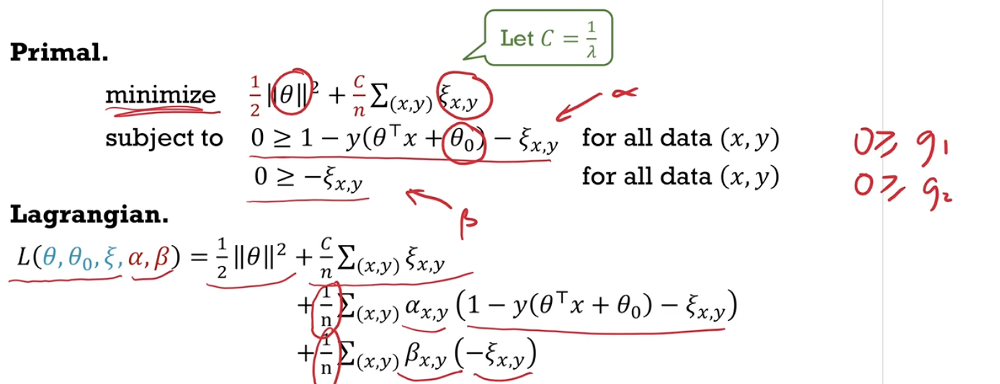
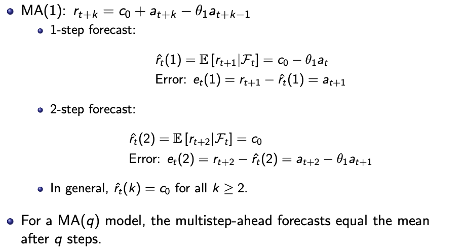
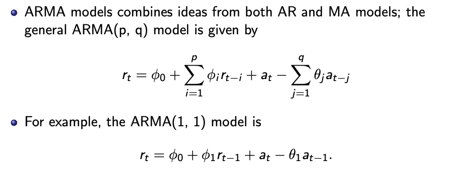
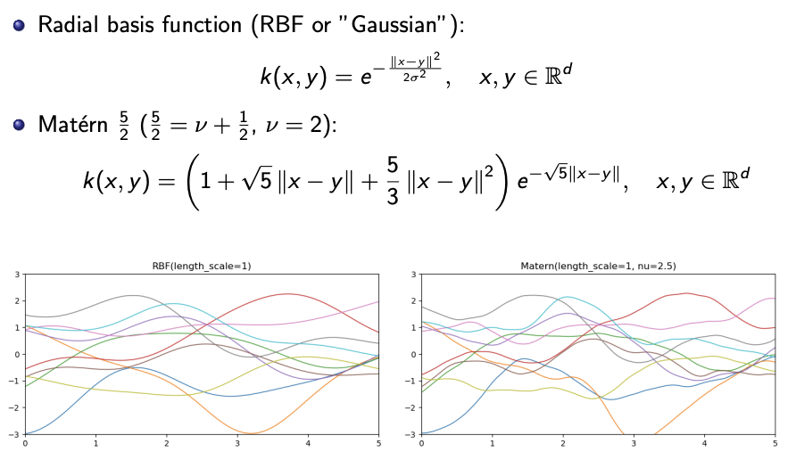

# Statistical Machine Learning

Instructors - Shaowei, Nengli

* auto-gen TOC:
{:toc}

<script type="text/x-mathjax-config"> MathJax.Hub.Config({ TeX: { equationNumbers: { autoNumber: "all" } } }); </script>
<script type="text/x-mathjax-config">MathJax.Hub.Config({tex2jax: {inlineMath: [ ['$','$'], ["\\(","\\)"] ], processEscapes: true}}); </script>
<script src="https://cdn.mathjax.org/mathjax/latest/MathJax.js?config=TeX-AMS-MML_HTMLorMML" type="text/javascript"></script>

## Course Overview

| Component     | Weightage (%) |
| ------------- | ------------- |
| Midterms      | 20            |
| Finals        | 30            |
| Participation | 10            |
| Homework      | 40            |


Shaowei's background
- Spiking neural networks (for energy efficient training)
- Machine reasoning
- You can start a tuition centre and earn $10k/month, but this life is easy and meaningless. You want to try something big, if it failed at least you have tried.


Resources
- [First half](https://people.sutd.edu.sg/~shaowei_lin/2020-sml/)
- [Second half](https://people.sutd.edu.sg/~nengli_lim/teaching/)
- [Homework](https://www.dropbox.com/sh/vm47e18xw51dg8j/AAA0flBxkI70R8-_XjTkmBqTa?dl=0) and sample midterms
- [Lecture videos](https://www.youtube.com/playlist?list=PLT9axpKGZUPT3tRicTypkjxMj3sbCxTzL)


Textbook sections

 Week | Topic                        | Book   | Chapter   
 ---- | ---------------------------- | ------ | --------- 
 7a   | Kullback distance            | Bishop | 1.6       
 7b   | Collaborative Filtering      | ?      | ?         
 7c   | Gaussian Mixtures            | Bishop | 9.2       
 8a   | Information Theory           | Bishop | 1.6       
 8b   | Clustering                   | Bishop | 9.1       
 9a   | Principal Component Analysis | Bishop | 12.1      
 9b   | Time Series                  | Tsay   | 2.1 - 2.6 
 10   | Gaussian Processes           | Bishop | 6.4       
 11   | Hidden Markov Models         | Bishop | 13        
 12   | Multi-armed Bandit           | Sutton | 1-2       
 13   | Markov decision processes    | ?      | ?         

(Bishop) Pattern Recognition and Machine Learning, Christopher Bishop, https://www.microsoft.com/en-us/research/uploads/prod/2006/01/Bishop-Pattern-Recognition-and-Machine-Learning-2006.pdf#page=13

(Tsay) Analysis of Financial Time Series, 3rd Edition, Tsay http://matematicaeducativa.com/foro/download/file.php?id=1939&sid=4874ce61c124b03eb841e58a71aaeceb

(Sutton) Reinforcement Learning: An Introduction, Sutton and Barto https://web.stanford.edu/class/psych209/Readings/SuttonBartoIPRLBook2ndEd.pdf#page=3

### Development Environment

```bash
conda create -n sml  python=3.7
conda activate sml
conda install numpy scipy matplotlib scikit-learn -y
conda install nb_conda jupyter ipykernel -y
# include OpenAI gym also
```


<div style="page-break-after: always;"></div>

## **Introduction**

#### Machine Learning 

- Define machine learning in terms of algorithms, tasks, performance and experience.
  - algorithms that improve their performance at some task with experience
- State that the goal of machine learning is generalization.
  - generalises well even on unseen data.
- List three main types of machine learning, e.g. supervised, unsupervised, and reinforcement learning.
- Describe some potential dangers in machine learning, e.g. making unethical predictions due to bias in training data, undesirable feedback between machine and human learning, applying an algorithm without understanding its assumptions.

<div style="page-break-after: always;"></div>


## **Learning Frameworks**

#### Pipeline

- List the steps in the machine learning pipeline: collect data, extract features, design models, train models, select models, evaluate solution.
- Define the roles of training, validation and test data in the pipeline, and describe their structure as sets of pairs of inputs/features and targets. 
- Define the following: model, estimator, model parameter, training objective, optimal parameter, optimal estimator. 
  - Each model $\mathcal{H}$ (a set of linear functions) is a set of estimators $f$ (a linear function) consisting of paramters $\theta$ (coefficients).
- Explain the difference between training and prediction.
- Explain the difference between underfitting and overfitting. 
- Give an example in regression of a task, the performance evaluation (via test data), the given experience (via training data), and the training algorithm.


#### Decision Theory 

- Define and give examples of **action, loss, risk, empirical risk and decision**.
  - Actions $\theta$ - Objects considered in decision making
  - Loss $\mathcal{L(\theta \vert (x,y))}$ - Amount lost by action $\theta$ based on truth $(x,y)$.
    - "Minimising the empirical risk under squared loss is the same as maximising the likelihood under Gaussian error"
    - $\mathcal{L}(\theta) = \frac{1}{2} (y-\theta^T x)^2 = \text{Loss}( y - \theta^T x)$ where $\text{Loss}(z) = \frac{1}{2} z^2$
  - Risk $\mathcal{R}(\theta \vert p)$ - Expected loss given true distribution $p(x,y)$ which is unknown.
    - $\int \mathcal{L}(0;(x,y)) \enspace p(x,y) \enspace dx \enspace dy$
  - Emprirical Risk $\mathcal{R}(\theta \vert  \mathcal{S})$ - Estimated risk given data $\mathcal{S}$ (which can be training data $\mathcal{S}_n,$ validation data $\mathcal{S}_{val}$ or test data $\mathcal{S}_*$)
  - Decision $\hat{\theta}(S_n)$ Action chosen based on data $\mathcal{S}_n$
- Give examples of different kinds of loss functions.
  - squared loss (L2), absolute loss (L1), zero-one loss (L0), negative log-likelihood
- Define the inability to generalize as risk, and explain why we need to estimate this risk with empirical risk, e.g. training, validation, test errors.
  - Inability of $\mathcal{H}$ to generalise = bias + variance + noise
  - 


#### Optimization 

- Describe how to derive exact solutions or use gradient descent for optimization problems. Describe how local minima problems can be mitigated.
  
  - Local minima problem - solve for all local minima for exact solution, multiple starting points for gradient descent
- Explain why we may prefer descent over exact methods in machine learning.
  
  - Faster and feasible computation, transferable algorithms
- Outline some computational strategies for machine learning: distributed computation, stochastic gradient descent, automatic differentiation. 
- Compute gradients automatically using PyTorch. 
  - ```python
    optimizer.zero_grad()
    outModel = model(data)
    loss = criterion(outModel, target)
    loss.backward()
    optimizer.step()
    ```


#### Regression

- Define regression statistically as estimating the conditional expectation of an unknown target given the observed inputs.
  - To obtain estimator $r(x) = \mathbb{E}[y \vert x]$.
- Outline the statistical methodology in regression: learn the conditional distribution using maximum likelihood; derive the conditional expectation.
  - Learn conditional distribution $p(y \vert x)$ with maximum likelihood.
  - Derive the conditional expectation $r(x)$ from $p(y \vert x)$.
- Given a conditional distribution and data set, write down the (conditional) likelihood, the negative log-likelihood and derive its gradient.
  - 
  - How to **derive the gradient**?
- Describe a generalized linear model as a set of conditional distributions (from some exponential family) with a link function. View linear regression as a GLM.
  - **conditional distribution** $p(y \vert x, \theta) = \mathbb{E}[y \vert x,\theta]$ from some exponential family
  - **link function** $g(\mathbb{E}[y \vert x,\theta]) = \theta^T x$ (does this need to be **invertible**?)
- List strategies to overcome overfitting in models with many parameters.
  - More data, less parameters, early stopping, model selection


#### Model Selection 

- Explain in words the bias-variance tradeoff, and how it affects model selection.
  - Inability of $\mathcal{H}$ to generalise = bias + variance + noise


#### Regularization 

- Explain that regularization helps generalization by creating for model selection, a family of models where model complexity is penalized to different extents during training. Describe how the hyperparameters are selected.
  - Different regulraisation parameter $\lambda$ for to penalise the complexity of the model to different extents.
  - Hyperparameters are selected with validation error.
- Describe the difference between the training objective and the training error.
  - training objective = training error + regularisation
- Give examples of regularizers that are commonly used in machine learning.
  - Ridge regression $\dfrac{\lambda}{2}  \vert  \vert \theta \vert  \vert ^2$
  - Lasso regression $\lambda  \vert \theta \vert $
  - Lasso has higher test error, picks a simpler model, and runs faster for subset selection.
- Explain how the exact solution for ridge regression stabilizes the estimator.
  - No longer a problem when there are **more parameters** than data
- Explain how gradient descent for ridge regression works through shrinkage.
  - The parameter shrinks at every step, unless propped by the gradient.
  - 


#### Classification

- Describe the difference between classification and regression.
  - The target is a label instead of a real value.
- Given a perceptron, draw its decision boundary and decision regions.
  - $h(x;\theta) = H(\theta^T x)$, $H(z)$ is one if positive, zero otherwise.
  - $\theta$ is orthogonal to the decision boundar which splits the space into  decision regions
  - Gradient is zero almost anywhere.


#### Logistic Regression

- Write down the model in logistic regression, and describe how a classifier can be derived from a conditional distribution in the model after learning.
  - $f(x \vert \theta) = \text{sigmoid}(\theta^T x)$
- Write down logistic regression as a generalized linear model. **Derive** the training objective and the training gradient.
  - Conditional distribution $p(y \vert x)$ 
    - $p(y \vert x) = \text{sigmoid}((2y-1)(\theta^T x))$
    - From the Bernoulli family
  - Link function $g(\mathbb{E}[y \vert x]) = \theta^T x$ 
    - $g(z) = f^{-1}(z) =  \text{sigmoid}^{-1}(z) = \log \dfrac{z}{1-z}$ 
  - Training objective is to minimise negative log likelihood $\mathcal{L}(\theta \vert \mathcal{S}_n)$
    - $\mathcal{L}(\theta \vert \mathcal{S}_n) = \dfrac{1}{n}\sum_{(x,y) \in \mathcal{S}_n} \text{Loss}\left((2y-1)(\theta^T x)\right)$
    - $\text{Loss}(z) = \log(1 + e^{-z})$
  - Training gradient is the average of point gradients
    - Point gradient $\dfrac{\delta}{\delta \theta} \text{Loss}\left((2y-1)(\theta^T x)\right) = x(f(x \vert \theta) - y)$


#### Softmax Regression

- Define one-hot encodings for labels in multiclass classification.
  - Logistic regression is the case when the number of labels is two.
- Write down the model in softmax regression. Define the softmax function. Explain why the last column of the matrix of parameters may be set to zero.
  - Model vector of $k$ probabilities $p(y \vert x,\theta) = \text{softmax}(\theta^T x)$
  - $\text{softmax}(z)_j = \dfrac{\exp z_j}{\sum_{l=1}^k \exp z_l}$
  - Dimensions of parameter $\theta \in \mathbb{R}^{d \times k}$
  - As adding a constant to any entire row does not change the model, the last column may be subtracted from every column without changing the model, the last column may be set to zero.
- Write down softmax regression as a generalized linear model
  - Conditional distribution $p(y \vert x)$ 
    - $p(y \vert x) = \text{softmax}(\theta^T x)$
    - From the Bernoulli family
  - Link function $g(\mathbb{E}[y \vert x]) = \theta^T x$ 
    - $g(z) = f^{-1}(z) =  \text{softmax}^{-1}(z) = \log \dfrac{y}{y_k}$ 
    - **What is $y_k$?** It is any constant such that the sum of probabilities become one?
  - Training objective is to minimise **negative log likelihood**
    - Point loss $\mathcal{L}(\theta \vert (x,y)) = \log(\sum \exp \theta^T x) - (\theta y)^T x$
  - Training gradient is the average of point gradients
    - Point gradient $\dfrac{\delta}{\delta \theta} \mathcal{L}(\theta \vert (x,y)) = x(f(x \vert \theta) - y)$


<div style="page-break-after: always;"></div>
## **Neural Networks**

#### Feedforward Networks  

- Define an artificial neuron. Give examples of activation functions.
  - $h_{w,b}(x) = f(\sum_{i=1}^d w_i x_i + b)$
  - sigmoid $\frac{1}{1+e^{-z}}$, tanh $\frac{e^z - e^{-z}}{e^z + e^{-z}}$, softplus  $\ln(1-e^{-z})$, ReLU $\max(0,z)$
- Write down **forward propagation in matrix notation**.
  - 
- Distinguish between network parameters and network architecture.
  - **Weights and biases** versus arrangement and number of neurons and activation functions used
- Give examples of network architectures in supervised learning (e.g. convolutional networks) and in unsupervised learning (e.g. autoencoders).
  - Undersupervised learning and "reduced representation"


#### Backpropagation

- Define the training loss and the **backpropagated error**. **Derive the gradients in terms of the backpropagated error using chain rule.**
  - 
  - 
- **Outline the steps of the backpropagation algorithm.** Explain how dynamic programming speeds up the computation of the gradient during training.
  - 
- Explain why deep learning is more successful today than it was in the 1980s.
  - Too little data, computers too slow, weights initialised wrongly, wrong type of non-linearity (should use ReLU instead of sigmoid which saturates)


#### Feature Engineering 

- Explain the success of deep learning in terms of removing the need for handcrafted features by domain experts.
  - The features learnt in each layer are learnt by backprop, not designed by hand. The weights learnt in the neural network are called feature maps.
- Give examples of applications of deep learning. 
- View a deep network with ReLU activations as a piecewise-linear function.
  - Piecewise linear functions can approximate function.
  - Deep network is a model of piecewise linear functions. **How are the regions derived?**
  - $2^n$ regions with $n$ neurons to fit any shape in the data.
- Explain the strengths and the limitations of deep learning using the universal approximation theorem and the no-free-lunch theorem.
  - Universal approximation theorem - there exist two-layer neural network (with arbtirarily large middle layer) perform perfectly on training data - but will overfit
  - No-free-lunch theroem - if an algorithm performs well on a certain class of problems, it has degraded performance on the remaining problems - not all problems are useful however
- Describe how deep learning enables regression/classification with less data by learning lower dimensional structure in high dimensional data
  - Data is often near low-dimensional manifold in a high dimensional space - Sparsity aids the learning low-dimensional manifold - Fewer labeled points needed for classification
- Describe how deep learning advances machine learning (software without explicit programming) by allowing modular blocks to be chained and trained.
  - Differentiable programming - "search to a continuous subset of the program space" - "assembling networks of parameterized functional blocks" - you can chain together different blocks and train them together - and this is how deep learning is different from traditional machine learning


#### Convolutional Networks 

- Explain how convolution of shared filters and pooling of feature maps solves the dimensionality problem in computer vision.
  - A fully connect layer requires too many parameters - The location feature in an image does not matter, "translation invariance, feature invariance"
- Compute the tensor convolution of a multichannel feature map by multichannel filters. Define the kernel size, stride and padding in a convolution. 
  - Please know how to compute by hand
- Identify the purpose of different blocks in a given piece of PyTorch code.


<div style="page-break-after: always;"></div>

#### Recurrent Neural Networks 

- Distinguish between feedforward and recurrent networks.
- Describe how recurrent networks learn long-term dependencies in sequential data by storing temporal states and accessing them with attention.
  - $\text{Attention}(Q,K,V) = f(K^T Q) \star V$
    - Matrix of keys $K$, vector of values $V$, vector of query $Q$
    - How much to select $K^T Q$, What to select $V$
    - $f$ could be a sigmoid or softmax
    - $\star$ is the notation for element-wise product
    - Returns a vector
- Describe attention mechanisms in terms of queries on key-value pairs. 
  - Input for every cell
    - cell state $C_{t-1}$
    - concatenate of output state $h_{t-1}$ and input vector $x_t$ 
  - Output for every cell
    - cell state $C_t$
    - output state $h_{t}$  
  - Update cell state
    - $C_t = f_t \star C_{t-1} + i_t \star \tilde{C}_t$
  - Selective forget
    - $f_t = \sigma(W_f \cdot [h_{t-1}, x_t] + b_f)$
         - **What to forget** (A kind of attention)
      - Key matrix $W_f$, Query vector $[h_{t-1}, x_t]$
      - Outputs a 0-to-1 vector
    - Applied on previous state $C_{t-1}$ to forget
  - Selective remember
    - $i_t = \sigma(W_t \cdot [h_{t-1}, x_t] + b_i)$
      - **What to remember** (A kind of attention)
      - Key matrix $W_t$, Query vector $[h_{t-1},x_t]$
      - Outputs a 0-to-1 vector
    - $\tilde{C}_t = \tanh(W_C \cdot [h_{t-1}, x_t] + b_C)$
      - **How much to remember** (A kind of attention)
      - Key matrix $W_c$. Query vector $[h_{t-1},x_t]$
      - Outputs a -1-to-1 vector
    - $i_t \star \tilde{C}_t$ is added to the cell state.
  - Selective output
    - $o_t = \sigma(W_o \cdot [h_{t-1}, x_t] + b_o)$
    - $h_t = o_t \star \tanh(C_t)$


<div style="page-break-after: always;"></div>


## **Kernel Methods**

#### Maximum Margins 

- Explain how the problem of finding a classifier with maximal margin widths can be written as a constrained squared-loss optimization problem.
- Explain why soft margins are needed for linearly inseparable data, and how it can be written as a constrained optimization problem with slack variables.
  - minimise $\dfrac{\textcolor{red}{\lambda}}{2}  \vert  \vert \theta \vert  \vert ^2 + \textcolor{red}{\dfrac{1}{n}\Sigma_{(x,y)} \xi_{x,y}}$
  - subject to $y(\theta^T x + \theta_0) \geq 1 - \textcolor{red}{\xi_{x,y}}$ and $\textcolor{red}{\xi_{x,y} \geq 0}$
- Explain how the hinge loss classifier with regularization **is the same as** the soft margin classifier with slack variables. 
  - minimise $\dfrac{\lambda}{2} \vert  \vert \theta \vert  \vert ^2 + \dfrac{1}{n} \Sigma_{(x,y)} \text{Loss}(y(\theta^T x + \theta_0))$
  - $\text{Loss}(z) = \max(1-z,0)$
- Analyze the effects (in terms of margin width and in terms of generalization) of changing the hyperparameters $\lambda$ or $C=1/\lambda$ on the trained classifier.


#### Duality

Comment: As the two strategies are explained side-by-side, it was quite hard to follow. Moreover you are mixing primal-dual (from optimsation) and Lagrangian (from systems world).

- Outline two strategies (dual problem with box constraints, exact solution to KKT conditions) for solving optimization problems with inequality constraints.
  - Solve a dual optimisation problem where the constraints are nicer and where it is easier to implement gradient descent.
    - Box constraints (variable $\in [a,b]$) are easier to work with, and the objective function is still manageable (quadratic for example).
  - Solve the Lagrangian system of equations.
    - Write down the Lagrangian, solve for critical points, pick the critical point which gives the global minimum. Issue - manipulating math may be hard (?).
- Write down the primal and dual problems in terms of the Lagrangian. Compare the primal and dual optimal values using the max-min inequality.
  - Lagrangian $\mathcal{L}(x,\lambda) = f(x) + \lambda_1 h_1 (x) + ...$ 
  - Objective of primal player - minimise $\mathcal{L}(x,\lambda)$ 
    Approach - set all $h_i(x)$ to zero and you get $p^*$
  - Objective of dual player - maximise $\mathcal{L}(x,\lambda)$
    Approach - for each $\lambda$ compute $\underset{x}{\min}\mathcal{L}(x,\lambda)$. Return the maxmin. 
  - $p^* = \underset{x}{\min} \underset{\lambda}{\max} \mathcal{L} (x, \lambda) \geq \underset{\lambda}{\max} \underset{x}{\min} \mathcal{L} (x, \lambda) = d^*$
  - Intuition - you do better if you have the final say.
- Given a constrained optimization problem, **derive the dual problem and its constraints**, and **write down the complementary slackness conditions**.
  - This uses both the primal and dual formulations.
  
    
  
  - The Lagrangian, primal inequalities $g_i(x) \leq 0$, dual inequalities $\alpha_i \geq 0$  and complelementary slackness.
  
    

<div style="page-break-after: always;"></div>

#### Support Vector Machines

- Outline how the dual form of a support vector machine may be derived from the primal form with slack variables (but no need to memorize the dual form).
  - 
  - 
  - 
  - 
  
- Define support vectors as feature vectors linearly combined in the optimal $\hat{\theta}$. Recognize that often, there are only a few support vectors.
  
  - 
  
- Describe how the value of the multiplier $\alpha_{x,y}$ determines the position of a feature vector 𝑥 in relation to the margin of the classifier.
  
  - 
  
- Write down the formula of the resulting classifier in terms of the support vectors, and its offset $\theta_0$ in terms of a boundary support vector.
  
  - $(\tilde{x}, \tilde{y})$ is a support vector, $(x,y)$ is the new data. Non-support vectors are not in the classifier because its $\alpha$ is zero
  
  - 

<div style="page-break-after: always;"></div>

#### Kernels

- Describe the kernel trick as a strategy to reduce computation during training and prediction by writing them in terms of an easy-to-compute kernel as opposed to a difficult-to-compute feature map. Illustrate this with an example.
  - Refer to Polynomial and Radial Basis Kernel
- Define a kernel as a symmetric function which generates Gram matrices that are positive semidefinite. Relate kernels to similarity maps and distance maps. 
  - $K:\mathbb{R}^d \times \mathbb{R}^d \to \mathbb{R}$
  - $K(x,y) = K(y,x)$ for all $x, y \in \mathbb{R}^d$
  - $K(x,y) \geq 0$ for all $x, y \in \mathbb{R}^d$ 
    - The Gram matrix $K_{ij} = K(x_i, x_j)$ is positive semidefinite 
      - symmetric (previous property)
      - all eigenvalues are nonnegative (not imaginary)
  - Existence of a feature map function $\phi(x)$
    - $K(x,x') = \phi(x) \cdot \phi(x')$
    - However $\phi$ may be hard to find. 
  - When $K(x,y)$ is large, $x$ and $y$ is similar (and the distance is small)
- Write down the linear, polynomial and radial basis kernels.
  - Linear Kernel $K(x,x') = x \cdot x'$
    - $\phi(x) = x$
  - Polynomical kernel $K(x,x') = (x \cdot x' + 1)^k$
    - For $k=2$, $\phi(x) = (1,\sqrt{2}x_1, ..., \sqrt{2} x_1 x_2, ... x_1^2, ...)$
  - Radial Basis Kernel $K(x,x') = \exp \left( -\frac{1}{2}  \vert  \vert  x - x'  \vert  \vert ^2 \right)$
    - $\phi$ returns an infinite dimensional vector

<div style="page-break-after: always;"></div>

#### Kernelization

- Describe how to use a radial basis kernel in an SVM for training and prediction.
  - Refer to SVM, but $K(x,x') = x \cdot x'$ should be $K(x,x') = \exp \left( -\frac{1}{2}  \vert  \vert  x - x'  \vert  \vert ^2 \right)$
- Outline how a representation of $\theta$ as a linear combination of feature vectors $x$ can be used to derive the **kernel ridge regression**.
  - SVM is a classifier, kernels can be used for regression.
  - $\hat{\theta}$ will be a linear combination of vectors $x$.
  - You can use other kernels instead of the linear kernel.
  - 
  - 
- Describe the pros and cons of using a higher-order kernel (e.g. radial basis kernel or polynomial kernel of high order) for classification or regression.
  - Underfitting and overfitting (will not generalise well to unseen data).


<div style="page-break-after: always;"></div>

## **Graphical Models**

#### Probability

- Define the **multinomial** and multivariate Gaussian distributions. Recognize $\Sigma$ in the Gaussian distribution as the covariance matrix.
  - $\Sigma = (\Lambda ^T \Lambda)^{-1}$
  - $\varepsilon = \Lambda x = \mathcal{N}(0,I)$
  - $p(x \vert \mu, \Sigma) = (2\pi)^{d/2} (\det \Sigma)^{1/2} \exp \left\{ -\dfrac{1}{2} (x-\mu)^T \Sigma^{-1} (x-\mu) \right\}$
  - $\Sigma_{ij} = \text{Cov}(X_i, X_j) = \mathbb{E}[(X_i - \mu_i)(X_j - \mu_j)]$
- Write down the resulting multivariate Gaussian distribution after applying a change of basis to a spherical Gaussian distribution.
  - $x = \Lambda^{-1} \varepsilon \sim \mathcal{N}(0, \Sigma)$
- Define the conditional independence of $X$ and $Y$ given $Z$.
  - $p_{X,Y \vert Z}(x,y  \vert  z) = p_{X \vert Z}(x \vert z) \cdot p_{Y \vert Z}(y \vert z)$ for all outcomes $x$ and $y$ and $z$.


#### Graph Theory 

- Identify the following aspects of a graph: vertex, edge, undirected graph, directed graph, adjacent, child, parent, descendent, ancestor, path, cycle, directed path, undirected path, collider, non-collider.
  - parent $\to$ child 
  - ancestor $\to$ child $\to$ something $\to$ descendant 
  - a variable is a collider when it is causally influenced by two or more variables
  
- Identify the following kinds of graphs: acyclic directed graph, complete graph, subgraph, clique, maximal clique. 
   - clique - a complete subgraph
   - maximal clique - a clique not contained in any larger clique
   
- Define the **separation** of sets $A$ and $B$ by $C$. Define the **d-separation** of sets $A$ and $B$ by $C$.
  
   - 
   - 
   - Non-colliders are open (can pass through, connects), but closed if in $W$
   - Colliders are usually closed, but open if in $W$ or its desendants is in $W$
    - 
    - Is $X$ and $U$ d-separated (given anything other set)? 
   
- Define a graphical model as a collection of random variables with a graph defining the relationship between the variables. Recognize shaded and unshaded nodes as observed and hidden variables respectively.

- Recognize directed edges as descriptions of conditional distributions. Recognize undirected edges as descriptions of joint distributions. Define Bayesian networks and Markov random fields.


#### Bayesian Networks (Directed Graphical Models)

- Define a distribution satisfying the factorization property with respect to a graph using conditional distributions.
  - $p(x_1, ..., x_k) = \Pi_{i=1}^k p(x_i  \vert  \text{parents}_i)$
- Describe ways to define multinomial distributions and Gaussian distributions which factorize with respect to a graph. Given a graph, write down the **inverse covariance** $\Lambda$ of the corresponding Gaussian using linear dependencies.
  - 
- Define the global Markov property of a distribution with respect to a graph. Determine if a statement $S \bot T \  \vert  \ W$ is true using d-separation. 
  - A distribution $p$ satisfies the global Markov property with respect to graph $\mathcal{G}$ if
    - for all the disjoint sets $S$,$T$,$W$ that $S$ and $T$ are d-separated given $W$
      - $S$ and $T$ is conditionally independent given $W$ i.e. $S \bot T \  \vert  \ W$
- Understand the Hammersley-Clifford Theorem as stating the equivalence between two ways of defining Bayesian networks.
  - $p$ satisifies the factorisation property with respect to $\mathcal{G}$
  - $p$ satisifies the global Markov property with respect to $\mathcal{G}$
- Understand the concept of explaining away, that conditioning on a collider will lead to dependence between two parent variables.
  - Knowing the battery is flat explains away the observation that the gauge level is zero (there is less need to consider another explanation). Fuel level is less likely to be zero even though battery level does not affect fuel level.


#### Markov Random Fields (Undirected Graphical Models) 

- Define a distribution satisfying the factorization property with respect to a graph using potential functions. If the distribution is strictly positive, give the definition in terms of energy functions.
  - We say $p$ satisfies the factorisation property with respect to $\mathcal{G}$ if
    $$p(x_1, ... x_k) = \dfrac{1}{z}\prod_{\text{max clique } C} \enspace \varphi_C (x_C)$$ 
    for some nonnegative potentials $\varphi_C(x_C)$ where $x_C = (x_i)_{i \in C}$ 
  - If the nonnegative potential functions $\varphi_C(x_C)$ are positive, we can write  $\varphi_C(x_C) = \exp \left\{ - E_C(x_c) \right\}$ for some energy function $E_C(x_c)$.
    Then  $p(x_1, ... x_k) = \dfrac{1}{z} \exp \left\{ -\sum_{\text{max clique }C} E_C (x_C) \right\}$
- Define the global Markov property in terms of separation.
  - A distribution $p$ satisifies the global Markov property with respect to graph $\mathcal{G}$ if
    - for all disjoint subsets $A$,$B$,$C$ that $A$ and $B$ are separated given $C$.
      - $A$ and $B$ are conditionally indepedent given $C$, i.e. $A \bot B \  \vert  \ C$ 
  - **How did the class example $ABCD$ satisfy this?**
- Define the pairwise Markov property in terms of non-adjacency.
  - We say that a distribution $p$ satisfies the pairwise Markov property with respect to $\mathcal{G}$ if for all non-adjacent variables $X$ and $Y$, $X \bot Y \  \vert  \ V  \backslash \{X,Y\}$
  - This is a special case of global Markov property, where the two conditionally independent sets have one element each, and are not adjacent.
  - **Isn't this like all the simple graphs?** - Seems like **you need to property** to draw the graph that way.
- Understand the Hammersley-Clifford Theorem as stating the equivalence between three ways of defining strictly positive Markov random fields.
  - If $p$ is strictly positive, then the following are equivalent.
  - $p$ satisifies the factorisation property with respect to $\mathcal{G}$
  - $p$ satisifies the global Markov property with respect to $\mathcal{G}$
  - $p$ satisifies the pairwise Markov property with respect to $\mathcal{G}$
    - Two variables that are not adjacent are independent of each other if conditioned on every other variable, because the covariance matrix of the two matrix will be a diagonal.
- Describe ways to define multinomial distributions and Gaussian distributions which factorize with respect to a graph.
  - 
- Given a graph, write down the inverse covariance of the corresponding Gaussian using the pairwise Markov property.
  - 
    
- Recognize a Boltzmann machine as a special case of a multinomial distribution with binary variables and only two-way interactions (second-order energies).
  - **What is a Boltzmann machine? What does it do?**
  - "only two-way interactions" - All higher-order energies can be written in terms of second-order ones.
  - With all the second order energies (each of them is a $2 \times 2$ matrix), we can write the weights in terms of the second order energies.
  - We can write the joint distribution of the entire Boltzmann machine as well.
    


## Latent variables

#### Kullback Distance

- Compute the MLE of a statistical model given data. Write down the MLE of a multinomial model and a spherical Gaussian model.
  - Maximum likelihood estimate $\hat{\theta} = \text{argmax}_{\theta} \prod_{x \in \mathcal{S}} p(x,\theta) = \text{argmax}_{\theta} \sum_{x \in \mathcal{S}} \log p(x,\theta)$
  - MLE of regression is concerned with $p(y \vert x,\theta)$.
  - Multinomial model to evaluate the probability of the bag of words
    - Likelihood $p(\mathcal{S} \vert \theta) = \prod_{w \in W} \theta_W^{n(w)}$
    - Log-likelihood $\mathcal{L}(\theta) = - \dfrac{1}{n} \sum_{w \in W} n(w) \log \theta_w$
    - MLE $\hat{\theta}_w = \dfrac{n(w)}{\sum_{w' \in W} n(w')} = \dfrac{n(w)}{n}$
  - Gaussian model
    - Log-likelihood = $-\dfrac{1}{n} \log p(x \vert \mu,\sigma^2) = \dfrac{d}{2} \log(2\pi \sigma^2) + \dfrac{1}{2 \pi \sigma^2} \sum_{x \in \mathcal{S}}  \vert  \vert  x-\mu  \vert  \vert ^2$
    - MLE - mean is sample mean, variance is sample variance.
- Design a classifier using the log likelihood ratio.
  - Compute the MLE $\theta^+$ and $\theta^-$ for the likelihoods for each of the classes (i.e. find the optimal parameters for each class). Then compute the likelihood of the new data point on the model trained on each class. We look at the sign of the ratio
    - $\log \dfrac{p(\mathcal{S} \vert \theta^+)}{p(\mathcal{S} \vert \theta^-)} = \sum_w n(w) \log \dfrac{\theta_w^+}{\theta_w^-}$
  - Classifying between two Gaussian with the same variance and different means $\mu^+$ and $\mu^-$
    - $\log \dfrac{p(x \vert \mu^+,\sigma)}{p(x \vert \mu^-,\sigma)} = x \cdot \dfrac{\mu^+ - \mu^-}{\sigma^2} - \dfrac{1}{2 \sigma^2} \left( \vert  \vert \mu^+ \vert  \vert ^2 -  \vert  \vert \mu^- \vert  \vert ^2 \right) \\= x\theta - \theta_0$
- Define the Kullback distance as the expectation of the log likelihood ratio. Recognize that the Kullback distance is non-negative and not symmetric.
  - $\text{KL}_w(q \vert  \vert p) = \mathbb{E}\left[ \log \dfrac{q(x)}{p(x)} \right] = \int q(x) \log \dfrac{q(x)}{p(x)} dx \geq 0$
  - Distance is defined from the true distribution $q(x)$, measured in bits or nats.
- Define the empirical distribution as that of sampling from the training data. Recognize the equivalence between maximizing the likelihood, minimizing the negative log likelihood, and minimizing the Kullback distance between the empirical distribution and the model.
  - $q_\mathcal{S}(x)$ is the empirical distribution
  - $\text{KL}_x(q \vert  \vert p_{\theta}) = \sum_x q_\mathcal{S}(x) \log q_\mathcal{S} (x)- \sum_x q_\mathcal{S}(x) \log p_{\theta} (x)$
  - $- \sum_x q_\mathcal{S}(x) \log p_{\theta} (x)$ is the negative log likelihood.
- Identify alternating minimization between the model parameters 𝜃 (weights) and the distribution of $z \vert x$ (states) as a common strategy for training models with latent variables.
  - Latent variables are variables which we cannot observe.
- (**Conditional Kullback Distance** and Chain Rule not in syllabus)
  - 
  - 
  - Solving the green minimisation problem solves the blue minimisation problem.
  - Expectation step - minimise $\text{KL}_x(q  \vert  \vert  p_\theta)$ by computing the soft labels with the parameter $\theta$.
  - Maximisation step - minimise $\text{KL}_{z \vert x} (q \vert  \vert p_\theta)$ over the parameter $\theta$.


#### Recommender Systems

Please draw the matrix and label the dimensions.

- Give examples of recommender systems, e.g. Netflix, Amazon. 
- Define collaborative filtering as the completion of a large similarity matrix with sparse entries. Identify low-rank matrix factorization as a solution.
  - Each movie $i$ has a latent vector $Z_i \in \mathbb{R}^k$ and $Z_i \sim \mathcal{N}(0,I/\lambda)$
  - Each user $a$ has a latent vector $\theta_a \in \mathbb{R}^k$ and $\theta_a \sim \mathcal{N}(0,I/\lambda)$ 
  - $X_{ai} = \theta_a^T Z_i + \varepsilon_{ai}$ where $\varepsilon \sim \mathcal{N}(0,1)$
  - $X \approx \theta^T Z \in \mathbb{R}^{n \times m}$
- Write down the training objective for matrix factorization.
  - Likelihood = $p(Z)p(\theta)p(X_{ai} \vert Z,\theta) = p(Z)p(\theta)p(\varepsilon_{ai} \vert Z,\theta)$
  - Training objective is the negative log likelihood
    - $\mathcal{L}(\theta,Z \vert X) = \sum_{(a,i) \in \mathcal{D}} \frac{1}{2}(X_{ai} - \theta_a^T Z_i)^2 + \frac{\lambda}{2} \sum_a  \vert  \vert \theta_a \vert  \vert ^2 + \frac{\lambda}{2} \sum_i  \vert  \vert Z_i \vert  \vert ^2$
- Describe how alternating least squares solves the matrix factorization problem.
  - Initialise $\theta$ (and $Z$) randomly. Repeat until convergence
    - Fix $\theta$ and minimise $\mathcal{L}(\theta,Z \vert X)$ over $Z$ 
    - Fix $Z$ and minimise $\mathcal{L}(\theta,Z \vert X)$ over $\theta$
  - Feasible because each step is a standard ridge regression problem. You can do this independently for each movie vector and user vector.
    - $\sum_{(a,i) \in \mathcal{D}} \frac{1}{2}(X_{ai} - \theta_a^T Z_i)^2 + \frac{\lambda}{2} \sum_i  \vert  \vert Z_i \vert  \vert ^2$
    - $\sum_{(a,i) \in \mathcal{D}} \frac{1}{2}(X_{ai} - \theta_a^T Z_i)^2 + \frac{\lambda}{2} \sum_a  \vert  \vert \theta_a \vert  \vert ^2$
- Describe how hyperparameters $k, \lambda$ can be found by model selection. 
  - $k$ is number of latent variables for each movie and user
  - $\lambda$ is the regulariser
  - Use the validation set to select $k$, $\lambda$.
- Visualize user and movie latent features in the same space, and describe how to predict a user rating for a movie using these latent features.
  - Each user and movie has $k$ latent variables. You can plot users and movies in the same space and recommend nearby movies to nearby films.


#### Gaussian Mixtures

- Define the mixture model for a given list of distributions. Describe the mixture model as a kind of directed graphical model with latent variables.
  - $\varphi(x) = \pi_1 \varphi_1(x) + \dots + \pi_k \varphi_k(x)$. The area under graph of each $\varphi$ is one, and the mixing parameters $\pi_i$ sums up to one.
- Write down the distribution of a Gaussian mixture model and its log likelihood. Compare with the distribution and log likelihood of the fully-observed model.
  - Parameters - $\pi_i$, $\mu_i$, $\sigma_i$ for each of the $k$ spherical Gassians.
  - Distribution $p_{\theta}(x) = \sum_Z \pi_z (2 \pi \sigma_z^2)^{d/2} \exp \left\{ -\dfrac{1}{2 \sigma_2^2}  \vert  \vert  x - \mu_z  \vert  \vert ^2 \right\}$
- Recognize that log likelihood of fully observed model is convex with unique local minima, but the latent model is non-convex with many local minima.
  - 


#### Expectation Maximization

- Describe the EM algorithm as an alternating minimization algorithm where the E-step involves computing $\mathcal{L}(\theta) = \mathbb{E}\left[ \log p_{\theta} (z,x) \right] = \sum_{x \in \mathcal{S}} \int p_{\tilde{\theta}} (z \vert x) \log p_{\theta} (z,x) dz$ for given $\tilde{\theta}$ and the M-step involves maximising $\mathcal{L}(\theta)$ to update $\tilde{\theta}$ 

- Describe the EM algorithm for Gaussian mixtures, in terms of computing soft labels. Compare with the MLE of the fully observed model using hard labels. 
  - Initialise the parameters with something reasonable.
    - $\pi_z = 1/k$
    - $\mu_z$ of random points, or from k-means clustering
    - $\sigma_z^2 = \sigma^2$ all sample variance.
      
  - If the observed labels have been observed, you will have the hard binary labels $\delta(z \vert x)$ instead of soft probability label $p_\theta (z \vert x)$. Understand the concept "effective".
  
  ```python
  def E_step():
      gamma = np.zeros((NUMDATAPTS, K))
      log_lik = 0
      for i in range(NUMDATAPTS):
          gamma[i] = [multivariate_normal.pdf(X[i], mu, cov) for mu,cov in zip(mu,cov)]
          gamma[i] = gamma[i]/sum(gamma[i])
          log_lik += sum(gamma[i] * np.log(pi*gamma[i]))
      print("Negative Log Likelihood : ", log_lik)
      return gamma
  
  def M_step(gamma): 
      for z in range(K):
          soft_labels = gamma[:,z]
          pi = soft_labels/NUMDATAPTS
          effective_points = sum(gamma[:,z])
          mu[z] = np.average(X, weights=soft_labels, axis=0)
          cov[z] = np.cov(np.transpose(X),aweights=soft_labels)
      return None
  ```
  
- Recognize the EM algorithm for mixture models as a clustering algorithm. Compare with the k-means algorithm - similarity in alternating minimization and multiple local minima, but difference in smoothly navigating local minima.
  - Gaussian mixture model
    - Given Gaussians, compute soft labels. 
    - Given soft labels, compute Gaussians.
  - k-means clustering
    - Given centroids, compute hard labels.
    - Given hard labels, compute centroids.
  - k-means is a special case of Gaussian, with use of hard labels and unchanging variance. (Refer to Mickey Mouse dataset for performance difference)
  - Both algorithms may get stuck in local minima. However, unlike k-means, the soft labels allow points to move between clusters slowly.
  
- Define the Bayesian Information Criterion, and describe how to use it for model selection for number of clusters.
  - The more cluster you use, the lower the loss. However you want to prevent overfitting and underfitting. 
  - To select models - use validation error or use Bayesian Information Criterion.
  - $\text{BIC}(\mathcal{M}_k) = \mathcal{L}(\mathcal{M}_k) + \dfrac{f}{2}\log(n)$, where $n$ is the number of training data points and $f=k(d+2)-1$ is the number of free parameters in the mixture model.
  - "The negative of the BIC approximates the marginal likelihood intergral appearing in the Bayesian posterior probability."


## Infromation Theory

(Chapter 1.6 of Bishop)

- **Entropy** of a random discrete distribution
  - $H(X) = - \sum_i p_i \log_2 p_i$


- **Shannon’s source coding theorem** (or noiseless coding theorem) tells us
  - We cannot find a lossless encoding scheme that uses on average fewer bits than $H(X)$ i.e. entropy gives us a lower bound.
  - At the optimal coding scheme, each letter with probability $p_i$ will should require $p_i \log_2 p_i$ bits


- **Cross entropy** of two discrete distributions $p$ and $q$
  - $H(p,q) = -\sum_i p_i \log q_i$
  - If $q_i = 0$ for some $i$ but $p_i > 0$, then $H(p,q) = \infty$
  - Number of bits needed to code $p$ with coding scheme associated with distribution $q$.
  - The cross entropy gives a measure of how dissimilar of $q$ is from $p$.
  - Cross entropy is not symmetric $H(p,q) \neq H(q,p)$ in general.


- **Kullback-Leibler divergence** of of two discrete distributions $p$ and $q$
  - $D_{KL} (p \vert q) = H(p,q) - H(p,p) = \sum_i p_i \log \dfrac{p_i}{q_i}$
  - KL divergence measures the number of extra bits required to transmit X with distribution $p$, as compared to the optimal code, when we use the sub-optimal coding scheme associated with distribution $q$.


- **Jensen's inequality**
  - $f(x)$ is a convex function, $\mu$ is a probability measure, $g(x)$ and $f(g(x))$ are integrable, then
  
    $$f\left( \displaystyle \int{g(x) \ d \mu(x)} \right) =  \displaystyle \int{f(g(x)) \ d \mu(x)} $$
  
    Please screengrab the slide. Continuous and discrete has different probability measure.
  
    $f(\mathbb{E}(X)) \geq \mathbb{E}(f(x))$
    
    


## Unsupervised learning

- Objective - finding structure in data.
- Example - Dimensionality reduction, eg. PCA.
- No labels/targets

Application
- Feature engineering
  - Additional features with the cluster information
  - Could help with classification or regression (more explainable than random forests)
- Data compression


Clustering

- Hyperparamters
  - Number of clusters
    - Chosen with the elbow method
- Model design
  - Metrics 
    - squared Euclidean distance (lower the more similar)
    - cosine similarity (higher the more similar)
- Training loss
  - sum of metrics within each cluster, sum over all clusters

(When to use medoids rather than centriods - you cannot show the centriods of n webpages)


Optimisation

- Assign members to leaders
- Reassign leaders
- (Idea - you have to fix the leaders when you assign the members)


Coordinate descent

- Because you cannot optimise both x and y at the same time.


K-means


- Initialisation - place the points far apart with high probability
- Training loss always decreases in each step (coordinate descent).
- Converges to a local minimum, not necessarily a global minimum.
- Repeat the algorithm over many random initial points, then pick the configuration with the smallest training loss.
- Elbow method to choose the number of clusters

(Not K-nearest neighbours (KNN) - which does not have a training phase, and it is a supervised method)


Other clustering methods (FYI)

- Spectral clustering (for cresent and dot dataset)
- Hierarchical clustering (refer to Analytics Edge)
- Density-based clustering (DBSCAN)


## Principal Component Analysis

Transform into features that are

- most important
- uncorrelated to each other


PCA is a linear dimension reduction. (Manifold learning is non-linear dimensional reduction).

One potential drawback is that such a transformation would lead to a loss in interpretability of the data.


### Single value decomposition


We assume that $n >> p$

The feature vectors are the columns of $U$. The feature vectors have a norm of one and are orthogonal to each other.

**What is $V$?** 

- the feature vectors if SVD is computed for $X^T$

- the amount of each feature one entry have


Please understand how the **information** is conserved.

#### SVD Procedure

Positive semidefinite - all eigenvalues are non-negative (and real). 
- $U^T U = I$ because $U$ is an orthonormal matrix. (same for $V$)

   


Things to note

- Remember how to do eigendecomposition
- We want normalised eigenvectors
- You do not need to do eigendecomposition for $X X^T$ for $U$, you can calculate it from $XV = U \Sigma$. The first $p$ diagonal elements of $\Sigma$ is the same.


### Principal Component Analysis


Design matrix is the data, and each entry is one row. We need to normalise each column first.

The result is a matrix $XV$ with dimension reduced from $n \times p$ to $n \times L$.


Why does PCA work

- It maximises the variance of the first column of $T = XV$.
- (My visualisation - consider the multivariate Gaussian distribution - we want to find the vector, when the data is projected on the vector, the variance of the projection is maximised)
- The columns of $T = XV$ is orthogonal to each other.
- I did not read the derivation.


## Time Series

Not useful for stock returns modelling, but a good tool to measure volatility.


### Stochastic processes 

A stochastic process $\{X_t\}_t \in T$ is a collection of random variables indexed by some index set $T$ and governed by some joint distribution $P$. The random variables $X_t$ take on values in some state space $\mathcal{S}$.

$T$ and $\mathcal{S}$ could be discrete or continuous.

For a time series, $\mathcal{S} = \mathbb{R}$, and $T = \{ 0,1,2,\cdots \}$


#### Strict stationarity

The joint distribution of values is the same for any collection of indices.

- Too difficult to prove, we do not need this strong to prove results either


#### Weak stationarity

$\mathbb{E}[r_t] = \mu = \mathbb{E}[r_{t+s}]$ for any $s$.

$\text{Cov} (r_t, r_{t-s}) = \gamma(s)$ is a function (autocovariance) only of the lag $s$.

Strict stationarity is hard to check, we adopt the second definition here.


### Stationarity Autocorrelation function (ACF)


In essence, this is Pearson correlation applied on elements that are time $t$ apart.


### White noise sequences

All time entries $\{ a_t \}$ are independent of each other, with a finite variance.

If $\{ a_t \}$ is normally distributed then the sequence is a "Gaussian white noise"


### Auto-regressive (AR) models

AR(1) model

$r_t = \phi_0 + \phi_1 r_{t-1} + a_t$

where ${a_t}$ is a white noise series.

Given sufficient data, $\phi_0$ and $\phi_1$ can be found with linear regression.

Proof of weak conditionality (please understand)
- $\mathbb{E}[r_t] = \mu = \dfrac{\phi_0}{1-\phi_1}$
- $\gamma(s) = \text{Cov}[r_t, r_{t-s}]$
- Weak conditionality if $ \vert \phi_1 \vert  < 1$
  - You can show this by recurviely subtituting
- $\text{Var}(r_t) = \dfrac{\sigma_a^2}{1-\phi_1^2}$

- $\rho(s) = \phi_1^s$
  - The ACF of AR(1) decays exponentially with rate $\phi_1$


Homework - AR(2) was modelled.

- $r_t = \phi_0 + \phi_1 r_{t-1} + \phi_2 r_{t-2} + a_t$


The general AR(p) model is given by

$r_t = \phi_0 + \phi_1 r_{t-1} + \cdots + \phi_p r_{t-p} + a_t$

Need to use partial-ACF (not in exam) to determine $\rho$, because ACF cannot distinguish AR models with different orders. (Partial F-test to determine fit)


### Moving average (MA) models

MA(1) model

$r_t = c_0 + a_t - \theta_1 a_{t-1}$

- $\mu = \mathbb{E}[r_t] = c_0$
- $\text{Var}(r_t) = \sigma_a^2 + \theta_1^2 \sigma_a^2$

MLE to find optimal parameters.


ACF

Look at the correlation plot between points $s$ apart, for $s >= 1$. See where the correlation stops.


MA(q) model

$r_t = c_0 + a_t - \theta_1 a_{t-1} - \cdots - - \theta_q a_{t-q}$

- $\mu = \mathbb{E}[r_t] = c_0$
- $\text{Var}(r_t) = (1 + \theta_1^2) \sigma_a^2$

ACF


MA(q) models **are always weakly stationary** because they are finite linear combinations of a white noise sequence with time-invariant expectation and variance.


### Forecasting

For all models, as the horizon increase we are more uncertain of the forcast.

2-step - two step into the future, assuming your prediction of 1-step. You need to recursively calculate.


For MA(q) model, when the values are more than $q$ points apart the prediction is $c_0$ because values will be uncorrelated.



For a stationary series, the multistep-ahead forecasts converge to the mean of the series, and the variance of forecast errors converge to the variance of the series as the forecast horizon increases.


### ARMA models

(not in exam)



Use MLE to find optimal parameters.


## Gaussian processes

"This is an exercise" - will come up for finals.

Is the "inverse covariance matrix" the inverse of covariance matrix?

Conditional distribution in the continuous case $p(y \vert x) = \dfrac{p(y,x)}{p(x)}$ - how to interpret this?


Interesting animation, but I prefer one that animates what the prof has shown (with the truth that is noisily sampled).
- https://distill.pub/2019/visual-exploration-gaussian-processes/


### Marginal distribution

Probability density function of multivariate Gaussian distribution
$$
p(x) = C \exp \left( -\frac{1}{2} \left< 
(x-\mu), \Lambda (x-\mu)
\right> \right)
$$

where 
- $x$ is the vector we are calculating the marginal distribution for
- $\mu$ is the mean vector
- $\Sigma$ is the $d \times d$ covariance matrix (which should be symmetrical)
- $\Lambda = \Sigma^{-1}$ is the $d \times d$ precision matrix (which should be symmetrical)
- $C$ is a constant


### Distribution of partitioned vectors

If we partition the vector $x$, we can express the marginal distribution in terms of each partition.


Note that

- $\Lambda_{ba}^T = \Lambda_{ab}$
- $\Sigma_{ba}^T = \Sigma_{ab}$


If we are interested in the unconditioned marginal distribution of $x_a$, simply take the integral across $x_b$.


### Conditional distribution

We are interested in $\mu_{a \vert b}$ and $\Sigma_{a \vert b}$ as we want to model the distribution of $x_{a \vert b}$.

We set $x_b$ to a constant and compare the expressions.


We want to express $\mu_{a \vert b}$ and $\Sigma_{a \vert b}$ in terms of $\mu$ and $\Sigma$, so we use an expression that was covered in the homework.


## Gaussian process


Both the state space and the indexing is continuous.


Example of kernels

- The kernel function needs to fulfill the stated requirements - symmetric and positive semidefinite (and when $x=y$ the correlation should be one?)



In essence, if $x$ is close to $y$, x should be strongly correlated to $y$.


### Bayesian prediction

Linear regression

$$
p(y \vert f(x)) \sim \mathcal{N}(f(x), \tau^2)
$$

Modelling $f$ with a Gaussian process distribution, with kernel $K$

$$
p(f(x)) \sim \mathcal{N}(0,K)
$$

> Parametric methods assume there is a process that generates the data and that process is defined using some parameters. Non-parametric methods do not make any assumption about the process - they try to solve the problem solely in terms of the input data.
>
> Parameteric methods throw away the training data when the model is trained.

The kernels do not have parameters (therefore this is a "non-parametric" method).

**What is the value of $\tau$?** - an unknown noise variance that does not need to be known?

$t$ is the **target** (no it is not time)


$\delta_{ij} = 1$ if $i=j$, otherwise $0$. 


Refer to conditional distribution of the partitioned variables for the concept.
- I can see how the formula can be applied.
- **The sampling can be noisy** (see the red band around the truth). As per prof's explanation, the variance of the distribution of a point already sampled is zero. (I need to see how it works out).
  - How will the following predictions be updated when the resampling of the same point returns a different result?
- I should code an example someday. The method is quite recent, the recommended textbook "Gassian process for regression" was written in 2005.


### Bayesian optimization

We want to minimise the computation of $f$, which is a black-box function that does not have an analytic expression.
- Example: hyperparameter tuning in deep learning models.
  - Training a model with a set of hyperparameters is time-consuming.
  - We are not interested in how the metric is modelled with the function of hyperparameters, we just want the optimal hyperparameters.


Bayesian optimization techniques attempt to find the global optimum of $f$ in as few steps as possible.

- Define a **surrogate model** which approximates the objective function $f$  - e.g. a Gaussian process
- Use an **acquisition function** to direct sampling to areas where one will have an increased probability of finding the optimum.

> Parametric methods assume there is a process that generates the data and that process is defined using some parameters. Non-parametric methods do not make any assumption about the process - they try to solve the problem solely in terms of the input data.


### Optimisation procedure


Common acquisition functions


- Red dot are past observations. Notice that the truth is a distribution, and the red dot may not be red dotted line which is the mean of the distribution.
- The blue dot is the next element to sample. It is the maximum of the acquisition function.
- The acquisition function is derived from the conditional distribution conditioned on past observations. The search for the maximum of the acquisition function should be computationally efficient with methods such as gradient descent. There are other acquisition functions.
- Exploitation versus exploration
  - Exploitation - You only explore solutions that you are confident that you will get a better solution. Points sampled tend to close to each other. You lose out better opportunities. 
  - Exploration - The opportunities that are "better" may not be actually better, and you waste your search options.

With the surrogate model, we can easily calculate $\mu_{GP}(x)$

## Hidden Markov Models

What to take note - off by one errors, identify exactly which chain each variable is referring to.

Time-homogeneous Markov chain

- Transition probability depends only on the previous state
- Transition probability is time invariant

A Markov chain is defined by

- An $n \times n$ matrix containing state-change probabilities
- An $n$ dimensional vector $\pi$ containing initial state probabilities


Nth order Markov Chain (we are only dealing with 1st order, 2nd order in exams?)


Assumption - The probability of observing a series of observations can be factorised into conditions.

- The hidden state
- The emissions


Parameters for a hidden Markov model

- **Initial** probabilities: $p(S_1 = j) = \pi_i$
  - One value of every state
- **Transition** probabilities: $p(S_t = j \ \vert \ S_{t-1} = i) = p_{ij}$
  - One value for every state-state pair
- **Emission** probabilities: $p(O_t = y \ \vert \ S_t = i) = q_i^y$
  - One value for every state-output pair


### Example


Three main problems

- **Evaluation**
- **Decoding**
- **Learning**


### Evaluation: Forward algorithm


Starting from the initial node to the last node, calculate the **forward probability** of each hidden state.


The forward probability $\alpha_t^k$ is the joint probability of the hidden state $k$ and past and current observations up to $t$.


To get the (required) joint probability of observations $p(\{ O_t \}_{t=1}^T )$, take the sum of the latest forward probabilities over all the hidden states $\sum_k \alpha_t^k$.

Dynamic programming simplifies the computation of all $K^T$ paths to $KT$ alphas.


### Decoding: Forward-Backward algorithm


d-separation allows for the above decomposition, because we condition on $S_t$ which d-separates the two subgraphs and thus $$\{ O_1 ... O_t, S_1 ... S_{t-1} \} \bot \{ O_{t+1} ... O_T, S_{t+1} ... S_T \} \ \vert \ S_t$$

The first part $\alpha_t^k$ is calculated in the forward algorithm until $t$.

The "backward" probabilities $\beta_{t}^k$ is the probability of the following observations from a node given the state of the node.

We compute the $\beta_{t}^k$ starting from last node, until the node that are we interested in the probability in. We would compute all the $\beta$ (and $\alpha$)anyways, because we want to know the probability of each state in every node.


Why initialise $\beta_T^k = 1$? See the LHS of first termination equation, substitute $t=T$ and it is $\alpha_T^k$.

The second termination equation - numerator is the first termination equation, denominator is the sum across all states of the numerator.

The termination equations applies to all $t$s.

Explaining the iterative equation 

- across all states we take the sum of 
  - the probability of the following observations from a node given the state $i$ of the node $t+1$ (i.e. $\beta_{t+1}^i$) 
    - multiplied by 
  - the new observation conditioned on the state $i$ of the node $t+1$ 
    - multiplied by 
  - the transition probability from $k$ to $i$.


### Learning: Baum-Welch (EM) Algorithm

Objective - find parameters that maximise the likelihood of the observed data.

E-step - Fix parameters, find expected state assignments 

M-step - Fix expected state assignments, update parameters

"Likelihood does not factorize since observations are not i.i.d."


$p_{ij}$ is the transition probability from state $i$ to $j$

$q_j^{O_t}$ is the emission probability of hidden state $j$ to $O_t$

$\gamma_i(t)$ are the probabilities of the hidden state $i$ for each node $t$, computed with the forward-backward algorithm.

$\varepsilon_{ij}(t)$ is the **probability of how the hidden states transitioned** (invitation to "check" line 2 and 3). **Why don't we just use $p_{ij}$?**


## Multi-armed bandits

Reinforcement learning

- agent and environment 

- actions and rewards


Objective 

- help the agent act maximise the total reward


Policy 

- defines the agent's behaviour at a given time
- the mapping from states to action
- can be stochastic (to model real world problems)


**Value function** 

- Challenges in learning
  - Delayed rewards 
  - You only know when you win at the end of the game, you might need to get into a bad state to win
  - Heuristics are used to help learning


Model

- Approximation of the environment, used for planning
- Model-free and model-based method (may introduce human bias, you want to discover something that people has yet to discover)


Multi-armed bandit problem

- You have $k$ jackpot machines that gives a random payout $X$ per pull and you have $n$ pulls. What is the optimal strategy to maximise payouts?
- $q^*(i)$ is "stationary", as it does not chnage


Action-values function $Q_t(i)$

- (depends on state and action)
- $Q_t(i) \to q^*(i)$
- How to update value 
  - Similar to updating to sample mean
  - $Q_{n+1} = Q_n + \dfrac{1}{n+1} (R_{n+1} - Q_n)$
  - This can be seens as a parameter update
    - Step size and Loss


Value function (depends on the state)


Exploitation

- Select the best action (after a certain time) and maximise the expected reward.
- This is the greedy policy, and a short term view.

Exploration

- Receive a smaller reward in the short term in hope of finding better actions which we can exploit at later times to maximise the reward in the long run.


$\epsilon$-greedy policy

- Behaves greedily 90% of the time. $\epsilon = 0.1$
- Does not select intelligently between the $k-1$ non-greedy actions.
- 

UCB1

- $A_t = \text{argmax}_i \left( Q_i(t) + c \sqrt{\dfrac{\log t}{N_t(i)}} \right)$
- $N_t(i)$ is the number of time action $i$ has been selected before
- $c$ is exploration constant - higher more exploratory
- Hoeffding's inequality? Fixes some upper bound.


## Monte-Carlo tree search

Not recorded


## Markov Decision Processes

The agent can now transition a different state (unlike the multi-arm bandit problem which where the agent is the always in the same state).


**Problem setup**

The problem is defined with these probabilities.


**Objective**

To maximise the expected sum of rewards $\mathbb{E}(G_0)$

$G_t = R_{t+1} + \gamma R_{t+2} + \gamma R_{t+3} + ... = \sum_{k=0}^\infty \gamma^k R_{t+k+1}$

$\gamma \in [0,1]$ is the discount factor. If $\gamma=0$, the algorithm will be greedy and maximise only the immediate reward. $\gamma = 1$ may not converge if there are infinite episodes.

$\gamma$ is selected during training, and **may not produce the optimum** result?

The policy function, the state-value and action-value function is independent of $t$ - this is the Markov assumption.


**Policy function** $\pi(a \vert s)$

- the probability that $A_t = a$ given that $S_t = s$ 


**State-value function** $v_\pi(x)$ for given policy $\pi$

- $v_{\pi}(s) = \mathbb{E}[G_t  \vert  S_t = s]$

Terminal states has a value of 0.


**Action-value function** $q_\pi (s,a)$ for given policy $\pi$

- $q_\pi (s,a) = \mathbb{E}[G_t  \vert  S_t = s, A_t = a]$


**Bellman equation**


This will be a system of $ \vert S \vert $ equations with $ \vert S \vert $ unknowns, one for each state-value function. This can be solved with linear algebra. This will compute the state-values **given a policy**.

How do you **compute the action-values** given a policy?


**Optimal conditions**

If you have one of these, **you can evaluate the rest**.

**Optimal policy **

$v_\pi (s) \geq v_{\pi'} (s)$ for all $s \in \mathcal{S}$

**Optimal state-value function**

$v_{*}(s) = \max_\pi v_\pi (s) = \max_a q_*(s,a)$

**Optimal action-value function**

$q_{*}(s,a) = \max_\pi q_\pi (s,a)$


**Iterative policy evaluation**

When $ \vert S \vert $ is small, we can directly solve the linear equations. However, when the state space is large, we need to use iteration.


**Policy iteration**

Start with a random policy, evaluate the policy and then improve the policy until it eventually reach optimum.


**Value iteration**

Start with random values, evaluate the values and improve the values until you reach the optimum.


**AlphaGo**

Supervised-only approach - given board state predict next move (with CNN) - good policy function, bad value function.

MTCS trains both policy and value function. It does not require any human games, but just the rules (self-play).


